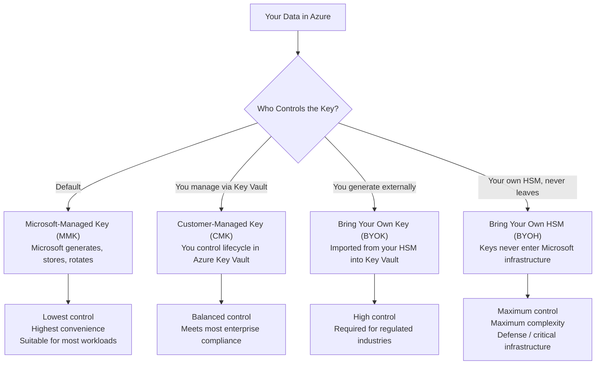

> 🤖 **Short on time?** Copy this into ChatGPT, Copilot, Gemini, or Claude for an instant summary — or to decide if it's worth reading in full:
>
> `Summarize this article in 5 bullet points with key takeaways, and flag anything worth double-checking in your own key management or data protection setup: https://blog.suubodhpatil.com/posts/Encryption-Demystified-Part1/`
{: .prompt-tip }

> **Series:** **Part 1** · [Part 2: Inside Azure — How Encryption at Rest Works →](https://blog.suubodhpatil.com/posts/Encryption-Demystified-Part2/) · [Part 3: Advanced Key Management →](https://blog.suubodhpatil.com/posts/Encryption-Demystified-Part3/)

---

## Executive Summary

- Encryption protects data across three states — at rest, in transit, and in use. This series focuses on data-at-rest encryption and key management: who holds the keys to your data, and what that means for compliance and trust.
- In cloud environments, the primary threats encryption addresses are logical — compromised credentials, insider access, and multi-tenant exposure — not physical media theft.
- Regulatory frameworks including PCI DSS, HIPAA, GDPR, ISO 27001, and CJIS increasingly mandate **customer-controlled key management**, not just encryption by default.
- Cloud providers offer a spectrum of key control models — from Microsoft-Managed Keys (MMK) to Bring Your Own HSM (BYOH). The right model depends on your compliance obligations and risk profile.
- Selecting the wrong key management model at design time is costly to retrofit — mapping regulatory requirements to key control models is a first-principles architectural decision, not an afterthought.

---

## Introduction

Encryption is one of the most foundational controls in cloud security — yet it is frequently misunderstood, underspecified, or treated as something the cloud provider "just handles." This post establishes the conceptual foundation: what encryption actually is, why data-at-rest encryption remains critical even in hyperscale cloud environments, and what the regulatory landscape demands of organizations storing sensitive data in the cloud.

Encryption protects data across three states: **at rest** (stored on disk), **in transit** (moving across a network), and **in use** (being actively processed in memory). This series focuses on data-at-rest encryption and key management — the controls that determine *who holds the keys* to your data, and what that means for compliance, trust, and risk.

[Part 2](https://blog.suubodhpatil.com/posts/Encryption-Demystified-Part2/) dives into Azure's specific implementation — CMK, BYOK, and Key Vault. [Part 3](https://blog.suubodhpatil.com/posts/Encryption-Demystified-Part3/) covers advanced patterns — BYOH, escrow models, and governance at scale.

---

## What is Encryption?

Encryption converts readable data (plaintext) into an unreadable format (ciphertext) using a cryptographic algorithm and a key. Only a party with the correct key can reverse the process and recover the original data.

**Two primary models:**

**Symmetric Encryption** uses the same key for both encryption and decryption. It is fast and efficient for large volumes of data. The most widely deployed algorithm is AES-256 — used by Azure, AWS, and GCP as the default for data-at-rest encryption. A practical example: when Azure encrypts a blob in storage, it uses a symmetric AES-256 data encryption key (DEK) to do so.

**Asymmetric Encryption** uses a mathematically linked key pair: a public key to encrypt, and a private key to decrypt. It is computationally heavier but ideal for scenarios where two parties need to establish trust without sharing a secret. Common algorithms are RSA and ECC. A practical example: when you connect to an Azure service over HTTPS, TLS uses asymmetric cryptography to negotiate a shared session key, then switches to symmetric encryption for the actual data transfer.

In practice, most systems combine both — asymmetric encryption secures the key exchange, symmetric encryption handles the data.

---

## Why Data-at-Rest Encryption Matters in the Cloud

In traditional on-premises environments, a primary threat was physical theft of storage media — a stolen hard drive meant exposed data. In hyperscale cloud environments, physical access to hardware is tightly controlled, making that scenario far less likely.

Yet **data-at-rest encryption remains critical in the cloud** for different reasons:

- **Protection against logical breaches:** Compromised credentials, misconfigured permissions, or exploited APIs can expose storage systems without any physical access. Encryption ensures that even if an attacker reaches the raw storage layer, the data is unreadable without the key.
- **Defense against insider threats:** Encryption with customer-controlled keys ensures that even cloud provider employees — with privileged access to infrastructure — cannot read your data.
- **Multi-tenancy isolation:** Cloud infrastructure is shared. Encryption enforces a strong boundary between tenants at the data layer, independent of compute and network isolation.
- **Data sovereignty and jurisdiction control:** When data is replicated across regions for resilience, encryption with customer-controlled keys ensures only the authorized party can decrypt it — critical for cross-border compliance scenarios.
- **Incident containment:** In a breach, encrypted data materially reduces the reportable scope and regulatory impact under most frameworks.

---

## Regulatory Requirements Driving Customer-Controlled Keys

Several major regulatory frameworks mandate encryption at rest and, in some cases, require that keys be managed *outside* the cloud provider's control:

- **PCI DSS v4.0:** Cardholder data must be encrypted at rest. Keys must be protected and managed separately from the encrypted data — encouraging customer-managed keys or BYOK to separate key custody from storage.
- **HIPAA (US):** Encryption of PHI is an addressable safeguard; if implemented, keys must be managed to prevent unauthorized access. Customer-controlled keys limit the risk of provider-side access to health data.
- **GDPR (EU):** Encryption is a recommended technical safeguard for personal data. BYOK directly supports data sovereignty arguments and simplifies cross-border transfer compliance.
- **ISO/IEC 27001 & 27018:** Mandates controls for encryption and key management in cloud services, with an explicit emphasis on separation of duties between the data processor (cloud provider) and the data controller (customer).
- **CJIS Security Policy (US):** Criminal justice data must be encrypted at rest with keys under agency control — requiring BYOK or on-premises HSM integration with cloud services.

For regulated industries, **customer-managed keys (CMK)** or **Bring Your Own Key (BYOK)** are not optional enhancements — they are often the minimum bar for compliance and audit sign-off.

---

## The Cloud Shift: Shared Responsibility

Before cloud computing, organizations managed encryption entirely in-house — keys stored in on-premises Hardware Security Modules (HSMs), lifecycle managed manually, rotation handled by internal teams. The complexity was significant, but the control was absolute.

Cloud computing redistributes this responsibility:

- **Cloud provider's role:** Secure the physical infrastructure, data centers, and foundational platform services.
- **Customer's role:** Secure data, applications, access controls — and, critically, encryption keys.

The important nuance is that cloud providers offer *layers* of key control. Most default to managing keys on your behalf — which is operationally convenient but means a third party holds the keys to your data. As compliance requirements tighten or customer trust demands increase, organizations need to take more direct ownership of key management.

---

## The Key Control Spectrum

Understanding the available models is essential before selecting one. Across this series, we cover four:

Part 2 covers MMK, CMK, and BYOK in detail. Part 3 covers BYOH and escrow models, and provides a decision framework for choosing between them.

---

## Key Takeaways

- Encryption in the cloud is primarily about **logical security** — protecting against credential compromise, misconfiguration, and insider access — not just physical theft prevention.
- Regulatory frameworks increasingly require **customer-controlled key management**, not just encryption by default.
- Cloud providers offer a spectrum of key control models, from fully managed (MMK) to fully customer-owned (BYOH). Understanding where your compliance obligations sit on that spectrum is the first step.
- Symmetric and asymmetric encryption serve different purposes in practice — most cloud encryption combines both.

---

> 💡 **Pro Tip:** Map your regulatory obligations to key management models early in your design phase — before selecting a cloud service or architecture pattern. Retrofitting key management controls into an existing deployment is significantly more complex and costly than designing for them upfront.
