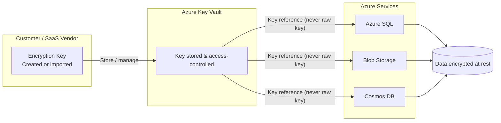

> **Series:** [← Part 1: Building the Foundation](https://blog.suubodhpatil.com/posts/Encryption-Demystified-Part1/) · **Part 2** · [Part 3: Advanced Key Management →](https://blog.suubodhpatil.com/posts/Encryption-Demystified-Part3/)

---

## Introduction

[Part 1](https://blog.suubodhpatil.com/posts/Encryption-Demystified-Part1/) established *why* encryption at rest matters and *what* the regulatory landscape demands. This post goes inside Azure's implementation: how default encryption works, how Customer-Managed Keys (CMK) and Bring Your Own Key (BYOK) extend that baseline, and what SaaS providers need to understand to turn key management into a trust and compliance differentiator.

---

## Azure's Default Encryption: Microsoft-Managed Keys

By default, Azure encrypts all data at rest using **AES-256** across its core storage and database services — including Azure Blob Storage, Azure Files, Azure SQL Database, Azure Cosmos DB, and many others. For a current list of services that support encryption at rest, refer to [Microsoft's official documentation](https://learn.microsoft.com/en-us/azure/security/fundamentals/encryption-atrest).

**How it works:**

- Microsoft automatically generates and manages the encryption keys.
- Keys are stored in Microsoft-controlled HSMs.
- Key rotation is handled transparently, with no customer action required.

**Trade-off:** Zero operational overhead, but limited visibility and control. Microsoft holds the keys. For many workloads this is entirely sufficient — but for regulated industries or customers with strict data sovereignty requirements, it is not enough.

---

## Customer-Managed Keys (CMK) via Azure Key Vault

CMK shifts key ownership to the customer. You create and manage your own encryption keys in **Azure Key Vault**, and Azure services use a reference to that key — rather than their own internally managed key — to encrypt and decrypt your data.

A key detail: Azure services never receive the raw key material. They receive a *reference* to the key in Key Vault, and Key Vault performs the cryptographic operations. This separation means that revoking access to the key in Key Vault immediately renders all encrypted data inaccessible — a powerful control for incident response or offboarding scenarios.

**Benefits for SaaS providers:**

- **Customer assurance:** You can demonstrate that sensitive customer data is encrypted with keys you — not Microsoft — control.
- **Compliance alignment:** Meets separation-of-duties requirements across frameworks like PCI DSS, HIPAA, and ISO 27001. (See [Part 1](https://blog.suubodhpatil.com/posts/Encryption-Demystified-Part1/) for the full regulatory breakdown.)
- **Auditability:** Key Vault provides detailed audit logs of every key operation — who accessed the key, when, and from which service. These logs can be surfaced to customers as compliance evidence.

---

## Key Protection Levels in Azure Key Vault

Not all keys in Azure Key Vault are equal. There are two protection levels, and the choice matters for compliance:

**Software-protected keys** are stored and processed in software within the Key Vault service. They are less expensive and suitable for most workloads, but do not satisfy requirements that mandate hardware-level key protection.

**HSM-protected keys** are stored and processed in FIPS 140-2 Level 3 validated Hardware Security Modules, either in the shared multi-tenant Azure Key Vault HSM tier or in **Azure Managed HSM** (a single-tenant, dedicated HSM instance). For organizations subject to CJIS, financial services regulators, or any framework requiring hardware-level key isolation, HSM-protected keys are the appropriate choice.

When selecting Azure Key Vault for CMK or BYOK, explicitly choose the protection level that matches your compliance requirements — the default is software-protected.

---

## Bring Your Own Key (BYOK): Extending Trust to Customers

BYOK takes CMK a step further. Instead of generating keys inside Azure Key Vault, you generate them in your own on-premises HSM — ensuring the key material originates in a fully customer-controlled environment — then import them into Key Vault.

**Why this matters:**

- **Provable origin:** The key was never generated in Microsoft infrastructure. For customers that require this assurance, BYOK provides a clear chain of custody.
- **Competitive differentiation for SaaS:** Offering BYOK support as a platform feature signals to enterprise buyers — particularly in regulated industries — that your product is built for their compliance needs.
- **Shared responsibility made tangible:** Even the SaaS provider cannot access a customer's data without their key. This is a powerful trust statement.

**How SaaS providers can surface this to customers:**

- Offer **per-tenant encryption** using customer-supplied keys, so each customer's data is encrypted with a key only they hold.
- Provide **self-service key rotation** as part of enterprise subscription tiers.
- Surface **key usage audit logs** in the customer portal as a compliance feature, not a backend detail.

---

## Key Rotation and Monitoring

Regardless of whether you use CMK or BYOK, Azure Key Vault supports:

- **Automated key rotation** via Key Vault rotation policies — set a rotation period and Key Vault handles it without manual intervention.
- **Key expiry alerts** through Azure Monitor and Event Grid, so expiring keys trigger notifications before they cause service disruption.
- **Detailed audit logs** via Azure Monitor, exportable to Log Analytics, Event Hubs, or a SIEM — giving both SaaS providers and their customers a full record of key operations.

For SaaS providers, turning these operational capabilities into customer-facing reports or dashboard features is a direct way to differentiate on compliance transparency.

---

## Key Takeaways

- Azure encrypts all data at rest by default with MMK — operationally simple, but Microsoft holds the keys.
- CMK shifts key ownership to the customer, with Azure services referencing keys in Key Vault rather than storing raw key material.
- BYOK extends this further — keys are generated outside Azure, providing a provable chain of custody for regulated industries.
- Key protection level matters: software-protected keys vs. HSM-protected keys have different compliance implications. Choose explicitly.
- For SaaS providers, CMK and BYOK are not just compliance controls — they are platform features that expand addressable market into regulated industries.

---

> 💡 **Pro Tip:** Position encryption and key management as part of your **customer value proposition**. A customer-facing key management dashboard — showing key ownership, rotation history, and audit logs — turns a backend compliance control into a visible trust signal that differentiates your platform in enterprise sales conversations.
