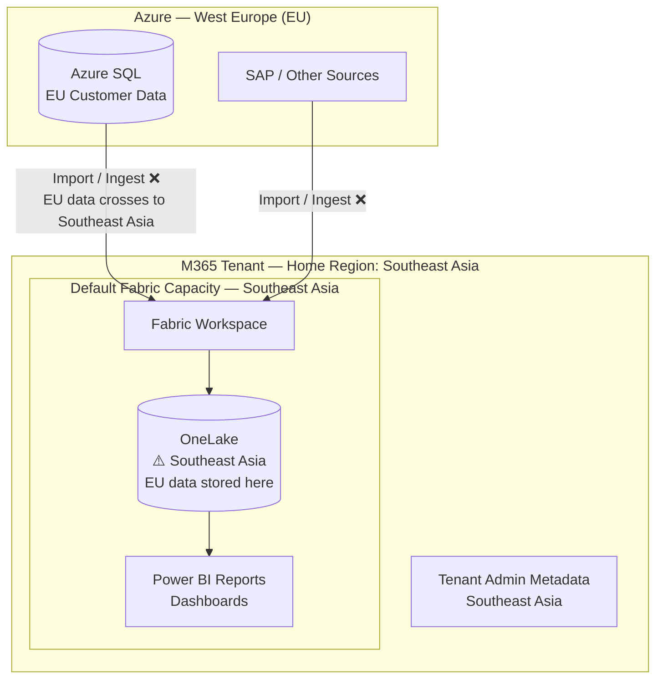
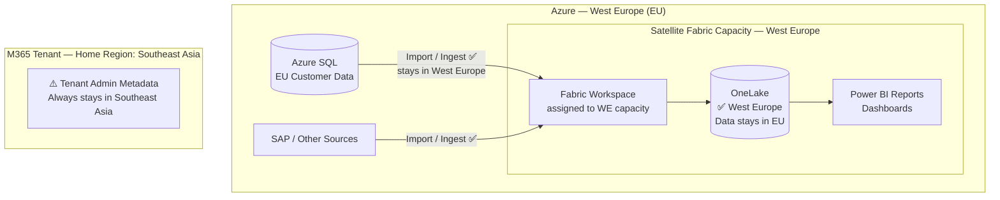

> 🤖 **Short on time?** Copy this into ChatGPT, Copilot, Gemini, or Claude for an instant summary — no need to read the whole thing:
>
> `Summarize this article in 5 bullet points with key takeaways, and flag anything a cloud/security architect should act on: https://blog.suubodhpatil.com/posts/multi-geo-compliance-shield/`
{: .prompt-tip }

> **Written for:** SaaS vendors, cloud architects, and compliance leads building analytics products on Power BI or Microsoft Fabric for regulated markets.

---

## Executive Summary

- Without Multi-Geo, Power BI and Microsoft Fabric store all workspace data in the tenant's home region — regardless of where compute capacity is provisioned — creating a compliance gap for SaaS vendors with data residency obligations.
- Multi-Geo moves workspace data and most workspace metadata to a satellite Azure region, enabling SaaS vendors to make defensible "data stays in your region" commitments for customers under GDPR, DPDP, PIPL, LGPD, and other data localization frameworks.
- Enabling Multi-Geo requires a tenant-level licensing prerequisite: at least **5% of eligible users** must hold a Multi-Geo add-on license before Microsoft enables the capability at the tenant level — it is not simply a capacity configuration choice.
- Tenant-level administrative metadata always remains in the home region regardless of Multi-Geo configuration — compliance commitments must be scoped accordingly.
- For SaaS vendors where even residual home-region metadata is unacceptable, a **multi-tenant architecture** — with separate Microsoft tenants provisioned per target region — provides complete data sovereignty, at significantly higher operational complexity and cost.

---

## Introduction

For SaaS vendors, data residency is no longer just a technical detail — it's a contractual and regulatory obligation. Customers expect their data to be stored and processed only in the region they select, driven by a growing body of data localization laws and cross-border transfer restrictions:

- **GDPR (EU):** Chapter V restricts transfers of personal data outside the EU/EEA unless adequacy decisions or Standard Contractual Clauses are in place. Keeping EU customer data in an EU Azure region is the simplest way to avoid that complexity.
- **India's DPDP Act / RBI Payment Data circular:** India's Digital Personal Data Protection Act empowers the government to restrict cross-border transfers, and the RBI explicitly requires payment data of Indian customers to be stored in India.
- **China's PIPL / DSL:** Personal Information Protection Law and Data Security Law mandate data localization for personal information and "important data," with strict cross-border transfer controls.
- **Brazil's LGPD:** Restricts international data transfers in a manner similar to GDPR.
- **EBA Outsourcing Guidelines / DORA (EU Financial Services):** Require financial institutions to know and control exactly where their data is processed — SaaS vendors serving EU banks must demonstrate regional data processing control.
- **Contractual requirements:** Even where no law strictly mandates it, enterprise contracts in banking, insurance, government, and healthcare routinely include explicit data residency clauses.

When offering analytics and reporting services through Power BI Online + Embedded or Microsoft Fabric, SaaS vendors face a hidden challenge: without Multi-Geo, data storage defaults to the tenant's home region, regardless of where compute capacity is provisioned. This gap can expose SaaS providers to compliance risks and erode customer trust.

---

## The Challenge Without Multi-Geo

By default, both Power BI Online + Embedded and Microsoft Fabric store data and metadata in the tenant's home region — the geographic location established when the Microsoft 365 tenant was originally provisioned.

- **Power BI Online + Embedded:** Imported datasets, reports, dashboards, and metadata are stored in the home region. Compute can run in customer-selected Azure regions via capacity provisioning, but storage remains anchored to the home region.
- **Microsoft Fabric (F SKUs):** Fabric uses **OneLake** as its unified storage layer — a logical data lake that backs all Fabric workspaces. OneLake is distinct from Fabric Dedicated Capacity (the compute resource); the capacity determines which region OneLake uses for that workspace. Without Multi-Geo, all Fabric workspace data — Lakehouse parquet/Delta files, Warehouse tables, Dataflow outputs — is stored in OneLake in the home region, regardless of where the compute capacity runs.

For SaaS vendors promising "all data stays in the customer's chosen region," this default behavior creates a compliance gap.

---

## What Multi-Geo Enables

Multi-Geo gives SaaS vendors control over where data at rest is stored by allowing workspaces to be assigned to capacities provisioned in satellite Azure regions.

- **Storage residency control:** Workspaces assigned to a satellite-region capacity have their OneLake data — Lakehouse files, Warehouse tables, Power BI datasets, reports — stored in that region, not the home region.
- **Compute alignment:** Fabric F SKU and Power BI Embedded capacities can be provisioned in the same region as the required data residency, aligning compute and storage locality.
- **Compliance assurance:** Vendors can commit to customers that their workspace data resides in the selected region.

**Important caveat:** Multi-Geo moves workspace-level data and most workspace metadata to the satellite region. However, certain tenant-level metadata — administrative configuration, some service telemetry, and platform-level records — remains anchored to the home region. This distinction matters for audits: "data residency" under Multi-Geo covers workspace content, but not the full tenant metadata footprint.

---

## How Data Flows: Visualizing the Residency Gap

To make this concrete, consider a SaaS vendor whose M365 tenant was provisioned from India (home region: Southeast Asia), with customer data sitting in Azure SQL in West Europe.

### Without Multi-Geo — Data Crosses Region Boundaries

EU customer data ingested into Fabric lands in Southeast Asia — the home region of the tenant. A SaaS vendor that has committed to "data stays in the EU" is already in breach the moment a dataset is imported.

---

### With Multi-Geo — Data Stays in the Customer's Region

With Multi-Geo enabled and a Fabric F SKU capacity provisioned in West Europe, the workspace's OneLake storage is in West Europe. EU data ingested from Azure SQL stays in the EU. The SaaS vendor can now make a defensible data residency commitment — with the caveat that tenant-level administrative metadata still anchors to Southeast Asia.

### A Note on DirectQuery Mode

Both diagrams above apply to **Import mode** and **Direct Lake mode** — scenarios where data is physically copied into OneLake. In **DirectQuery mode**, no data is ingested into Fabric at all. Power BI queries go directly to the source database at runtime, so data residency is governed entirely by where the source database lives (e.g., Azure SQL's region), not by Fabric or Multi-Geo. DirectQuery effectively bypasses the residency concern for Fabric — though it comes with its own performance trade-offs.

---

## Fabric vs Power BI Online: Residency Layers

| Layer | Without Multi-Geo | With Multi-Geo |
|---|---|---|
| Source DB (SQL, SAP, etc.) | Always in its own region | Same — unaffected |
| Compute (capacity) | Runs in provisioned region | Same — unaffected |
| Power BI datasets | Stored in tenant home region | Stored in satellite region |
| Reports & dashboards | Stored in tenant home region | Stored in satellite region |
| Workspace metadata (info, lineage) | Stored in tenant home region | Stored in satellite region |
| Fabric Lakehouse / Warehouse / Dataflows | Stored in OneLake in home region | Stored in OneLake in satellite region |
| Tenant-level administrative metadata | Stored in home region | **Remains in home region** |

---

## Enabling Multi-Geo: The Tenant Licensing Prerequisite

Before any capacity — Power BI Premium (P SKUs) or Fabric (F SKUs) — can be provisioned in a region other than the tenant's home region, **Microsoft must first enable Multi-Geo at the tenant level**.

Microsoft enables tenant-level Multi-Geo only when at least **5% of the tenant's eligible users hold a Multi-Geo add-on license**. This threshold is not a per-product rule — it is a tenant-wide gate. Once the tenant is Multi-Geo enabled, SaaS vendors can provision both Power BI Premium capacities and Fabric F SKU capacities in any supported satellite Azure region.

In practice, this means Multi-Geo is not simply a capacity configuration choice — it requires a licensing investment that unlocks the capability at the tenant level first.

---

## Business Impact for SaaS Vendors

- **Customer trust:** Enterprise clients in regulated industries demand verifiable proof of data residency. Multi-Geo provides the technical mechanism to deliver it.
- **Competitive advantage:** Vendors offering Multi-Geo can win deals where strict regional compliance is a procurement requirement.
- **Risk mitigation:** Avoid contractual breaches, regulatory penalties, and reputational damage from data landing in an unexpected region.
- **Scalability:** As you expand globally, Multi-Geo allows you to serve customers across multiple jurisdictions without provisioning separate Microsoft tenants for each region.

---

## Practical Considerations

- **Workspace assignment discipline:** Multi-Geo only works if workspaces are explicitly assigned to the correct satellite-region capacity. A workspace left on the default (home-region) capacity stores data in the home region — there is no automatic or policy-driven assignment. Governance processes must enforce correct placement.
- **Not all Fabric workload types behave identically:** Fabric Eventstream (Real-Time Intelligence) routes event data through Eventhouse (KQL Database) or configurable Lakehouse destinations — it does not automatically write to OneLake. Event data residency depends on where the destination (Eventhouse or Lakehouse) is configured, not Multi-Geo alone.
- **Capacity provisioning:** Fabric F SKUs and Power BI Embedded capacities must be explicitly provisioned in the target satellite Azure region. The region is set at capacity creation time and cannot be changed afterwards.

---

## Beyond Multi-Geo: When a Multi-Tenant Architecture Is Needed

Multi-Geo addresses workspace data residency effectively. However, tenant-level administrative metadata always remains in the home region — the region tied to where the Microsoft 365 tenant was originally provisioned.

Consider this scenario: a SaaS vendor whose tenant was provisioned from India has a home region in Southeast Asia. With Multi-Geo enabled, they can provision Fabric capacities in West Europe and store EU customer data there. But certain tenant-level metadata will always reside in Southeast Asia — outside the EU.

No regulation today explicitly targets this residual service metadata layer as a standalone requirement. However, if that metadata contains personal data — audit logs with user identities, workspace membership records, access activity — GDPR, PIPL, or DPDP cross-border transfer rules can indirectly apply.

For SaaS vendors where even this residual metadata exposure is unacceptable to a specific customer base, the architectural answer is **separate Microsoft tenants provisioned from within each target region**:

| Approach | Data residency coverage | Metadata residency | Operational complexity | Cost |
|---|---|---|---|---|
| Single tenant + Multi-Geo | Workspace data in satellite region | Partial — some stays in home region | Low | Lower |
| Multiple tenants per region | Complete — home region is the target region | Full — no residual leakage | High | Higher |

A multi-tenant architecture is a significant operational and cost commitment — separate identity management, separate capacity billing, limited cross-tenant collaboration. It is not the right answer for every vendor. But for SaaS providers targeting markets with the strictest data sovereignty expectations — where customers contractually require that *no* data or metadata touches a non-compliant region — it is worth evaluating.

---

## Key Takeaways

- Without Multi-Geo, Power BI and Fabric store all data in the tenant home region regardless of where compute capacity is provisioned — creating a compliance gap for SaaS vendors serving regulated markets.
- Multi-Geo is gated by a tenant-level licensing prerequisite: Microsoft requires at least 5% of eligible users to hold Multi-Geo add-on licenses before enabling the capability on the tenant.
- Multi-Geo moves workspace data and most workspace metadata to the satellite region — but tenant-level administrative metadata remains in the home region. Compliance commitments should be scoped accordingly.
- For vendors where residual home-region metadata is a concern, a multi-tenant architecture — with separate tenants provisioned per target region — provides complete data sovereignty, at the cost of significantly higher operational complexity.

---

> 💡 **Pro Tip:** Before committing to a single-tenant + Multi-Geo architecture, map your largest customers' regulatory requirements against what Multi-Geo actually covers. For most customers, Multi-Geo is sufficient. But if you have customers in jurisdictions with strict data localization laws who ask "where does *any* of my data live?" — including metadata — the honest answer may point you toward a multi-tenant design.
