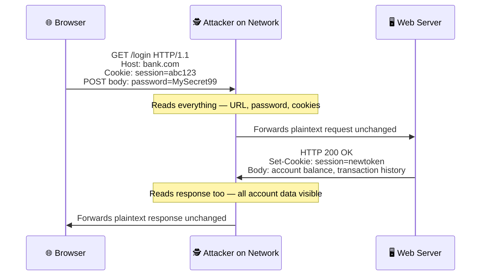
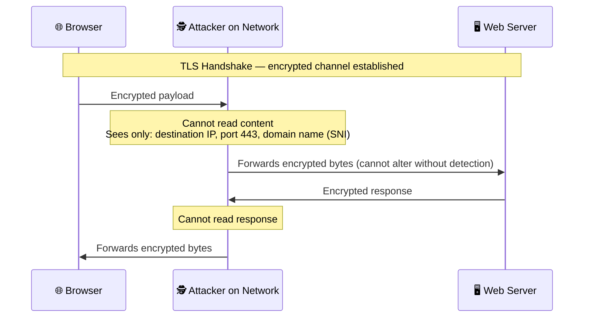
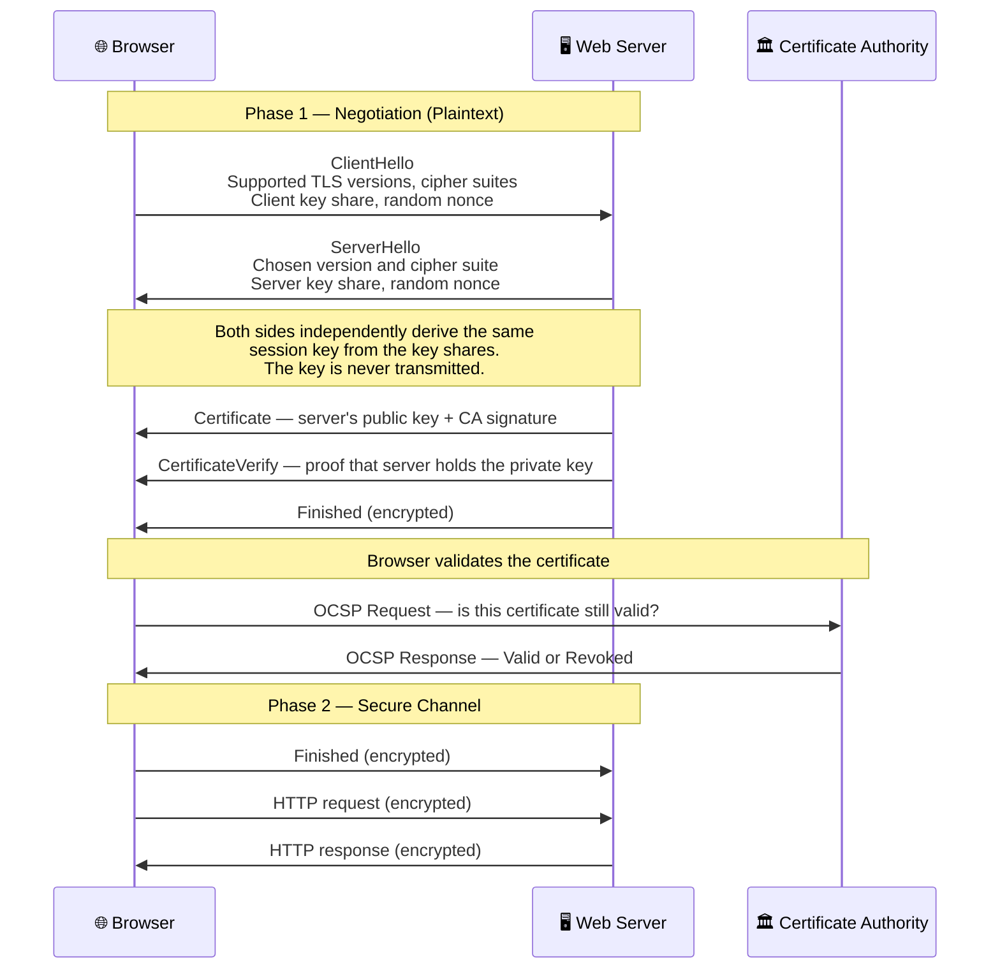
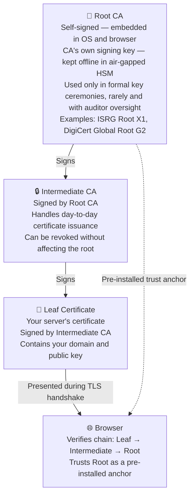

Short on time? >>

  

    📍
    📋
  

  

    
<strong>Short on time?</strong> Summarize this article with

    

      <select class="ai-selector-dropdown" id="ai-platform-select">
        <option value="">-- Select an AI --</option>
        <option value="claude">🤖 Claude</option>
        <option value="chatgpt">✨ ChatGPT</option>
        <option value="gemini">🔮 Gemini</option>
        <option value="perplexity">🌐 Perplexity</option>
        <option value="copilot">⚡ Copilot</option>
      </select>
    

    
Your prompt is copied automatically — just paste it once the AI opens.

  

<blockquote>

<strong>Written for:</strong> Application and infrastructure engineers responsible for TLS and certificate management, and security architects governing HTTPS configurations.

</blockquote>

<blockquote>

<strong>Also worth reading:</strong> <a href="/posts/ssl-to-tls-evolution-of-secure-communication/">From SSL 2.0 to TLS 1.3</a> · <a href="/posts/post-quantum-cryptography-tls-not-safe-forever/">Post-Quantum Cryptography and TLS</a> · <a href="/posts/why-tls-private-keys-must-never-live-on-web-server/">Why TLS Private Keys Must Never Live on Your Web Server</a>

</blockquote>

---

## Introduction

The padlock icon in your browser is one of the most trusted symbols in computing — and one of the least understood. Before TLS, HTTP transmitted everything in plaintext: every request, every cookie, every password visible to anyone on the same network. In 2010, a Firefox extension called **Firesheep** made session hijacking a single click — no technical skill required. Hundreds of thousands of downloads in 24 hours forced major sites to move to HTTPS-by-default within months.

The business stakes go further than session security. Every major compliance framework — PCI DSS, GDPR, HIPAA, ISO 27001, RBI, MAS — mandates encryption in transit. Auditors don't just ask "do you use HTTPS?" They ask which TLS versions are enabled, which cipher suites are configured, whether certificates are properly chained, and whether weak protocols have been explicitly disabled. The padlock is the easy part. What sits behind it is a governance decision.

TLS solves three problems simultaneously: **confidentiality** (data cannot be read by an eavesdropper), **integrity** (data cannot be modified in transit without detection), and **authentication** (you are communicating with the server you believe you are). The third is the most critical and most overlooked. Encryption without authentication means sending a secret to *someone* — but you don't know who. Remove that binding and no amount of encryption prevents a man-in-the-middle attacker from silently reading and relaying your traffic.

This post builds the foundation: what the handshake actually does, how the session key is derived without ever being transmitted, what a certificate is and why the CA that signed it matters, and — critically — what HTTPS does not protect that engineers frequently assume it does.

---

## HTTP vs. HTTPS: The Difference in Practice

The simplest way to understand HTTPS is to see what happens with and without it.

**Plain HTTP — everything is visible:**

The attacker does not need to break any encryption. They simply read the traffic as it passes through any network hop between the browser and server.

**HTTPS — attacker is blind to the content:**

TLS operates as a layer between TCP and HTTP. The TCP connection is established first, then TLS negotiates on top of it, and HTTP runs inside that encrypted tunnel. The attacker can see *that* a connection happened and *which domain* was contacted — but nothing about the content.

---

## The TLS Handshake: Step by Step

Before any application data flows, the browser and server perform a handshake — a negotiation that authenticates the server, agrees on cryptographic algorithms, and establishes a shared session key. TLS 1.3 completes this in a single round trip — often under 100ms in low-latency environments, though cross-region connections may take considerably longer depending on network RTT.

A few things worth noting:

- **The `CertificateVerify` message is the identity proof.** The server signs a transcript of the handshake with its private key. Having the certificate alone is not enough to impersonate a server — the matching private key is required.
- **TLS 1.3's public-key key exchanges provide forward secrecy.** A full 1-RTT handshake uses fresh ephemeral (EC)DHE values, so later compromise of the server's certificate private key does not expose completed sessions. TLS 1.3 also permits PSK-only resumption, which does not provide forward secrecy; PSK resumption combined with ephemeral DH does. 0-RTT early data is not fully forward secret and can be replayed. TLS 1.2's forward secrecy likewise depends on the negotiated key exchange; static RSA key exchange provides none and now belongs in legacy configurations.
- **OCSP stapling improves validation performance and privacy.** Rather than the browser making a separate round trip to the CA's OCSP responder during every handshake, the server pre-fetches and caches the CA's OCSP response and attaches (staples) it directly to the TLS handshake. This eliminates latency and prevents the CA from learning which sites a user visits.

### How the Session Key Is Derived — The Math Behind It

This is the part most TLS explanations skip. The session key is never transmitted — both sides independently arrive at the same secret through a mathematical trick called **Diffie-Hellman key exchange**, invented in 1976.

The elegant insight: two parties can compute the same shared secret using only **public values** — even if an attacker records every packet.

**A toy finite-field Diffie–Hellman (DH) example:**

Both sides use the same public parameters: a prime `p` and a generator `g`. For this deliberately tiny example, `p = 23` and `g = 5`. In plain-text math, `^` is called a **caret** and commonly means “raised to the power of”; the table uses superscripts to make the exponent clear. Each side chooses a private exponent and sends only its resulting public value.

| Who | Action | Value |
|---|---|---|
| Both agree | Public parameters | `p = 23`, `g = 5` |
| Browser | Chooses private exponent `a` | `a = 6` — stays on the browser |
| Server | Chooses private exponent `b` | `b = 15` — stays on the server |
| Browser → Server | Sends public share `A` | A = ga mod p = 56 mod 23 = 8 |
| Server → Browser | Sends public share `B` | B = gb mod p = 515 mod 23 = 19 |
| Browser (after receiving `B`) | Computes shared secret `K` | K = Ba mod p = 196 mod 23 = **2** |
| Server (after receiving `A`) | Computes shared secret `K` | K = Ab mod p = 815 mod 23 = **2** |
| Passive observer | Sees public parameters and shares | `p`, `g`, `A`, `B` — can recover `K` for these tiny values by trying possible exponents |

The browser knows `p`, `g`, its own exponent `a`, both public shares, and computes `K` from `a` and `B`. The server knows `p`, `g`, its own exponent `b`, both public shares, and computes the same `K` from `b` and `A`. The observer sees the public values, not `a` or `b`.

This example demonstrates how both endpoints derive the same shared secret; it does **not** demonstrate security. Because `p = 23` is tiny, an observer can try the few possible exponents and recover `a`, `b`, and `K` quickly. Production finite-field DH groups use standardized, much larger parameters so the best-known classical attacks are computationally infeasible. Many TLS connections use elliptic-curve DH instead, which relies on a related but different discrete-log problem.

In TLS, the DH shared secret is input to the TLS key schedule; it is not used directly as the HTTP traffic-encryption key. TLS 1.3 uses HKDF to derive the handshake and application traffic secrets and keys from the handshake inputs.

**TLS 1.3 commonly uses ECDHE — the same idea, different math**

TLS 1.3 commonly uses **Elliptic Curve Diffie–Hellman Ephemeral (ECDHE)**, and it also supports finite-field DHE groups. With ECDHE, each side has a private scalar and exchanges a public point; the hard problem is discrete logarithm on an elliptic curve rather than modular arithmetic. A 256-bit elliptic-curve group such as P-256 or X25519 provides roughly 128-bit classical security, comparable to a 3072-bit finite-field DH group.

The most common curves in TLS 1.3:
- **X25519** — the default for most modern TLS connections; fast and designed to resist side-channel attacks
- **P-256** (secp256r1) — NIST-standardized, widely supported
- **P-384** — used in high-assurance environments (government, regulated industries)

These are what the browser advertises in the `supported_groups` extension of the ClientHello, and what the server selects and returns in its own key share.

In TLS 1.3, this shared secret is mixed with the random nonces exchanged earlier to produce the final session keys used to encrypt HTTP traffic — but the core insight is already here: both sides arrive at the same secret without ever transmitting it.

**Why "ephemeral" is the critical word**

The private values `a` and `b` are generated fresh for each session and discarded immediately after. This is what makes the exchange *ephemeral* — and it is the source of forward secrecy. Old TLS 1.2 connections using RSA key exchange had no equivalent: the client encrypted the session key with the server's long-term RSA public key, so anyone who recorded past traffic and later obtained the private key could decrypt the entire historical archive. TLS 1.3 eliminated RSA key exchange entirely for this reason.

> **A note for the road ahead:** ECDH's security rests on the hardness of the elliptic curve discrete logarithm problem — a problem that a sufficiently powerful quantum computer can solve efficiently using Shor's algorithm. This is the mathematical foundation of the quantum threat to TLS, and the reason Post-Quantum Cryptography exists. More on this later in this series.

---

## Two Types of Encryption — and Why TLS Needs Both

The handshake and the data channel use fundamentally different types of encryption — each chosen for what it does best.

**Symmetric encryption** uses the same key to encrypt and decrypt. It is extremely fast — AES-256 can process gigabytes per second on modern hardware. The problem is key distribution: how do two parties who have never met securely share a key over an untrusted network? If you send the key over the wire before encryption is established, anyone intercepting the connection can read it.

**Asymmetric cryptography** uses mathematically linked public and private keys. In public-key encryption, data encrypted with the public key can be decrypted with the private key; that is how legacy TLS RSA key transport worked. Modern TLS key agreement uses ephemeral Diffie–Hellman instead: each side contributes a private value and public share to derive a shared secret, rather than encrypting the session key with the server's certificate key. Public-key operations are also more expensive than symmetric encryption, so TLS uses symmetric keys for application data.

In certificate-authenticated handshakes that use ephemeral (EC)DHE, the peers derive a session secret from ephemeral key shares, while the certificate's private key authenticates the handshake with a signature (for example, RSA-PSS, ECDSA, or EdDSA). TLS 1.3 PSK-only resumption instead authenticates with the pre-shared key and does not use a certificate signature. Legacy TLS 1.2 static RSA key exchange used the certificate's RSA public key to transport the premaster secret, rather than to sign the handshake. **Symmetric encryption then protects the application data** using traffic keys derived by the TLS key schedule. These are distinct TLS roles; key agreement is not the same operation as public-key encryption or signing.

---

## Certificates and the Chain of Trust

Before a client can trust a server's public key, it needs to verify that the key actually belongs to the server it believes it's connecting to. Anyone can generate a key pair and claim it belongs to `www.yourbank.com`. Certificates solve this identity problem.

A TLS certificate is a digitally signed document containing the domain name, the server's public key, the validity period, and a signature from a Certificate Authority. The CA's signature is the trust anchor: it means *"we have verified that this entity controls this domain, and we are vouching for this public key."*

Browsers and operating systems ship pre-installed with roughly 150 trusted **root Certificate Authorities** — organizations like DigiCert, Let's Encrypt, and Sectigo that have passed rigorous independent audits. The trust model is hierarchical: root CAs sign intermediate CAs, which issue the end-entity certificates your server presents. Root CA private keys are kept offline in HSMs and used rarely; if an intermediate CA is compromised, it can be revoked without touching the root.

A real-world chain makes this concrete. When your browser connects to a site secured by Let's Encrypt, the certificate chain it verifies looks like this:

| Level | Name | Signed by |
|---|---|---|
| Root CA | ISRG Root X1 | Self-signed — pre-installed in browsers and OS |
| Intermediate CA | Let's Encrypt R3 (or E1) | Signed by ISRG Root X1 |
| Leaf Certificate | your-domain.com | Signed by R3 — contains your server's public key |

The browser walks up this chain verifying each signature until it reaches ISRG Root X1 — which it already trusts because it was pre-installed. If any signature in the chain is invalid, the connection is rejected.

**One important clarification on whose keys are in those HSMs.** The HSMs shown above belong entirely to the Certificate Authority — DigiCert, Let's Encrypt, Sectigo. The private key stored offline is the CA's *own signing key*, used to sign intermediate CA certificates. It has nothing to do with your server's private key. When you obtain an SSL certificate, you generate your own key pair — the CA never sees your private key. Your certificate is simply the CA's signature on your public key and domain name. How and where you store your server's private key is entirely your responsibility — and one of the most underestimated security decisions in TLS deployments, which we will address directly in this series.

**What happens when this model breaks?** In 2011, **DigiNotar** — a Dutch CA — was breached by Iranian state actors. Fraudulent certificates were issued for Google, the CIA, Mossad, and hundreds of other domains, enabling undetectable MITM attacks. DigiNotar was removed from all browser trust stores within weeks and went bankrupt. One CA breach, and the trust model for every domain it had ever issued for collapsed.

**Governance implication:** CA selection is a third-party risk decision. **Certificate Authority Authorization (CAA) DNS records** restrict which CAs are permitted to issue certificates for your domain. Compliant CAs check CAA before issuing. It is one of the most underused controls in enterprise TLS management — a simple DNS entry that meaningfully reduces the blast radius of a CA compromise.

---

## What HTTPS Protects — and What It Doesn't

Many teams believe "we use HTTPS" fully answers security and compliance questions. It answers some. It does not answer all.

| What HTTPS **does** protect | What HTTPS **does not** protect |
|---|---|
| Request body (POST data, passwords, form fields) | **Destination domain** — visible via SNI in the ClientHello |
| Response body (page content, API responses) | **Destination IP address** — always visible in IP headers |
| HTTP headers (cookies, auth tokens, custom headers) | **Request volume and timing** — traffic analysis remains possible |
| URL path and query string (`/account?id=123`) | **Certificate** — fully public and visible to anyone |
| Session cookies and authorization tokens | **TLS metadata** — cipher suite, TLS version, certificate details |

**The SNI problem — your domain name is always visible**

When a browser initiates a TLS handshake, it sends the **Server Name Indication (SNI)** extension in the ClientHello — in plaintext, before any encryption is established. SNI is necessary so a server hosting multiple domains knows which certificate to present. The consequence: the domain you are visiting is visible to any network observer even over HTTPS.

**Encrypted Client Hello (ECH)** is an emerging TLS extension designed to encrypt the SNI and close this gap. As of 2026, ECH is supported in Chrome and Firefox and deployed at scale by Cloudflare, but server-side support remains limited and it is not yet a universal solution — most web servers and CDNs do not support it. DNS-over-TLS (DoT) and DNSSEC address the related problem of DNS query visibility — though these are separate topics worth their own discussion.

**Governance implication:** If your compliance requirement covers the confidentiality of destination domains — internal service URLs, confidential API endpoints, or applications where visiting the site is itself sensitive — HTTPS alone is insufficient. Private networking or ECH-capable infrastructure is required.

---

## A Note on Mutual TLS (mTLS)

Standard TLS authenticates only the server — any client can connect. **Mutual TLS (mTLS)** extends the handshake so both sides present certificates, mutually authenticating each other before any data flows. It is increasingly relevant for Zero Trust service-to-service communication, API security, and B2B connectivity. Both RBI and MAS reference mTLS in their API security guidance. It uses the same certificate infrastructure described above — the difference is simply that the client also holds a certificate issued by a mutually trusted CA.

---

## Key Takeaways

- TLS provides confidentiality, integrity, and authentication. All three are required — encryption without server authentication allows silent MITM attacks.
- The session key is never transmitted. Both sides derive it independently from the key exchange material, making passive packet capture insufficient to decrypt traffic.
- Certificates bind a server's public key to a verified domain identity. The CA's signature is the trust anchor — and CA compromise breaks the entire model for every domain that CA issued for. CAA DNS records limit this risk.
- TLS 1.3 public-key key exchange provides forward secrecy, but PSK-only resumption and 0-RTT have weaker guarantees. In TLS 1.2, forward secrecy depends on the negotiated key exchange; legacy static RSA key exchange provides none.
- HTTPS does not hide the destination domain (SNI) or IP address. Systems with stricter confidentiality requirements need additional controls.
- Compliance frameworks require more than "HTTPS enabled" — specific TLS versions, cipher suites, and certificate lifecycle management are all in scope.

> **Open questions for the road ahead:** As quantum computing matures, will the classical public-key algorithms underlying TLS key exchange remain secure? [The next post examines that quantum risk](https://blog.suubodhpatil.com/posts/post-quantum-cryptography-tls-not-safe-forever/). The related operational question is how to protect the long-term private key that authenticates certificate-based handshakes; [the final post in this series covers key custody and HSM-backed termination](https://blog.suubodhpatil.com/posts/why-tls-private-keys-must-never-live-on-web-server/).

---

> 💡 **Pro Tip:** Run your domain through [Qualys SSL Labs](https://www.ssllabs.com/ssltest/) — it takes 60 seconds and produces a detailed grade covering TLS versions, cipher suites, certificate chain, and known vulnerabilities. An A grade is the minimum bar for any system handling sensitive data. A B or below is very likely a finding in a PCI DSS or ISO 27001 audit.



---

## References

- [RFC 9846 — The Transport Layer Security (TLS) Protocol Version 1.3](https://www.rfc-editor.org/rfc/rfc9846.html)
- [NIST SP 800-52 Rev 2 — Guidelines for TLS Implementations](https://csrc.nist.gov/publications/detail/sp/800-52/rev-2/final)
- [PCI DSS v4.0 — Requirement 4.2: Protect PAN with Strong Cryptography During Transmission](https://www.pcisecuritystandards.org/)
- [OWASP Transport Layer Security Cheat Sheet](https://cheatsheetseries.owasp.org/cheatsheets/Transport_Layer_Security_Cheat_Sheet.html)
- [Qualys SSL Labs — SSL Server Test](https://www.ssllabs.com/ssltest/)
- [Let's Encrypt — How It Works](https://letsencrypt.org/how-it-works/)
- [Google Certificate Transparency](https://certificate.transparency.dev/)
- [Encrypted Client Hello — IETF Draft](https://datatracker.ietf.org/doc/draft-ietf-tls-esni/)

---

## Disclaimer

This content reflects independent technical analysis based on publicly documented standards, protocols, and security research as of the publication date. Protocol specifications and compliance requirements evolve — readers should verify current standards before making architectural or compliance decisions. This post does not represent the position of any employer, vendor, or standards body.
