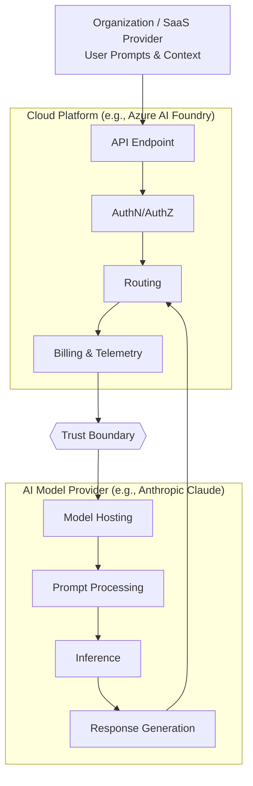

## Introduction

Cloud platforms increasingly act as **gateways to AI**, not the place where AI actually runs.

This creates a new and often misunderstood reality:

> You authenticate, deploy, and pay through a cloud provider —  
> but your prompts and outputs may be processed **outside that cloud entirely**.

This post explores the new AI trust problem, how trust boundaries emerge between cloud and model providers, what this means for security, privacy, and contractual responsibility, and a real-world example using Microsoft Azure AI Foundry and Anthropic Claude.

---

## The New AI Trust Problem

For years, cloud security operated on a simple assumption:

> *"If it runs in my cloud, my cloud provider processes my data."*

That assumption no longer holds true.

Modern AI platforms often expose **models they do not host or operate**. The cloud becomes a **broker of access**, while inference happens elsewhere.

This raises critical questions:

- Who actually processes my data?
- Where does inference really occur?
- Which contract governs my prompts?
- Who is responsible in case of a breach?

These are no longer theoretical — they directly impact **compliance, audit, and risk posture**.

---

## Understanding Trust Boundaries in Cloud AI Platforms

Before diving into a specific provider, it helps to separate two roles.

### Cloud Platform Provider

Responsible for API access, authentication and identity, request routing, and usage metering and billing. Importantly, this does **not automatically include AI inference**.

### AI Model Provider

Responsible for hosting the model, executing inference, processing prompts, and generating outputs.

### Where the Boundary Forms

A **trust boundary emerges** when these roles are separate:

> The moment your prompt leaves the cloud control plane and enters the model provider's infrastructure, **responsibility shifts**.

---

## Example: Azure AI Foundry and Anthropic Claude

Azure AI Foundry provides access to third-party models such as Anthropic Claude.

Microsoft documentation states:

> "The API gives you access to the model that Anthropic service hosts and manages."

This means the model is **not hosted in Microsoft Azure** — inference runs on **Anthropic-managed infrastructure**, and Azure provides the **control plane**, not the execution environment.

Reference: [Azure AI Foundry — Claude Models Data Privacy](https://learn.microsoft.com/en-us/azure/foundry/responsible-ai/claude-models/data-privacy)

---

## Data Residency Implications

In this architecture:

- Prompts and outputs are processed on **model provider infrastructure**
- Processing may occur across **global regions**
- Cloud region selection does **not constrain inference location**

**Key takeaway:** Cloud region ≠ AI processing location.

---

## Contractual Reality: Dual Responsibility

### Cloud Provider Scope

Covers API infrastructure, authentication metadata, and usage and billing. Governed by the [Microsoft Products and Services Data Protection Addendum](https://www.microsoft.com/licensing/docs/view/Microsoft-Products-and-Services-Data-Protection-Addendum-DPA).

### Model Provider Scope

Covers prompts, outputs, and personal data within AI interactions. Governed by the [Anthropic Data Processing Addendum](https://www.anthropic.com/legal/data-processing-addendum) and [Anthropic Commercial Terms](https://www.anthropic.com/legal/commercial-terms).

### Key Insight

The model provider is **not a sub-processor of the cloud provider**. Each party is responsible for **different parts of the data flow**.

---

## SaaS Perspective

For a SaaS provider:

- You act as a **processor**
- The AI model provider becomes your **sub-processor**
- Disclosure is required when personal data is involved

---

## Common Misconceptions

**"If it's in my cloud, my cloud provider processes it."**  
Not always true — modern AI platforms route inference to external model providers.

**"Region selection guarantees residency."**  
Not for external inference — model providers may process across global regions.

**"One contract covers everything."**  
Multiple agreements apply — cloud provider and model provider terms govern different parts of the data flow.

---

## Key Takeaways

- Cloud platforms increasingly act as access brokers, not inference environments — inference may happen outside your cloud entirely.
- A trust boundary forms the moment your prompt leaves the cloud control plane and enters the model provider's infrastructure.
- Cloud region selection does not constrain where AI inference occurs.
- Dual contractual responsibility applies — cloud provider and model provider agreements govern different parts of the data flow.
- SaaS providers must treat AI model providers as sub-processors and disclose this relationship when personal data is involved.

---

> 💡 **Pro Tip:** Before deploying any AI model through a cloud platform, audit the actual data flow: identify who hosts the model, where inference runs, and which contract governs your prompts. Don't assume cloud region = AI processing location.

---

## References

- [Azure AI Foundry Models Overview](https://learn.microsoft.com/en-us/azure/foundry-classic/concepts/foundry-models-overview#models-from-partners-and-community)
- [Azure AI Foundry — Claude Models Data Privacy](https://learn.microsoft.com/en-us/azure/foundry/responsible-ai/claude-models/data-privacy)
- [Microsoft Products and Services Data Protection Addendum](https://www.microsoft.com/licensing/docs/view/Microsoft-Products-and-Services-Data-Protection-Addendum-DPA)
- [Anthropic Data Processing Addendum](https://www.anthropic.com/legal/data-processing-addendum)
- [Anthropic Commercial Terms](https://www.anthropic.com/legal/commercial-terms)

---

## Disclaimer

This content reflects independent technical analysis based on publicly documented architecture and contractual terms and does not represent the position of any cloud provider, model vendor, or employer.
