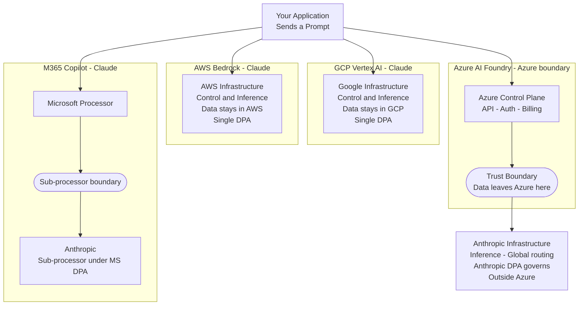

> **Written for:** CISOs, cloud architects, privacy and legal teams, and SaaS vendors building AI-powered products on managed cloud platforms.

## Executive Summary

- Cloud AI platforms frequently split the **control plane** (API, auth, billing — owned by the cloud provider) from the **data plane** (inference — which may be owned by an entirely different company under a separate contract).
- The same model accessed through different platforms carries different trust profiles: Claude on AWS Bedrock stays inside AWS, while Claude on Azure AI Foundry is processed on Anthropic's infrastructure outside Azure — under a separate Anthropic DPA.
- Common Azure security controls — Customer Managed Keys, EU Data Boundary, sovereign cloud deployments — **do not extend** to Anthropic's inference layer.
- Zero Data Retention (ZDR) reduces but does not eliminate Anthropic's data retention: User Safety classifier outputs are retained even under ZDR, and whether they constitute personal data under GDPR is an unresolved compliance question.
- Trust boundary evaluation is a **governance process, not a one-time audit** — platform architectures change, sub-processor lists update, and the answers from six months ago may no longer be correct.

---

## Introduction

In 2026, the cloud you authenticate with is no longer the cloud that processes your data.

For most of cloud computing's history, a straightforward assumption held: the provider you authenticated with was the entity processing your data. One vendor, one contract, one Data Processing Addendum. Compliance decisions, privacy notices, and audit responses were built on this foundation. It worked because cloud services were vertically integrated — the company managing your API was the same company running the compute that touched your data.

AI has quietly disaggregated that model.

This split is not unprecedented — control and data plane separation has long existed in SaaS architectures and payment processing pipelines. But AI makes it more acute for three reasons: prompts routinely contain unstructured sensitive data that is hard to sanitise before transmission; the inference layer is largely opaque, making it difficult to audit what happens inside; and a single model provider like Anthropic is now simultaneously deployed across Azure AI Foundry, AWS Bedrock, and GCP Vertex AI — each under a different hosting arrangement, a different DPA, and a different trust profile. Procurement decisions made for one platform do not carry over to another.

When you access a foundation model through a major cloud platform today, you may be dealing with two entirely separate companies processing your data — under different contracts, in different locations, with different sub-processors. The cloud provider manages the front door. A third party may handle everything that happens inside. And this split is not always visible from the API surface or the billing dashboard.

This post examines where that boundary forms, why it matters, and — more importantly — how to evaluate it for any model, on any platform, at any point in time. The specific answers will keep changing as cloud providers evolve their AI strategies. The framework for asking the right questions will not.

---

## The Structural Split: Control Plane vs. Data Plane

In traditional cloud services, the provider controls both layers of the stack:

- The **control plane** — API endpoints, authentication, request routing, billing, and metering
- The **data plane** — the actual execution environment where your data is processed

These two layers sitting within the same provider's boundary is what made cloud compliance tractable. Your Azure region selection, your AWS VPC, your GCP DPA — all of these controlled both layers simultaneously.

Modern cloud AI platforms have broken this assumption. The control plane often remains with the cloud provider. But the data plane — where your prompt is tokenised, processed by the model, and a completion generated — may operate on infrastructure owned and managed by an entirely different company.

When these two layers split across different companies, the consequences are significant:

- The cloud provider's DPA may cover only the control plane
- Cloud region selection may constrain routing, not inference location
- Security controls you have enabled may not extend to the inference environment
- You may have a direct contractual relationship with the model provider that your legal team has never reviewed
- Your sub-processor disclosures to customers may be incomplete

None of this is hypothetical. It is the documented, contractual reality of several major cloud AI integrations today.

---

## Same Model, Different Trust: Why Platform Choice Determines Your Risk

The clearest illustration of this problem is to trace what happens when the same model is accessed through different cloud platforms. The model's capabilities are identical. The trust profile is not.

| Platform | Who hosts inference | Contractual structure | Does cloud region constrain inference? |
|---|---|---|---|
| **Azure AI Foundry** (Claude) | Anthropic — outside Azure | Dual DPA: Microsoft (infra) + Anthropic (inference) | No — Anthropic routes globally |
| **AWS Bedrock** (Claude) | AWS — inside AWS | AWS DPA primary + Anthropic terms | Yes |
| **GCP Vertex AI** (Claude) | Google — inside GCP | Single DPA: Google only | Yes — hard regional enforcement |
| **M365 Copilot** (Claude) | Anthropic — outside Azure, on AWS/GCP infra | Microsoft DPA umbrella (Anthropic = MS sub-processor) | Partial — EU Data Boundary exclusions apply |
| **Azure OpenAI** (GPT — for contrast) | Microsoft — inside Azure | Single DPA: Microsoft only | Yes |

The same Claude model. Four different trust architectures. The platform you choose determines where inference runs, which contract governs your prompts, whether your region selection has any effect, and who bears data processing responsibility. The Azure OpenAI row shows GPT as a contrast — Azure *does* fully host that model, making data residency clean. Claude on Azure AI Foundry has no equivalent.

At the trust boundary, several things change simultaneously: TLS is re-terminated under a different certificate authority; audit logs switch retention policies and jurisdictional coverage; and the contractual basis for data processing shifts from one DPA to another. The diagram below shows where that boundary sits for each platform.

---

## Deep Dive: Azure AI Foundry and Anthropic Claude

Azure AI Foundry is the most instructive case study because the trust boundary is explicitly documented by Microsoft itself.

> *"The API gives you access to the model that Anthropic service hosts and manages."* ([source](https://learn.microsoft.com/en-us/azure/foundry/responsible-ai/claude-models/data-privacy))

> *"When you transact for Claude in Foundry, you will agree to Anthropic's terms of use and Anthropic (not Microsoft) is the processor of the data."* ([source](https://learn.microsoft.com/en-us/azure/foundry/responsible-ai/claude-models/data-privacy))

There is no ambiguity here. Azure AI Foundry is an API gateway, an authentication layer, and a billing mechanism. Inference runs on Anthropic-managed infrastructure outside Microsoft Azure. Azure region selection does not constrain where Anthropic processes prompts — Anthropic's infrastructure spans multiple geographies and routes requests dynamically.

### Two Contracts, Two Scopes

This architecture produces a dual-DPA reality. Both contracts are in force simultaneously, but they govern entirely different parts of the data flow.

**Microsoft DPA** governs: the Foundry API infrastructure, authentication metadata, usage telemetry, and billing records.

**Anthropic DPA** governs: user prompts, model completions, and any personal data contained within AI interactions.

Strengthening your contractual position with Microsoft — through enterprise agreements, DPA amendments, or compliance addenda — does not change what happens to your prompts after they cross into Anthropic's environment.

### What Security Controls Do Not Cover

**Customer Managed Keys (CMK):** CMK via Azure Key Vault covers data stored within Azure — project files, evaluation artefacts, uploaded documents. It does not apply to prompts or completions processed by Anthropic's infrastructure. Organisations enabling CMK believing it gives full cryptographic control over AI interactions are working with an incomplete picture.

**EU Data Boundary (as of May 2026):** Microsoft's EU Data Boundary programme currently excludes Claude models across Azure AI Foundry, M365 Copilot, Copilot Studio, and Power Platform. EU-based organisations cannot rely on this commitment for prompt and inference data.

**Azure sovereign cloud deployments:** Azure Government and other sovereign cloud variants provide infrastructure isolation within Azure's boundary. That isolation does not extend to Anthropic's inference environment.

### The Contract You May Not Know You Signed

Accepting the Azure Marketplace terms when enabling Claude in Foundry constitutes click-through acceptance of [Anthropic's Commercial Terms](https://www.anthropic.com/legal/commercial-terms) and [Data Processing Addendum](https://www.anthropic.com/legal/data-processing-addendum). A direct contractual relationship between your organisation and Anthropic is created automatically — often without the involvement of legal or procurement teams. This is worth auditing.

### Data Retention and Zero Data Retention

Under standard terms, Anthropic retains API interaction logs for 30 days. Enterprise customers can negotiate a Zero Data Retention (ZDR) addendum ([Anthropic DPA](https://www.anthropic.com/legal/data-processing-addendum)), under which prompts and completions are not stored after the response is returned. ZDR requires a separately executed agreement and must be confirmed for Foundry deployments specifically.

One important nuance: even under ZDR, Anthropic retains outputs from its User Safety classifier — the component that evaluates prompts for policy violations such as harmful content or jailbreak attempts. These outputs persist after the underlying prompts are erased. Whether they constitute personal data under GDPR is an open compliance question that requires legal review.

---

## Three Architectural Patterns

Across today's cloud AI platforms, three distinct trust architectures emerge. Understanding which pattern applies is the first step in evaluating any integration.

```mermaid
flowchart TD
    subgraph PA["Pattern A — Split Trust\nAzure AI Foundry with Claude"]
        A1["Your App"] --> CP1["Cloud Control Plane\nMicrosoft - API - Auth - Billing"]
        CP1 --> TB1(["Trust Boundary\nData leaves cloud here"])
        TB1 --> DP1["Model Provider Inference\nAnthopic - Outside Azure\nSeparate DPA"]
    end

    subgraph PB["Pattern B — Unified Trust\nGCP Vertex AI and AWS Bedrock"]
        A2["Your App"] --> ALL2["Cloud Provider\nControl and Inference\nData stays in cloud\nSingle DPA"]
    end

    subgraph PC["Pattern C — Sub-processor Chain\nM365 Copilot with Claude"]
        A3["Your App"] --> CP3["Cloud Processor\nMicrosoft - Full Accountability"]
        CP3 --> SB3(["Sub-processor boundary"])
        SB3 --> SP3["Model Provider\nAnthopic - Sub-processor\nunder MS DPA"]
    end
```

**Pattern A — Split Trust** is the Azure AI Foundry architecture. The cloud provider handles the control plane; the model provider independently handles inference under a separate DPA. Two contracts, two processors, two audit relationships.

**Pattern B — Unified Trust** describes GCP Vertex AI and AWS Bedrock. On GCP (as of May 2026), Claude is fully managed within Google's infrastructure. Requests go to Google Vertex AI endpoints — data never reaches Anthropic. Regional endpoints enforce hard data residency backed by infrastructure, not routing preference. [Google's sub-processor list](https://cloud.google.com/terms/subprocessors) does not include Anthropic, which is the contractual proof. AWS Bedrock follows the same pattern — AWS hosts and serves Claude under a single AWS DPA.

**Pattern C — Sub-processor Chain** is the M365 Copilot model, covered in detail in the next section.

**A word of caution on Pattern B:** "fully hosted" should not be read as "fully governed." It is worth asking whether AWS sends model telemetry or weight-update metrics back to Anthropic, and whether Google uses any third-party compute paths outside GCP's contractual boundary. If you cannot find a documented answer, that is a vendor questionnaire item, not a safe assumption. Use this checklist to verify:

- Does the cloud provider's sub-processor list for this specific service include the model developer?
- Does the cloud DPA explicitly state the provider processes inference data — not just infrastructure metadata?
- Does the model provider's privacy policy contain "usage data" or "service improvement" clauses that could allow telemetry flows?
- Has the model provider confirmed in writing that no inference data is returned to them in this hosting arrangement?

Vendor documentation changes. "Fully hosted" is a technical description, not a perpetual contractual guarantee.

**The model is not the trust boundary. The platform is.** Choosing a model and choosing a platform are separate decisions with separate trust implications.

---

## The M365 Copilot Nuance

M365 Copilot with Claude (as of May 2026) presents Pattern C — the sub-processor chain. Anthropic still hosts the inference on its own infrastructure (running on AWS/GCP datacenters), but the contractual structure is fundamentally different from Azure AI Foundry: Anthropic operates as a sub-processor *of Microsoft*, sitting under Microsoft's DPA umbrella rather than as a direct, independent processor.

This distinction has concrete governance implications:

| Governance dimension | Azure AI Foundry (Claude) | M365 Copilot (Claude) |
|---|---|---|
| **Your processor** | Anthropic — direct, independent | Microsoft — Anthropic is their sub-processor |
| **Liability** | Split: Microsoft for infra, Anthropic for inference | Microsoft bears full processor accountability |
| **Audit rights** | Audit Microsoft for infra; audit Anthropic separately under Anthropic DPA | Audit Microsoft; Microsoft audits Anthropic on your behalf |
| **Data residency** | Anthropic routes globally; Azure region has no effect | EU Data Boundary exclusions still apply |
| **Breach notification** | Two separate obligations, two timelines | Microsoft's 72-hour GDPR obligation covers the full chain |

From a GDPR perspective, an organisation using M365 Copilot deals with Microsoft as their processor — not with Anthropic directly. This simplifies the contractual relationship but does not eliminate the underlying architectural reality: inference still occurs outside Microsoft's infrastructure, and the EU Data Boundary exclusions that apply to Azure AI Foundry apply here too.

---

## The Evolving Landscape

The specific state of each platform in this post reflects documentation available in mid-2026 — and it will continue to change.

Microsoft has been developing regional data zone support for Claude in Foundry. EU data zone availability has been on the roadmap, which would bring inference residency controls closer to what GCP and AWS currently offer. If native hosted deployments of third-party models become available within Azure's infrastructure boundary, the dual-DPA structure described here would no longer apply.

**Any specific answer to "where does my data go?" has an expiry date.** Governance decisions need to be revisited when a service moves from preview to GA, when a cloud provider updates its sub-processor list, when a model gains a new regional deployment, or when a provider announces a hosting architecture change.

---

## How to Evaluate Your Trust Boundary

For any AI model integration — on any platform, at any point in time — three areas of inquiry determine the actual trust profile.

**Inference and residency:**
- Who physically hosts the model — the cloud provider or the model developer? Is this explicitly documented?
- Does the cloud provider's DPA name them as the data processor for prompts and completions, or does it defer to a third party?
- Does cloud region selection constrain where inference runs, or only where the API endpoint operates?
- Is this model explicitly included in or excluded from the cloud provider's data boundary programme?

**Contracts and acceptance:**
- How many DPAs govern this data flow? Which one covers prompts and completions specifically?
- Has your organisation reviewed and accepted the model provider's terms? Through what mechanism, and when?
- If there is a click-through acceptance path, has your legal team reviewed what was accepted?
- Which entities must be disclosed to your customers as sub-processors under GDPR Article 28?

**Controls and disclosure:**
- Do encryption controls extend to the inference environment, or only to data stored in the cloud provider's storage layer?
- What is the model provider's data retention period? Is ZDR available, activated, and confirmed for this specific integration?
- Does your privacy notice accurately describe where inference actually occurs?
- Have you cross-checked both the cloud provider's and model provider's sub-processor lists?

---

## Governance Process

Treat AI trust boundary evaluation as a governance process, not a one-time audit.

**Assign ownership:** Legal, security, and procurement all need input. Legal reviews DPA coverage; security verifies the technical boundary; procurement confirms the contractual path matches the vendor's actual architecture. One function should own the decision trail.

**Establish a review cadence:** Re-evaluate quarterly, and ad-hoc whenever a provider announces a service update, regional deployment, sub-processor list change, or shift from preview to GA. The answers from six months ago may no longer be correct.

**Document the decision trail:** For each AI integration, record who evaluated the boundary, when, which documentation they relied on, and what conclusion they reached. This is what auditors will ask for.

---

## Conclusion

The trust boundary question will not stay answered. As models shift between hosting arrangements, as cloud providers build native inference capacity, and as regulators catch up to multi-party AI architectures, the specific answers in this post will change. The discipline should not. Ask who physically processes your data, under which contract, and what controls actually reach that environment. Then ask again next quarter. The framework is stable even when the answers are not.

---

## Key Takeaways

- Cloud AI platforms frequently separate the control plane (API, auth, billing) from the data plane (inference). These two layers may belong to entirely different companies under different contracts.
- The same model operates under fundamentally different trust profiles depending on the platform — demonstrated by Claude's different architectures across Azure AI Foundry, GCP Vertex AI, AWS Bedrock, and M365 Copilot.
- Cloud region selection, Customer Managed Keys, and data boundary commitments may not extend to third-party model inference. Each control needs to be evaluated against what it actually covers.
- Contractual acceptance of model provider terms can occur automatically through cloud marketplace click-through. Audit which AI model agreements are in force and how they were accepted.
- The specific answers will change as platforms evolve. The evaluation process — who hosts the model, which DPA governs inference, what do controls actually reach — remains constant.

---

> 💡 **Pro Tip: Do not rely on the cloud provider's sub-processor list to determine where inference happens.**
>
> 1. **Start with the sub-processor list, but treat it only as a hint.** Most lists are global and do not reflect the architecture of a specific AI integration.
> 2. **Check the service-specific DPA and documentation.** If it explicitly names the model provider as the processor for prompts and completions, they are an independent processor — even if they also appear as a sub-processor elsewhere.
> 3. **Appearing on the sub-processor list does not mean the cloud provider hosts inference.** M365 Copilot is the clearest example: Anthropic is listed as a Microsoft sub-processor, yet inference still runs on Anthropic infrastructure outside Azure.
> 4. **If the model developer does not appear on the service-specific sub-processor list, you almost certainly have a dual-DPA structure.** That is the case for Azure AI Foundry with Claude.
> 5. **Check whether you accepted the model provider's terms via click-through.** Enabling Claude in Azure Foundry automatically creates a direct contractual relationship with Anthropic — without a separate signing process.
> 6. **Final rule:** Sub-processor list = who *may* process your data. DPA = who is *responsible* for processing your data. Architecture = where your data is *actually* processed. All three must be checked independently.

---

## References

- [Azure AI Foundry — Claude Models Data Privacy](https://learn.microsoft.com/en-us/azure/foundry/responsible-ai/claude-models/data-privacy)
- [Azure AI Foundry Models Overview](https://learn.microsoft.com/en-us/azure/foundry-classic/concepts/foundry-models-overview#models-from-partners-and-community)
- [Microsoft Products and Services Data Protection Addendum](https://www.microsoft.com/licensing/docs/view/Microsoft-Products-and-Services-Data-Protection-Addendum-DPA)
- [Anthropic Data Processing Addendum](https://www.anthropic.com/legal/data-processing-addendum)
- [Anthropic Commercial Terms](https://www.anthropic.com/legal/commercial-terms)
- [Anthropic Trust Center](https://trust.anthropic.com)
- [Google Cloud Vertex AI — Partner Models](https://cloud.google.com/vertex-ai/generative-ai/docs/partner-models/use-claude)
- [Google Cloud Vertex AI — Data Governance](https://cloud.google.com/vertex-ai/generative-ai/docs/data-governance)
- [Google Cloud Sub-processors](https://cloud.google.com/terms/subprocessors)
- [Anthropic — Claude on Google Vertex AI](https://www.anthropic.com/news/google-vertex-general-availability)

---

## Limitations

This analysis covers managed cloud AI integrations where a foundation model is accessed through a third-party platform's API. It does not cover:

- **On-premise deployments** or self-hosted open-weight models, where the trust boundary is entirely within your own infrastructure.
- **Fine-tuning data flows**, where training data may be stored or retained under different terms than inference prompts.
- **Multi-tenant versus single-tenant inference**, which affects isolation guarantees.
- **Sovereign cloud nuances beyond Azure**, such as AWS GovCloud or Google Cloud Sovereign Controls.

Readers should not assume that conclusions drawn for managed API inference apply to these scenarios without separate evaluation.

---

## Disclaimer

This content reflects independent technical analysis based on publicly documented architecture and contractual terms as of the publication date. Cloud AI platform architectures, hosting arrangements, and contractual terms evolve frequently — readers should verify current documentation before making compliance or architectural decisions. This post does not represent the position of any cloud provider, model vendor, or employer.
