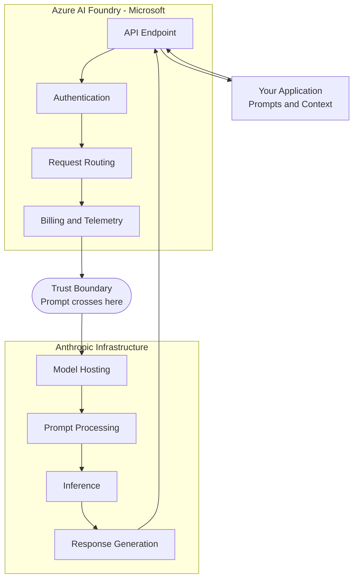

## Introduction

Most cloud contracts were written for vertically integrated services. AI integrations are changing the architecture beneath them — and the contractual coverage may not have kept pace.

For most of cloud computing's history, a straightforward assumption held: the provider you authenticated with was the entity processing your data. One vendor, one contract, one Data Processing Addendum. Compliance decisions, privacy notices, and audit responses were built on this foundation. It worked because cloud services were vertically integrated — the company managing your API was the same company running the compute that touched your data.

AI has quietly disaggregated that model.

This split is not unprecedented. Control and data plane separation has long existed in SaaS architectures, payment processing pipelines, and content delivery networks. But AI makes the split more acute for three reasons: first, prompts often contain unstructured sensitive data that is difficult to classify or sanitise before transmission; second, the inference layer is largely opaque, making it hard to audit what happens inside; and third, model providers are consolidating rapidly, creating unexpected vendor dependencies that may not be reflected in your original procurement decision.

When you access a foundation model through a major cloud platform today, you may be dealing with two entirely separate companies processing your data — under different contracts, in different locations, with different sub-processors. The cloud provider manages the front door. A third party may handle everything that happens inside. And this split is not always visible from the API surface or the billing dashboard.

This post examines where that boundary forms, why it matters, and — more importantly — how to evaluate it for any model, on any platform, at any point in time. The specific answers will keep changing as cloud providers evolve their AI strategies. The framework for asking the right questions will not.

---

## The Structural Split: Control Plane vs. Data Plane

In traditional cloud services, the provider controls both layers of the stack:

- The **control plane** — API endpoints, authentication, request routing, billing, and metering
- The **data plane** — the actual execution environment where your data is processed

These two layers sitting within the same provider's boundary is what made cloud compliance tractable. Your Azure region selection, your AWS VPC, your GCP DPA — all of these controlled both layers simultaneously.

Modern cloud AI platforms have broken this assumption. The control plane often remains with the cloud provider. But the data plane — where your prompt is tokenised, processed by the model, and a completion generated — may operate on infrastructure owned and managed by an entirely different company.

When these two layers are split across different companies, the following consequences follow:

- The cloud provider's DPA may cover only the control plane
- Cloud region selection may constrain routing, not inference location
- Security controls you have enabled (encryption, access policies, data boundaries) may not extend to the inference environment
- You may have a direct contractual relationship with the model provider that your legal team has never reviewed
- Your sub-processor disclosures to customers may be incomplete

None of this is hypothetical. It is the documented, contractual reality of several major cloud AI integrations today.

---

## Same Model, Different Trust: Why Platform Choice Determines Your Risk

The clearest illustration of this problem is to trace what happens when the same model is accessed through different cloud platforms. The model's capabilities are identical. The trust profile is not.

| Platform | Who hosts inference | Contractual structure | Does cloud region constrain inference? |
|---|---|---|---|
| **Azure AI Foundry** (Claude) | Anthropic — outside Azure | Dual DPA: Microsoft (infra) + Anthropic (inference) | No — Anthropic routes globally |
| **AWS Bedrock** (Claude) | AWS — inside AWS | AWS DPA primary + Anthropic terms | Yes |
| **GCP Vertex AI** (Claude) | Google — inside GCP | Single DPA: Google only | Yes — hard regional enforcement |
| **M365 Copilot** (Claude) | Anthropic — outside Azure, on AWS/GCP infra | Microsoft DPA umbrella (Anthropic = MS sub-processor) | Partial — EU Data Boundary exclusions apply |
| **Azure OpenAI** (GPT — for contrast) | Microsoft — inside Azure | Single DPA: Microsoft only | Yes |

The same Claude model. Four different trust architectures. The platform you choose determines where inference runs, which contract governs your prompts, whether your region selection has any effect, and who bears data processing responsibility. The Azure OpenAI row at the bottom shows GPT models as a contrast — a case where Azure *does* fully host the model, making data residency guarantees clean. Claude on Azure AI Foundry has no equivalent.

This is the core problem — and why "we use a reputable cloud provider" is not a sufficient answer to AI data governance questions.

At this trust boundary, several things can change simultaneously: TLS may be re-terminated, moving from one certificate authority to another; audit logs may switch retention policies and jurisdictional coverage; and the contractual basis for data processing shifts from one Data Processing Addendum to another. The table above shows where these boundaries sit for each platform. The diagram below illustrates how data flows across each of these architectures.

---

## Deep Dive: Azure AI Foundry and Anthropic Claude

Azure AI Foundry is the most instructive case study because the trust boundary is explicitly documented by Microsoft itself.

Microsoft's own documentation states (as of May 2026):

> *"The API gives you access to the model that Anthropic service hosts and manages."* ([source](https://learn.microsoft.com/en-us/azure/foundry/responsible-ai/claude-models/data-privacy))

And more directly (as of May 2026):

> *"When you transact for Claude in Foundry, you will agree to Anthropic's terms of use and Anthropic (not Microsoft) is the processor of the data."* ([source](https://learn.microsoft.com/en-us/azure/foundry/responsible-ai/claude-models/data-privacy))

There is no ambiguity here. Azure AI Foundry is an API gateway, an authentication layer, and a billing mechanism. Inference runs on Anthropic-managed infrastructure that sits outside Microsoft Azure. Azure region selection does not constrain where Anthropic processes prompts — Anthropic's infrastructure spans multiple geographies and routes requests dynamically for performance and capacity.

### Two Contracts, Two Scopes

This architecture produces a dual-DPA reality. Both contracts are in force simultaneously — but they govern entirely different parts of the data flow, and neither extends its coverage to the other's domain.

**Microsoft DPA** governs: the Foundry API infrastructure, authentication metadata, usage telemetry, and billing records.

**Anthropic DPA** governs: user prompts, model completions, and any personal data contained within AI interactions.

The practical implication: strengthening your contractual position with Microsoft — through enterprise agreements, DPA amendments, or compliance addenda — does not change what happens to your prompts after they cross the trust boundary into Anthropic's environment.

### What Security Controls Do Not Cover

Several controls that enterprises commonly enable in Azure do not extend their protection to Anthropic's inference layer.

**Customer Managed Keys (CMK):** Azure AI Foundry supports CMK via Azure Key Vault for data stored within Azure — project files, evaluation artefacts, and uploaded documents. CMK does not apply to prompts or completions processed by Anthropic's infrastructure. Enabling CMK provides encryption coverage for Azure-stored artefacts only. Organisations that enable CMK believing they have full cryptographic control over their AI interactions are working with an incomplete picture.

**EU Data Boundary (as of May 2026):** Microsoft's EU Data Boundary programme currently excludes Claude models deployed through Microsoft products — including Azure AI Foundry, M365 Copilot, Copilot Studio, and Power Platform. EU-based organisations using these services cannot rely on Microsoft's EU Data Boundary commitment for prompt and inference data. This exclusion is documented in Microsoft's own guidance.

**Azure sovereign cloud deployments:** Azure Government and other sovereign cloud variants provide infrastructure isolation within Azure's boundary. This isolation does not extend to Anthropic's inference environment — the same architectural split applies regardless of which Azure cloud variant you use.

### The Contract You May Not Know You Signed

When an organisation enables Claude in Azure Foundry through the Azure Marketplace, accepting the marketplace terms constitutes a click-through acceptance of [Anthropic's Commercial Terms](https://www.anthropic.com/legal/commercial-terms) and [Data Processing Addendum](https://www.anthropic.com/legal/data-processing-addendum). A direct contractual relationship between the organisation and Anthropic is created at this moment — automatically, without a separate signing process, often without the involvement of legal or procurement teams.

For many organisations, this means AI model agreements are in force without having been reviewed through normal procurement governance. This is worth auditing.

### Data Retention and Zero Data Retention

Under standard terms (as of May 2026), Anthropic retains API interaction logs for 30 days for abuse monitoring and safety purposes. Enterprise customers can negotiate a Zero Data Retention (ZDR) addendum — under which prompts and completions are not stored after the API response is returned ([Anthropic DPA](https://www.anthropic.com/legal/data-processing-addendum), [Commercial Terms](https://www.anthropic.com/legal/commercial-terms)). ZDR is not automatic for Foundry deployments; it requires a separately executed agreement with Anthropic and must be confirmed for this specific integration path.

One important nuance: even under a ZDR agreement, Anthropic retains the outputs of its User Safety classifier. This classifier evaluates prompts and completions for policy violations — such as harmful content, abuse, or jailbreak attempts — and generates outputs in the form of risk scores, category flags, or binary decisions. Under ZDR, these classifier outputs are retained while the underlying prompts and completions are erased. Whether these outputs constitute personal data under GDPR depends on whether they can be linked to an identifiable individual and on the specific categories of data flagged. This is an open question: organisations should treat this as an unresolved compliance point requiring legal review.

---

## The Counterexample: When the Cloud Fully Owns the Model

The Azure AI Foundry architecture is not universal. Other providers have made fundamentally different choices.

On **Google Cloud Vertex AI** (as of May 2026), Claude operates as a fully managed, serverless service within Google's own infrastructure. The model is hosted, served, and operated by Google. Requests go to Google Vertex AI API endpoints — the data never reaches Anthropic. Regional endpoints enforce hard data residency — selecting a region means your data and processing remain within that geographic boundary, backed by infrastructure rather than routing preference. [Google's sub-processor list](https://cloud.google.com/terms/subprocessors) does not include Anthropic, which is the contractual proof that Anthropic has no data processing role in this architecture. Even Claude-specific internal metadata generated during inference is classified as [Google-controlled Service Data](https://cloud.google.com/vertex-ai/generative-ai/docs/data-governance) under Google's terms.

On **AWS Bedrock** (as of May 2026), the architecture follows a similar pattern — AWS hosts and serves Claude within its own infrastructure under the AWS DPA, providing the same kind of single-provider trust boundary that GCP offers.

But "fully hosted" should not be read as "fully governed." It is worth asking whether AWS sends model performance telemetry, safety logs, or weight-update metrics back to Anthropic — and whether Google uses any third-party compute or network paths for Vertex AI inference that sit outside GCP's contractual boundary. Even if the answer to both questions is no, asking the question is part of evaluating the boundary rather than assuming it. Vendor documentation changes, and "fully hosted" is a technical description, not a perpetual contractual guarantee.

The contrast is stark: **the model is not the trust boundary. The platform is.** Choosing a model and choosing a platform are separate decisions with separate trust implications. Both need to be evaluated independently.

---

## The M365 Copilot Nuance

M365 Copilot with Claude (as of May 2026) presents a third architectural pattern. Here, Anthropic hosts the model — as with Azure AI Foundry — but the contractual structure differs: Anthropic operates as a sub-processor *of Microsoft*, sitting under Microsoft's DPA umbrella rather than as a direct, independent processor.

This means Microsoft bears processor responsibility for the full data flow, with Anthropic's role contractually subordinated. From a GDPR perspective, an organisation using M365 Copilot deals with Microsoft as their processor — not with Anthropic directly. Microsoft's commitments govern the whole chain.

This is a genuinely different risk profile from Azure AI Foundry — even though the underlying model and some infrastructure may be the same. It illustrates that the contractual architecture matters as much as the technical architecture.

---

## The Evolving Landscape

The specific state of each platform described in this post reflects documentation available in mid-2026 — and it will continue to change.

Microsoft has been developing regional data zone support for Claude in Foundry. EU data zone availability has been on the roadmap, which would bring inference residency controls closer to what GCP and AWS currently offer. If native hosted deployments of third-party models become available within Azure's infrastructure boundary, the dual-DPA structure described here would no longer apply to those deployments.

What this means in practice: **any specific answer to "where does my data go?" has an expiry date.** Governance decisions made today need to be revisited when a service moves from preview to GA, when a cloud provider updates its sub-processor list, when a model gains a new regional deployment, or when a provider announces a hosting architecture change.

This is why a static checklist is insufficient. What organisations need is a repeatable evaluation process.

---

## How to Evaluate Your Trust Boundary

For any AI model integration — on any platform, at any point in time — the following questions determine the actual trust profile.

**On inference location:**
- Who physically hosts the model — the cloud provider or the model developer? Is this explicitly documented?
- Does the cloud provider's DPA name them as the data processor for prompts and completions, or does it defer to a third party?
- Is the model developer listed as a sub-processor of the cloud provider? If not, they are a direct, independent processor.

**On data residency:**
- Does cloud region selection constrain where inference runs, or only where the API endpoint and control plane operate?
- Are regional guarantees backed by infrastructure and contractual commitments, or by routing preference only?
- Is this model explicitly included in or excluded from the cloud provider's data boundary programme?

**On contracts:**
- How many DPAs govern this data flow? Which one covers prompts and completions specifically?
- Has your organisation reviewed and accepted the model provider's terms? Through what mechanism, and when?
- If there is a click-through acceptance path, has your legal team reviewed what was accepted?

**On security controls:**
- Do encryption controls extend to the inference environment, or only to data stored in the cloud provider's storage layer?
- What is the model provider's data retention period? Is ZDR available, activated, and confirmed for this specific integration?

**For SaaS providers specifically:**
- Which entities in your AI data flow must be disclosed to your customers as sub-processors under GDPR Article 28?
- Does your privacy notice accurately describe where inference actually occurs?
- Have you cross-checked both the cloud provider's and the model provider's sub-processor lists?

---

## Governance Process

A checklist is only useful if someone owns it and revisits it. Organisations should treat AI trust boundary evaluation as a governance process, not a one-time audit.

**Assign ownership:** Decide whether legal, security, or procurement owns the evaluation. In practice, all three need input. Legal should review the DPA coverage; security should verify the technical boundary; procurement should confirm that the contractual path aligns with the vendor's actual architecture. One function should own the decision trail.

**Establish a review cadence:** Re-evaluate the trust boundary quarterly, and ad-hoc whenever the cloud provider or model vendor announces a service update, a new regional deployment, a change to their sub-processor list, or a shift from preview to general availability. The answers from six months ago may no longer be correct.

**Document the decision trail:** For each AI integration, maintain a short record of who evaluated the boundary, what date they evaluated it, which documentation they relied on, and what conclusion they reached. This record is what auditors will ask for, and it is far easier to maintain at the time of the decision than to reconstruct later.

---

## Key Takeaways

- Cloud AI platforms frequently separate the control plane (API, auth, billing) from the data plane (inference). These two layers may belong to entirely different companies under different contracts.
- The same model can operate under fundamentally different trust profiles depending on the platform — as demonstrated by Claude's different architectures across Azure AI Foundry, GCP Vertex AI, AWS Bedrock, and M365 Copilot.
- Cloud region selection, Customer Managed Keys, and data boundary commitments may not extend to third-party model inference. Each control needs to be evaluated against what it actually covers.
- Contractual acceptance of model provider terms can occur automatically through cloud marketplace click-through. Organisations should audit which AI model agreements are in force and how they were accepted.
- The specific answers will change as platforms evolve. The evaluation process — who hosts the model, which DPA governs inference, what do security controls actually reach — remains constant.

---

> 💡 **Pro Tip:** Check the cloud provider's sub-processor list as a starting point, but verify against the specific service's DPA and documentation. Sub-processor lists are often service-agnostic and may not reflect the architecture of a specific AI integration. If the model developer appears on the list for the specific service you are using, the cloud provider likely covers the inference layer under a single DPA. If they do not appear, the model developer may be an independent processor and you should review their terms separately.

---

## References

- [Azure AI Foundry — Claude Models Data Privacy](https://learn.microsoft.com/en-us/azure/foundry/responsible-ai/claude-models/data-privacy)
- [Azure AI Foundry Models Overview](https://learn.microsoft.com/en-us/azure/foundry-classic/concepts/foundry-models-overview#models-from-partners-and-community)
- [Microsoft Products and Services Data Protection Addendum](https://www.microsoft.com/licensing/docs/view/Microsoft-Products-and-Services-Data-Protection-Addendum-DPA)
- [Anthropic Data Processing Addendum](https://www.anthropic.com/legal/data-processing-addendum)
- [Anthropic Commercial Terms](https://www.anthropic.com/legal/commercial-terms)
- [Anthropic Trust Center](https://trust.anthropic.com)
- [Google Cloud Vertex AI — Partner Models](https://cloud.google.com/vertex-ai/generative-ai/docs/partner-models/use-claude)
- [Google Cloud Vertex AI — Data Governance](https://cloud.google.com/vertex-ai/generative-ai/docs/data-governance)
- [Google Cloud Sub-processors](https://cloud.google.com/terms/subprocessors)
- [Anthropic — Claude on Google Vertex AI](https://www.anthropic.com/news/google-vertex-general-availability)

---

## Limitations

This analysis focuses on managed cloud AI integrations where a foundation model is accessed through a third-party platform's API. It does not cover:

- **On-premise deployments** or self-hosted open-weight models, where the trust boundary is entirely within your own infrastructure.
- **Fine-tuning data flows**, where training data may be stored, processed, or retained under different terms than inference prompts.
- **Multi-tenant versus single-tenant inference**, which affects isolation guarantees but is not addressed here.
- **Sovereign cloud nuances beyond Azure**, such as AWS GovCloud or Google Cloud Sovereign Controls, which may have additional contractual or technical boundaries not covered in this post.

These are important topics, and readers should not assume that the conclusions drawn for managed API inference apply to them without separate evaluation.

---

## Disclaimer

This content reflects independent technical analysis based on publicly documented architecture and contractual terms as of the publication date. Cloud AI platform architectures, hosting arrangements, and contractual terms evolve frequently — readers should verify current documentation before making compliance or architectural decisions. This post does not represent the position of any cloud provider, model vendor, or employer.
