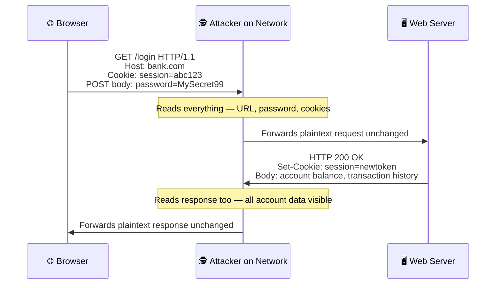
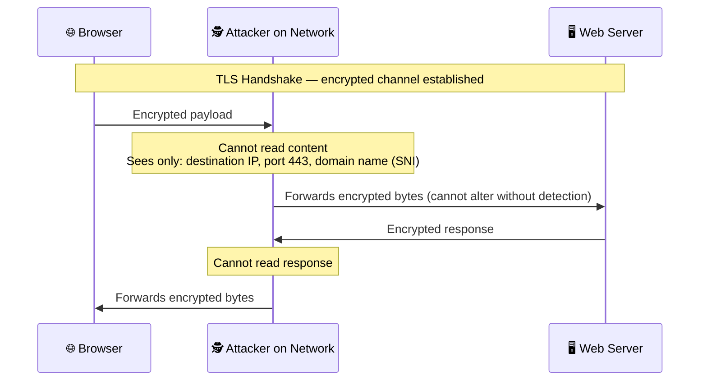
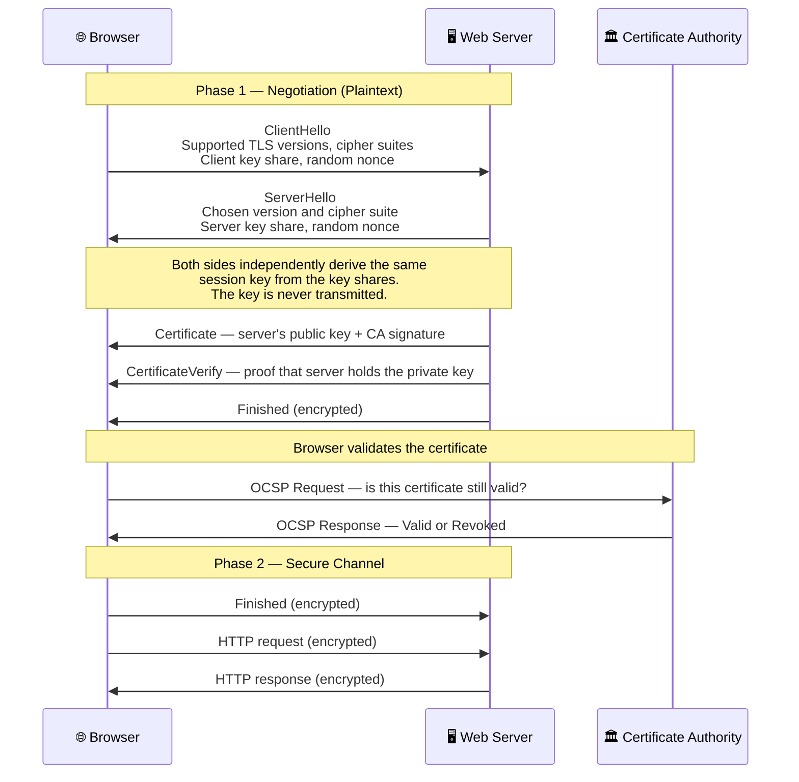
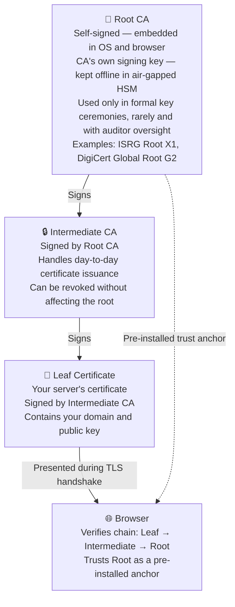

> 🤖 **Short on time?** Copy this into ChatGPT, Copilot, Gemini, or Claude for an instant summary — no need to read the whole thing:
>
> `Summarize this article in 5 bullet points with key takeaways, and flag anything a cloud/security architect should act on: https://blog.suubodhpatil.com/posts/how-https-actually-works/`
{: .prompt-tip }

> **Also worth reading:** From SSL 2.0 to TLS 1.3 · Post-Quantum Cryptography and TLS · Why TLS Private Keys Must Never Live on Your Web Server

---

## Executive Summary

- HTTPS combines three guarantees: confidentiality (data cannot be read in transit), integrity (data cannot be altered without detection), and authentication (you are communicating with the server you believe you are). Encryption without authentication is not HTTPS — it is encryption to an unknown party.
- The session key is **never transmitted** — both sides independently derive the same secret through Diffie-Hellman key exchange, providing forward secrecy when ephemeral keys are used.
- TLS 1.3 mandates forward secrecy and eliminates RSA key exchange — previously recorded sessions remain protected even if the server's long-term private key is later compromised.
- HTTPS does not hide the destination domain (visible via SNI in the ClientHello) or the destination IP address — systems with strict domain confidentiality requirements need controls beyond HTTPS.
- Compliance frameworks do not just ask "is HTTPS enabled?" — auditors check TLS versions, cipher suites, certificate chain validity, and explicit disablement of weak protocols.

---

## Introduction

The padlock icon in your browser is one of the most trusted symbols in computing — and one of the least understood. Before TLS, HTTP transmitted everything in plaintext: every request, every cookie, every password visible to anyone on the same network. In 2010, a Firefox extension called **Firesheep** made session hijacking a single click — no technical skill required. Hundreds of thousands of downloads in 24 hours forced major sites to move to HTTPS-by-default within months.

The business stakes go further than session security. Every major compliance framework — PCI DSS, GDPR, HIPAA, ISO 27001, RBI, MAS — mandates encryption in transit. Auditors don't just ask "do you use HTTPS?" They ask which TLS versions are enabled, which cipher suites are configured, whether certificates are properly chained, and whether weak protocols have been explicitly disabled. The padlock is the easy part. What sits behind it is a governance decision.

TLS solves three problems simultaneously: **confidentiality** (data cannot be read by an eavesdropper), **integrity** (data cannot be modified in transit without detection), and **authentication** (you are communicating with the server you believe you are). The third is the most critical and most overlooked. Encryption without authentication means sending a secret to *someone* — but you don't know who. Remove that binding and no amount of encryption prevents a man-in-the-middle attacker from silently reading and relaying your traffic.

This post builds the foundation: what the handshake actually does, how the session key is derived without ever being transmitted, what a certificate is and why the CA that signed it matters, and — critically — what HTTPS does not protect that engineers frequently assume it does.

---

## HTTP vs. HTTPS: The Difference in Practice

The simplest way to understand HTTPS is to see what happens with and without it.

**Plain HTTP — everything is visible:**

The attacker does not need to break any encryption. They simply read the traffic as it passes through any network hop between the browser and server.

**HTTPS — attacker is blind to the content:**

TLS operates as a layer between TCP and HTTP. The TCP connection is established first, then TLS negotiates on top of it, and HTTP runs inside that encrypted tunnel. The attacker can see *that* a connection happened and *which domain* was contacted — but nothing about the content.

---

## The TLS Handshake: Step by Step

Before any application data flows, the browser and server perform a handshake — a negotiation that authenticates the server, agrees on cryptographic algorithms, and establishes a shared session key. TLS 1.3 completes this in a single round trip — often under 100ms in low-latency environments, though cross-region connections may take considerably longer depending on network RTT.

A few things worth noting:

- **The `CertificateVerify` message is the identity proof.** The server signs a transcript of the handshake with its private key. Having the certificate alone is not enough to impersonate a server — the matching private key is required.
- **TLS 1.3 makes forward secrecy mandatory.** Each session uses a fresh ephemeral key pair. Compromising the server's private key today does not expose sessions recorded in the past. TLS 1.2 did not enforce this — whether forward secrecy applied depended entirely on which cipher suite was negotiated; RSA key exchange (still common in TLS 1.2 deployments) provided none.
- **OCSP stapling improves validation performance and privacy.** Rather than the browser making a separate round trip to the CA's OCSP responder during every handshake, the server pre-fetches and caches the CA's OCSP response and attaches (staples) it directly to the TLS handshake. This eliminates latency and prevents the CA from learning which sites a user visits.

### How the Session Key Is Derived — The Math Behind It

This is the part most TLS explanations skip. The session key is never transmitted — both sides independently arrive at the same secret through a mathematical trick called **Diffie-Hellman key exchange**, invented in 1976.

The elegant insight: two parties can compute the same shared secret using only **public values** — even if an attacker records every packet.

**Classic DH with small numbers:**

Both sides agree upfront on two public parameters — a large prime `p` and a generator `g`. These are not secret; anyone can see them. Each side then picks a private secret and computes a public value to share.

| Who | Action | Value |
|---|---|---|
| Both agree | Public parameters | `p = 23`, `g = 5` |
| Browser | Picks private secret `a` | `a = 6` (never shared) |
| Server | Picks private secret `b` | `b = 15` (never shared) |
| Browser → Server | Sends public value `A` | `A = g^a mod p = 5^6 mod 23 = 8` |
| Server → Browser | Sends public value `B` | `B = g^b mod p = 5^15 mod 23 = 19` |
| Browser derives shared secret | `K = B^a mod p` | `19^6 mod 23 = **2**` |
| Server derives shared secret | `K = A^b mod p` | `8^15 mod 23 = **2**` |
| Attacker sees on the wire | `p, g, A, B` only | `23, 5, 8, 19` — **cannot recover K** |

Both sides independently arrive at `K = 2` — without ever transmitting it. The security rests on the **Discrete Logarithm Problem**: given `g`, `p`, and `A = g^a mod p`, recovering `a` is computationally infeasible for large numbers. In production TLS, `p` is thousands of bits long.

**TLS 1.3 uses ECDH — the same idea, different math**

TLS 1.3 uses **Elliptic Curve Diffie-Hellman (ECDH)** rather than classical DH. The concept is identical — each side has a private scalar and exchanges a public point — but the underlying "hard problem" operates on elliptic curves rather than modular arithmetic. The practical benefit is dramatic: a 256-bit ECDH key provides equivalent security to a 3072-bit classical DH key.

The most common curves in TLS 1.3:
- **X25519** — the default for most modern TLS connections; fast and designed to resist side-channel attacks
- **P-256** (secp256r1) — NIST-standardized, widely supported
- **P-384** — used in high-assurance environments (government, regulated industries)

These are what the browser advertises in the `supported_groups` extension of the ClientHello, and what the server selects and returns in its own key share.

In TLS 1.3, this shared secret is mixed with the random nonces exchanged earlier to produce the final session keys used to encrypt HTTP traffic — but the core insight is already here: both sides arrive at the same secret without ever transmitting it.

**Why "ephemeral" is the critical word**

The private values `a` and `b` are generated fresh for each session and discarded immediately after. This is what makes the exchange *ephemeral* — and it is the source of forward secrecy. Old TLS 1.2 connections using RSA key exchange had no equivalent: the client encrypted the session key with the server's long-term RSA public key, so anyone who recorded past traffic and later obtained the private key could decrypt the entire historical archive. TLS 1.3 eliminated RSA key exchange entirely for this reason.

> **A note for the road ahead:** ECDH's security rests on the hardness of the elliptic curve discrete logarithm problem — a problem that a sufficiently powerful quantum computer can solve efficiently using Shor's algorithm. This is the mathematical foundation of the quantum threat to TLS, and the reason Post-Quantum Cryptography exists. More on this later in this series.

---

## Two Types of Encryption — and Why TLS Needs Both

The handshake and the data channel use fundamentally different types of encryption — each chosen for what it does best.

**Symmetric encryption** uses the same key to encrypt and decrypt. It is extremely fast — AES-256 can process gigabytes per second on modern hardware. The problem is key distribution: how do two parties who have never met securely share a key over an untrusted network? If you send the key over the wire before encryption is established, anyone intercepting the connection can read it.

**Asymmetric encryption** uses a mathematically linked key pair: a **public key** anyone can see, and a **private key** that never leaves the server. Data encrypted with the public key can only be decrypted with the private key. Think of the public key as a letterbox slot — anyone can post a message through it, but only the owner with the private key can open the box and read the contents. This solves the key distribution problem: two parties who have never met can establish a shared secret using only public information. The trade-off is performance — it is far too slow for encrypting large data streams.

TLS uses both in distinct roles. **ECDH handles key agreement** — both sides exchange public values and independently derive the same session key without ever transmitting it or using asymmetric encryption on it. **Asymmetric cryptography (RSA or ECDSA) handles authentication only** — the server signs the handshake transcript with its private key to prove it genuinely holds the certificate. **Symmetric encryption then handles all actual data**, using the derived session key. These three roles are separate: conflating key agreement with asymmetric encryption is one of the most common misconceptions about how TLS actually works.

---

## Certificates and the Chain of Trust

Before a client can trust a server's public key, it needs to verify that the key actually belongs to the server it believes it's connecting to. Anyone can generate a key pair and claim it belongs to `www.yourbank.com`. Certificates solve this identity problem.

A TLS certificate is a digitally signed document containing the domain name, the server's public key, the validity period, and a signature from a Certificate Authority. The CA's signature is the trust anchor: it means *"we have verified that this entity controls this domain, and we are vouching for this public key."*

Browsers and operating systems ship pre-installed with roughly 150 trusted **root Certificate Authorities** — organizations like DigiCert, Let's Encrypt, and Sectigo that have passed rigorous independent audits. The trust model is hierarchical: root CAs sign intermediate CAs, which issue the end-entity certificates your server presents. Root CA private keys are kept offline in HSMs and used rarely; if an intermediate CA is compromised, it can be revoked without touching the root.

A real-world chain makes this concrete. When your browser connects to a site secured by Let's Encrypt, the certificate chain it verifies looks like this:

| Level | Name | Signed by |
|---|---|---|
| Root CA | ISRG Root X1 | Self-signed — pre-installed in browsers and OS |
| Intermediate CA | Let's Encrypt R3 (or E1) | Signed by ISRG Root X1 |
| Leaf Certificate | your-domain.com | Signed by R3 — contains your server's public key |

The browser walks up this chain verifying each signature until it reaches ISRG Root X1 — which it already trusts because it was pre-installed. If any signature in the chain is invalid, the connection is rejected.

**One important clarification on whose keys are in those HSMs.** The HSMs shown above belong entirely to the Certificate Authority — DigiCert, Let's Encrypt, Sectigo. The private key stored offline is the CA's *own signing key*, used to sign intermediate CA certificates. It has nothing to do with your server's private key. When you obtain an SSL certificate, you generate your own key pair — the CA never sees your private key. Your certificate is simply the CA's signature on your public key and domain name. How and where you store your server's private key is entirely your responsibility — and one of the most underestimated security decisions in TLS deployments, which we will address directly in this series.

**What happens when this model breaks?** In 2011, **DigiNotar** — a Dutch CA — was breached by Iranian state actors. Fraudulent certificates were issued for Google, the CIA, Mossad, and hundreds of other domains, enabling undetectable MITM attacks. DigiNotar was removed from all browser trust stores within weeks and went bankrupt. One CA breach, and the trust model for every domain it had ever issued for collapsed.

**Governance implication:** CA selection is a third-party risk decision. **Certificate Authority Authorization (CAA) DNS records** restrict which CAs are permitted to issue certificates for your domain. Compliant CAs check CAA before issuing. It is one of the most underused controls in enterprise TLS management — a simple DNS entry that meaningfully reduces the blast radius of a CA compromise.

---

## What HTTPS Protects — and What It Doesn't

Many teams believe "we use HTTPS" fully answers security and compliance questions. It answers some. It does not answer all.

| What HTTPS **does** protect | What HTTPS **does not** protect |
|---|---|
| Request body (POST data, passwords, form fields) | **Destination domain** — visible via SNI in the ClientHello |
| Response body (page content, API responses) | **Destination IP address** — always visible in IP headers |
| HTTP headers (cookies, auth tokens, custom headers) | **Request volume and timing** — traffic analysis remains possible |
| URL path and query string (`/account?id=123`) | **Certificate** — fully public and visible to anyone |
| Session cookies and authorization tokens | **TLS metadata** — cipher suite, TLS version, certificate details |

**The SNI problem — your domain name is always visible**

When a browser initiates a TLS handshake, it sends the **Server Name Indication (SNI)** extension in the ClientHello — in plaintext, before any encryption is established. SNI is necessary so a server hosting multiple domains knows which certificate to present. The consequence: the domain you are visiting is visible to any network observer even over HTTPS.

**Encrypted Client Hello (ECH)** is an emerging TLS extension designed to encrypt the SNI and close this gap. As of 2026, ECH is supported in Chrome and Firefox and deployed at scale by Cloudflare, but server-side support remains limited and it is not yet a universal solution — most web servers and CDNs do not support it. DNS-over-TLS (DoT) and DNSSEC address the related problem of DNS query visibility — though these are separate topics worth their own discussion.

**Governance implication:** If your compliance requirement covers the confidentiality of destination domains — internal service URLs, confidential API endpoints, or applications where visiting the site is itself sensitive — HTTPS alone is insufficient. Private networking or ECH-capable infrastructure is required.

---

## A Note on Mutual TLS (mTLS)

Standard TLS authenticates only the server — any client can connect. **Mutual TLS (mTLS)** extends the handshake so both sides present certificates, mutually authenticating each other before any data flows. It is increasingly relevant for Zero Trust service-to-service communication, API security, and B2B connectivity. Both RBI and MAS reference mTLS in their API security guidance. It uses the same certificate infrastructure described above — the difference is simply that the client also holds a certificate issued by a mutually trusted CA.

---

## Key Takeaways

- TLS provides confidentiality, integrity, and authentication. All three are required — encryption without server authentication allows silent MITM attacks.
- The session key is never transmitted. Both sides derive it independently from the key exchange material, making passive packet capture insufficient to decrypt traffic.
- Certificates bind a server's public key to a verified domain identity. The CA's signature is the trust anchor — and CA compromise breaks the entire model for every domain that CA issued for. CAA DNS records limit this risk.
- TLS 1.3 makes forward secrecy mandatory — past sessions remain protected even if the private key is later compromised. In TLS 1.2, forward secrecy depended on cipher suite selection; RSA key exchange, still widely used, provided none.
- HTTPS does not hide the destination domain (SNI) or IP address. Systems with stricter confidentiality requirements need additional controls.
- Compliance frameworks require more than "HTTPS enabled" — specific TLS versions, cipher suites, and certificate lifecycle management are all in scope.

> **Open questions for the road ahead:** As quantum computing matures, will the asymmetric algorithms underlying TLS key exchange remain secure? And if the private key used in every TLS handshake is the root of all session trust — where exactly should that key live, and who should be able to access it? These questions drive the next posts in this series.

---

> 💡 **Pro Tip:** Run your domain through [Qualys SSL Labs](https://www.ssllabs.com/ssltest/) — it takes 60 seconds and produces a detailed grade covering TLS versions, cipher suites, certificate chain, and known vulnerabilities. An A grade is the minimum bar for any system handling sensitive data. A B or below is very likely a finding in a PCI DSS or ISO 27001 audit.

---

## References

- [RFC 8446 — The Transport Layer Security (TLS) Protocol Version 1.3](https://datatracker.ietf.org/doc/html/rfc8446)
- [NIST SP 800-52 Rev 2 — Guidelines for TLS Implementations](https://csrc.nist.gov/publications/detail/sp/800-52/rev-2/final)
- [PCI DSS v4.0 — Requirement 4.2: Protect PAN with Strong Cryptography During Transmission](https://www.pcisecuritystandards.org/)
- [OWASP Transport Layer Security Cheat Sheet](https://cheatsheetseries.owasp.org/cheatsheets/Transport_Layer_Security_Cheat_Sheet.html)
- [Qualys SSL Labs — SSL Server Test](https://www.ssllabs.com/ssltest/)
- [Let's Encrypt — How It Works](https://letsencrypt.org/how-it-works/)
- [Google Certificate Transparency](https://certificate.transparency.dev/)
- [Encrypted Client Hello — IETF Draft](https://datatracker.ietf.org/doc/draft-ietf-tls-esni/)

---

## Disclaimer

This content reflects independent technical analysis based on publicly documented standards, protocols, and security research as of the publication date. Protocol specifications and compliance requirements evolve — readers should verify current standards before making architectural or compliance decisions. This post does not represent the position of any employer, vendor, or standards body.
