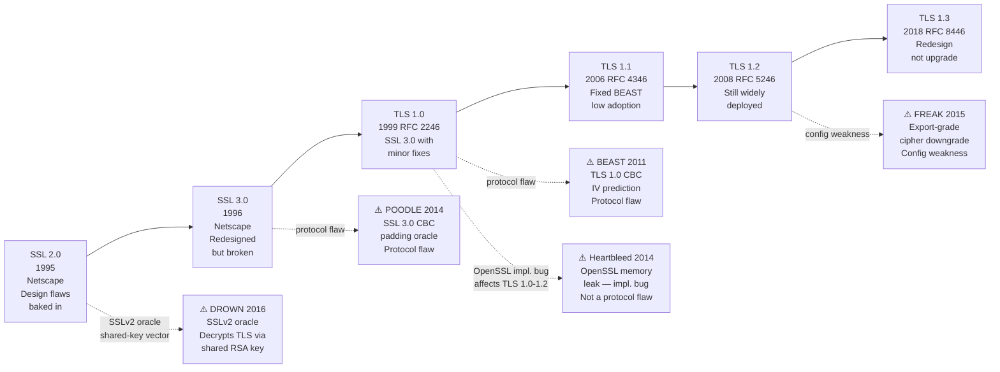
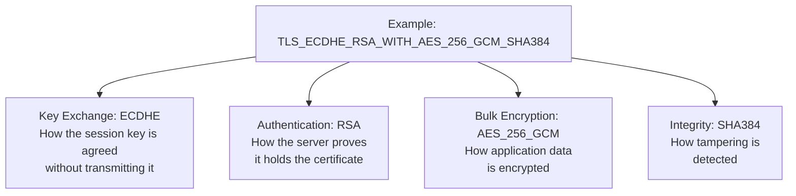
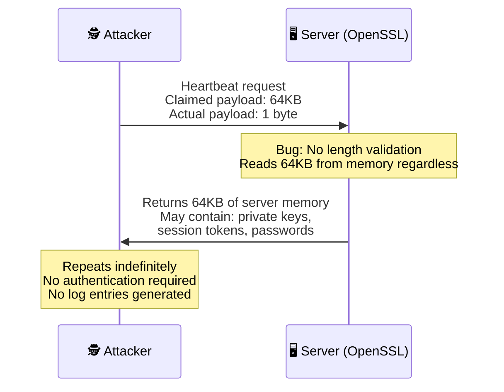
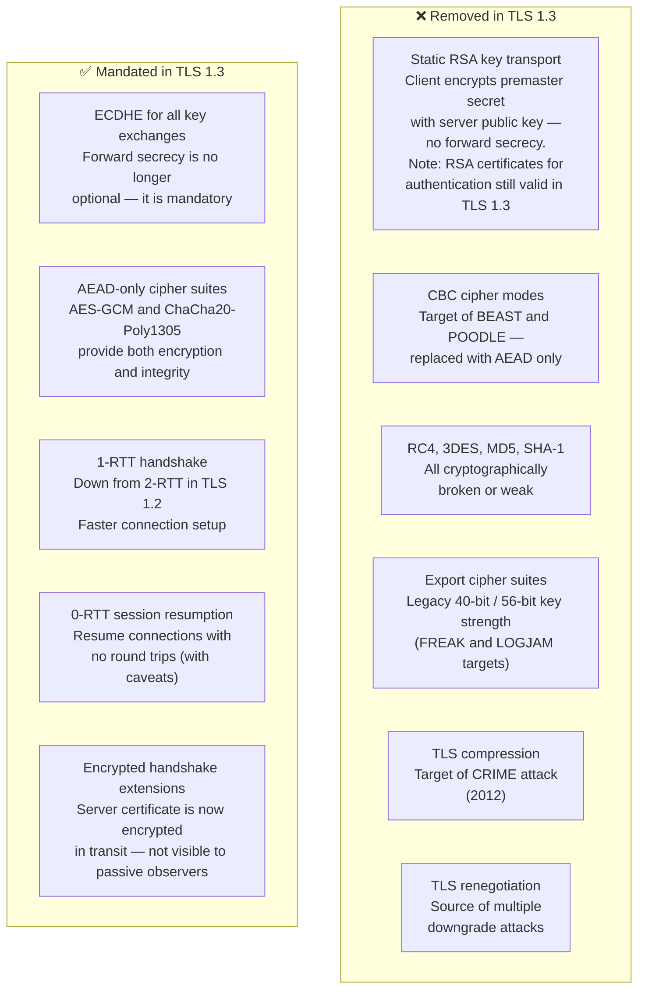

  

    📍
    📋
  

  

    
<strong>Short on time?</strong> Summarize this article with

    

      <select class="ai-selector-dropdown" id="ai-platform-select">
        <option value="">-- Select an AI --</option>
        <option value="claude">🤖 Claude</option>
        <option value="chatgpt">✨ ChatGPT</option>
        <option value="gemini">🔮 Gemini</option>
        <option value="perplexity">🌐 Perplexity</option>
        <option value="copilot">⚡ Copilot</option>
      </select>
    

    
Your prompt is copied automatically — just paste it once the AI opens.

  

> **Written for:** Security engineers, architects, and compliance leads responsible for TLS configuration and protocol governance.

> **Also worth reading:** [How HTTPS Actually Works](/posts/how-https-actually-works/) · Post-Quantum Cryptography and TLS · Why TLS Private Keys Must Never Live on Your Web Server

---

## Introduction

The protocol protecting your bank login today was built on top of one that could be broken in minutes. SSL 2.0, released by Netscape in 1995, was the foundation of web encryption for an era — and it had fundamental cryptographic flaws baked in from day one. The journey from SSL 2.0 to TLS 1.3 is not a story of incremental improvement. It is a 25-year record of vulnerabilities discovered, protocols patched, patches circumvented, and eventually a protocol redesigned from scratch because patching was no longer enough.

That history matters directly for governance. PCI DSS 4.0, fully mandatory since March 2025, explicitly prohibits SSL, TLS 1.0, and TLS 1.1. ISO 27001, HIPAA, and most financial regulators follow similar lines. Yet as of mid-2026, every major web server still supports TLS 1.2 — a protocol that is compliant but whose security depends entirely on how it is configured. The version number on your TLS deployment is the least important thing to check. The cipher suites behind it are where most organizations carry real risk.

This post traces the protocol's evolution, explains the vulnerabilities that drove each transition, and connects the technical history to the governance decisions organisations need to make today.

---

## The Protocol Timeline

The transition from SSL to TLS was not a clean break. Each version inherited structural decisions from the previous one, and each inherited version brought forward vulnerabilities that took years — sometimes decades — to fully eliminate.

---

## A Decade of Failures — SSL to TLS 1.1

### SSL 2.0 (1995): Flawed From the Start

SSL 2.0 shipped with multiple protocol-level design flaws: it used the same key for both message authentication and encryption, had no protection against cipher suite rollback (an attacker could force both sides to negotiate a weaker cipher without detection), and had weak MAC construction that was vulnerable to truncation attacks. It was deprecated by RFC 6176 in 2011 — but the damage it did architecturally carried forward for years because SSL 3.0 was built to maintain compatibility with it.

### SSL 3.0 and POODLE (1996 / 2014)

SSL 3.0 was a complete rewrite that fixed SSL 2.0's most obvious problems. It remained in widespread use for nearly two decades — which is why the **POODLE** attack (Padding Oracle On Downgraded Legacy Encryption, CVE-2014-3566) landed so hard when Google's security team disclosed it in October 2014.

POODLE exploited a weakness in how SSL 3.0 handled CBC mode padding. An attacker who could force a TLS connection to downgrade to SSL 3.0 — by injecting network errors to trigger fallback — could then use an oracle attack to decrypt the connection one byte at a time. In practice, this meant an attacker on the same network (hotel Wi-Fi, corporate LAN) could extract session cookies and hijack authenticated sessions.

**Business impact:** Session hijacking for any site still supporting SSL 3.0 fallback. The fix was to disable SSL 3.0 entirely — not patch it. Every major browser removed SSL 3.0 support within weeks of disclosure.

### TLS 1.0 and BEAST (1999 / 2011)

TLS 1.0 was essentially SSL 3.0 with minor modifications and a new name. It retained SSL 3.0's CBC mode implementation, using a predictable initialisation vector — the IV for each record was the last ciphertext block of the previous record. Security researchers had identified this as theoretically exploitable in 2002, but it was not demonstrated practically until 2011.

**BEAST** (Browser Exploit Against SSL/TLS, CVE-2011-3389) — disclosed by Juliano Rizzo and Thai Duong in September 2011 — showed that a man-in-the-middle attacker who could inject JavaScript into the victim's browser could exploit the predictable IV to perform a chosen-plaintext attack against CBC mode, eventually recovering plaintext such as session cookies.

TLS 1.1, released in 2006, fixed this by using random IVs — but TLS 1.1 saw almost no adoption, so TLS 1.0 with the BEAST vulnerability remained the dominant protocol for years after the fix existed.

**Business impact:** Session token theft against any TLS 1.0 connection where an attacker held a Man-in-the-Middle network position and could execute malicious client-side script in the victim's browser — delivered via an unencrypted HTTP advertisement, a malicious iframe, or a separate compromised page. XSS was not required; any mechanism to force the browser to send predictable plaintext to the HTTPS origin was sufficient. The attack required meaningful attacker capability, but in 2011 it was considered fully practical.

### TLS 1.1 (2006): The Fix Nobody Used

TLS 1.1 corrected the IV problem that enabled BEAST and added explicit IV generation. But browser vendors and server operators saw little reason to upgrade from TLS 1.0 — there was no obvious user-facing benefit, and compatibility concerns discouraged migration. TLS 1.1 was almost never deployed in isolation; it was treated as a fallback between TLS 1.0 and TLS 1.2, both of which saw far more implementation attention.

---

## Cipher Suites: The Hidden Configuration Problem

Understanding TLS vulnerabilities requires understanding cipher suites — because many of the attacks above were enabled not by protocol flaws alone, but by weak cipher suite configurations that protocols allowed and operators never disabled.

A cipher suite is a named combination of four cryptographic algorithms that together define how a TLS connection operates:

TLS 1.2 supports over 300 cipher suites — including many that should never be used. The most dangerous legacy suites that remained in wide use:

| Cipher Suite / Algorithm | Problem | Attack |
|---|---|---|
| `RC4` | Statistical biases in keystream | Plaintext recovery over many sessions |
| `3DES` (Triple-DES) | 64-bit block size — birthday collision reachable after ~32GB of data encrypted under the same key (not a key length flaw) | SWEET32 (birthday attack, CVE-2016-2183) |
| `NULL` ciphers | No encryption at all | Trivial interception |
| `EXPORT` suites | 40-bit/56-bit keys (US 1990s export rules) | FREAK (CVE-2015-0204), LOGJAM (CVE-2015-4000) |
| `RSA` key exchange | No forward secrecy | Historical session decryption if key later compromised |
| Anonymous DH (`ADH`) | No server authentication | MITM with no certificate required |

**The governance implication is critical:** A server running TLS 1.2 with strong cipher suites is meaningfully different from a server running TLS 1.2 with weak cipher suites — even though both report "TLS 1.2" in a version check. Compliance scanners that only verify protocol version will miss this. PCI DSS 4.0 Requirement 4.2.1 is explicit: inventory of all cipher suites in use is required, and weak suites must be disabled regardless of TLS version.

---

## Heartbleed: When the Bug Is in the Library

Not all TLS vulnerabilities are protocol flaws. **Heartbleed** (CVE-2014-0160), disclosed in April 2014, was a memory safety bug in OpenSSL — the library that powered roughly two-thirds of HTTPS servers at the time.

The OpenSSL heartbeat extension (RFC 6520) allows either party to send a "heartbeat" request — a small payload — and expect it echoed back, confirming the connection is still alive. OpenSSL's implementation failed to validate that the response buffer was sized to match the request. An attacker could send a heartbeat request claiming a large payload length while sending almost nothing — and OpenSSL would read and return up to 64KB of adjacent server memory.

What could be in those 64KB? The server's **TLS private key**. Session tokens. Passwords submitted by other users. Any data that happened to be in memory at the time. The attack required no authentication, left no log entries, and could be repeated indefinitely.

**Business impact:** Heartbleed affected an estimated 500,000+ HTTPS servers. Private key compromise meant any historical TLS traffic recorded by an adversary could potentially be decrypted (for non-PFS cipher suites). Certificates had to be revoked and reissued, sessions invalidated, and passwords reset — all simultaneously, across millions of sites.

**Governance lesson:** Heartbleed was not a protocol vulnerability — it was a patch management and dependency governance failure. Organisations that had no inventory of which services ran which OpenSSL version could not respond quickly. Those that did responded in hours. Software composition analysis and dependency tracking, treated as developer tooling, are in practice critical security controls.

---

## Why TLS 1.2 Is Still Everywhere

TLS 1.2 was released in 2008 and remains the most widely deployed TLS version. As of mid-2026, 100% of major websites still support it — even as TLS 1.3 reaches ~75% server-side adoption. This is not negligence. It reflects real operational constraints:

- **Legacy clients:** Older browsers, embedded devices, enterprise applications, and third-party integrations often cannot negotiate TLS 1.3. Dropping TLS 1.2 breaks connectivity for a real segment of users and partners.
- **Compliance baseline:** PCI DSS 4.0 permits TLS 1.2 with strong cipher suites. Organisations that have invested in hardened TLS 1.2 configurations are compliant — there is no immediate regulatory pressure to migrate.
- **Operational complexity:** Certificate and TLS configuration management at scale is non-trivial. Many organisations prioritise stability over upgrading to a newer protocol they have not tested thoroughly.

TLS 1.2 is compliant — but it requires active, ongoing cipher suite management to stay that way. Left unmanaged, a TLS 1.2 deployment drifts: legacy cipher suites remain enabled, weak configurations accumulate, and what was once hardened becomes a finding. The organisations that get caught by PCI DSS TLS findings are rarely running TLS 1.0 — they are running TLS 1.2 with 3DES or RSA key exchange still enabled.

---

## TLS 1.3: A Redesign, Not an Upgrade

TLS 1.3 (RFC 8446, 2018) was not built by patching TLS 1.2. It was a ground-up redesign guided by a clear principle: **remove everything that had ever been a vulnerability, and make the safe configuration the only configuration**.

**The forward secrecy point deserves emphasis.** In TLS 1.2 with RSA key exchange, the client encrypted the session key with the server's public key. Anyone who recorded that traffic and later obtained the private key could decrypt the entire historical session archive. In TLS 1.3, ephemeral ECDHE is mandatory for every session — session keys are derived and discarded, never stored, never recoverable even with the server's private key. This is not an option you configure; it is the only mode that exists.

A common point of confusion worth clarifying: **TLS 1.3 removed static RSA key transport — it did not remove RSA certificates.** Servers running TLS 1.3 can still present RSA 2048 or RSA 4096 certificates; RSA is used for the server's digital signature (RSASSA-PSS) during authentication, which is a different operation entirely. What TLS 1.3 removed is the mechanism where the client encrypts the pre-master secret with the server's RSA public key and sends it over the wire. If you are planning a TLS 1.3 migration, you do not need to replace RSA certificates — you need to ensure your key exchange is ECDHE, which TLS 1.3 mandates automatically.

**The cipher suite simplification is equally significant for governance.** TLS 1.2 offered over 300 cipher suites. TLS 1.3 offers five — all of them strong, all of them using AEAD construction. An organisation running TLS 1.3 cannot accidentally enable RC4 or 3DES. The secure configuration is not a choice you make; it is the default you inherit.

> **Wire compatibility note:** On the wire, TLS 1.3 deliberately sets the `ClientHello` version field to `0x0303` (TLS 1.2) and carries the actual version negotiation inside the `supported_versions` extension. This was intentional — many legacy firewalls and deep packet inspection appliances rejected `ClientHello` messages advertising versions above TLS 1.2, breaking connections before they started. TLS 1.3 is architecturally a redesign; on the wire it disguises itself as TLS 1.2 to get through these middleboxes.

### A Note on 0-RTT Resumption

TLS 1.3's 0-RTT resumption allows a client to send application data in the very first message of a resumed connection, before any handshake completes. This is significant for performance — particularly for latency-sensitive applications. The caveat is **replay vulnerability**: 0-RTT data can be replayed by an attacker who captures it. It is appropriate for idempotent requests (GET operations, non-sensitive reads) and should not be used for state-changing operations (POST, payments, authentication). Most TLS implementations leave 0-RTT disabled by default for this reason.

---

## The Governance View: What Auditors Actually Check

The protocol history above maps directly to what compliance frameworks require today:

| Protocol / Feature | PCI DSS 4.0 | NIST SP 800-52 Rev 2 | ISO 27001 | Status |
|---|---|---|---|---|
| SSL 2.0 / SSL 3.0 | ❌ Prohibited | ❌ Not permitted | ❌ Non-compliant | Disable immediately |
| TLS 1.0 / TLS 1.1 | ❌ Prohibited | ❌ Not permitted | ❌ Non-compliant | Disable immediately |
| TLS 1.2 (weak ciphers) | ❌ Non-compliant | ❌ Not permitted | ❌ Non-compliant | Disable weak suites |
| TLS 1.2 (strong ciphers) | ✅ Compliant minimum | ✅ Acceptable | ✅ Acceptable | Requires cipher management |
| TLS 1.3 | ✅ Preferred | ✅ Preferred | ✅ Preferred | Deploy and enforce |

Auditors checking TLS posture do not just run a protocol version scan. They check whether TLS 1.0/1.1 are disabled, whether weak cipher suites remain enabled in TLS 1.2, whether RSA key exchange is still offered, whether 3DES appears in the cipher list, and whether certificates use SHA-1 or MD5 signatures. A server that passes a version check but fails a cipher audit is a finding.

The fastest way to see your actual posture: Qualys SSL Labs produces a full cipher suite audit in 60 seconds and flags every one of the above issues explicitly.

---

## Key Takeaways

- Every major TLS version existed because the previous one was broken — SSL 3.0 (POODLE), TLS 1.0 (BEAST), TLS 1.1 (minimal adoption), TLS 1.2 (weak ciphers, Heartbleed). Understanding why each version exists explains what risks remain if it is still in use.
- Cipher suite configuration matters more than TLS version alone. A TLS 1.2 deployment with RSA key exchange and 3DES enabled is a compliance finding regardless of version. PCI DSS 4.0 requires an inventory of all cipher suites in use.
- Heartbleed was a patch management failure as much as a cryptographic one. Organisations without software composition visibility could not respond in time. Dependency tracking is a security control, not just a development convenience.
- TLS 1.3 makes the secure configuration the only configuration — five cipher suites, all strong, mandatory forward secrecy, no legacy modes. The governance burden of maintaining a hardened TLS configuration drops significantly once TLS 1.3 is enforced.
- As of mid-2026, TLS 1.3 has ~75% server-side adoption among major websites, but 100% of those sites still support TLS 1.2. Backward compatibility is the reason — but it means the cipher suite audit remains relevant for every deployment.

> **Looking ahead:** TLS 1.3 with strong ECDHE cipher suites is the best version of classical TLS we have. The question now is whether "classical" is good enough — because the mathematics underlying ECDHE can be broken by a quantum computer running Shor's algorithm. That threat, and what the industry is doing about it, is the subject of the next post in this series.

---

> 💡 **Pro Tip:** When auditing your TLS posture, run two checks, not one. First, check protocol versions (ensure TLS 1.0/1.1/SSL are disabled). Second — and more importantly — check cipher suites: look for RSA key exchange, 3DES, RC4, or NULL ciphers in your TLS 1.2 configuration. Most organisations pass the first check and fail the second. Qualys SSL Labs flags both in a single report.



---

## References

- [RFC 8446 — TLS 1.3](https://datatracker.ietf.org/doc/html/rfc8446)
- [RFC 8996 — Deprecating TLS 1.0 and TLS 1.1](https://datatracker.ietf.org/doc/html/rfc8996)
- [CVE-2014-3566 — POODLE](https://nvd.nist.gov/vuln/detail/CVE-2014-3566)
- [CVE-2011-3389 — BEAST](https://nvd.nist.gov/vuln/detail/CVE-2011-3389)
- [CVE-2014-0160 — Heartbleed](https://nvd.nist.gov/vuln/detail/CVE-2014-0160)
- [CVE-2016-0800 — DROWN](https://nvd.nist.gov/vuln/detail/CVE-2016-0800)
- [PCI DSS v4.0 — Requirement 4.2](https://www.pcisecuritystandards.org/)
- [NIST SP 800-52 Rev 2 — Guidelines for TLS Implementations](https://csrc.nist.gov/publications/detail/sp/800-52/rev-2/final)
- [Qualys SSL Labs — SSL Pulse](https://www.ssllabs.com/ssl-pulse/)

---

## Disclaimer

This content reflects independent technical analysis based on publicly documented standards, protocols, and security research as of the publication date. Protocol specifications, compliance requirements, and adoption statistics evolve — readers should verify current documentation before making architectural or compliance decisions. This post does not represent the position of any employer, vendor, or standards body.
