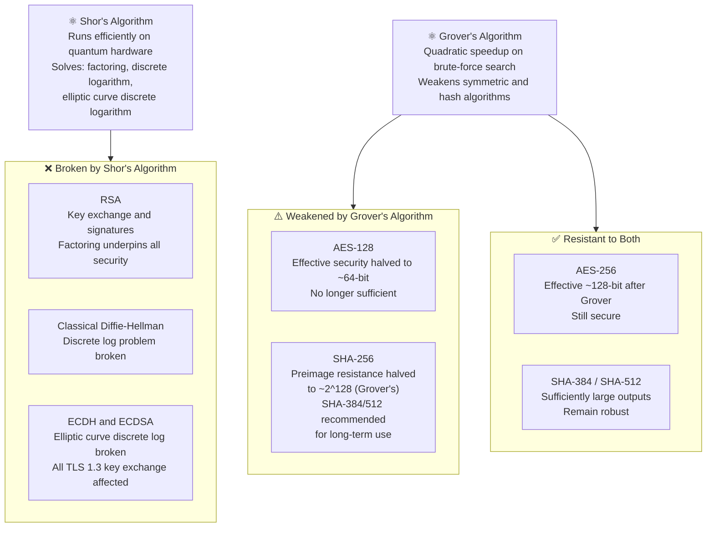
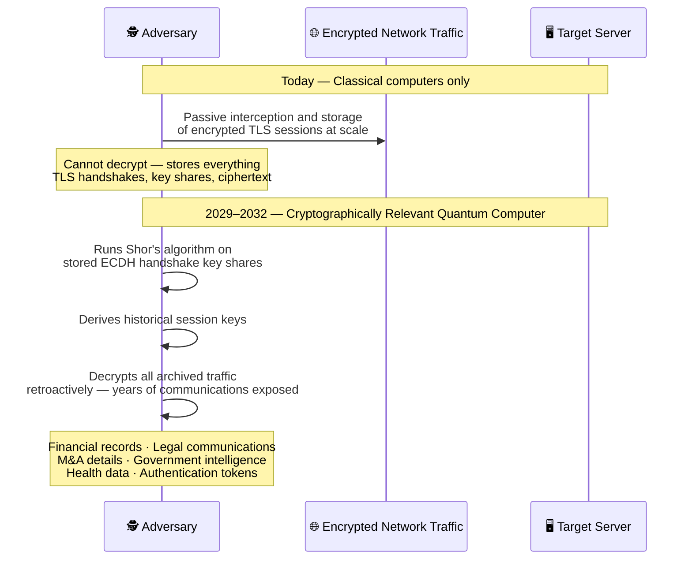
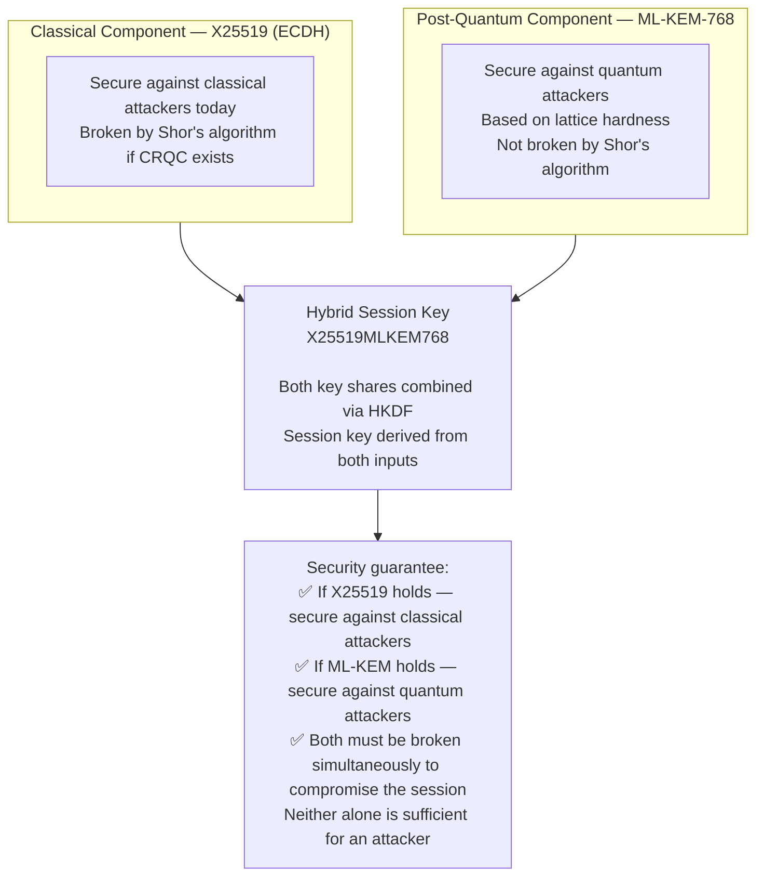
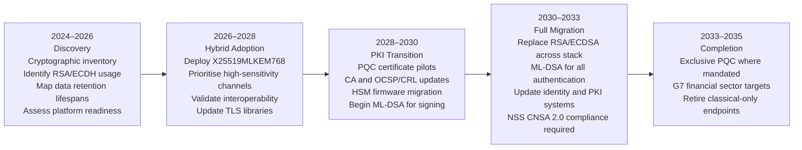

  

    📍
    📋
  

  

    
<strong>Short on time?</strong> Summarize this article with

    

      <select class="ai-selector-dropdown" id="ai-platform-select">
        <option value="">-- Select an AI --</option>
        <option value="claude">🤖 Claude</option>
        <option value="chatgpt">✨ ChatGPT</option>
        <option value="gemini">🔮 Gemini</option>
        <option value="perplexity">🌐 Perplexity</option>
        <option value="copilot">⚡ Copilot</option>
      </select>
    

    
Your prompt is copied automatically — just paste it once the AI opens.

  

> **Written for:** Security architects, CISOs, and engineers responsible for TLS infrastructure and cryptographic migration planning.

> **Also worth reading:** [How HTTPS Actually Works](/posts/how-https-actually-works/) · [From SSL 2.0 to TLS 1.3](/posts/ssl-to-tls-evolution-of-secure-communication/) · Why TLS Private Keys Must Never Live on Your Web Server

---

## Introduction

TLS 1.3 is the strongest version of the web's encryption protocol. Mandatory forward secrecy, no legacy cipher suites, a streamlined handshake built from scratch — it represents the best that classical cryptography has produced for securing internet communications. And it may not be enough.

The threat is not hypothetical and it is not in the future. Adversaries — nation-states among them — are collecting encrypted traffic today, storing it, and waiting for quantum computers powerful enough to break the mathematics underneath TLS. The attack is called **Harvest Now, Decrypt Later**, and it is active right now against any organisation whose data has long confidentiality requirements: financial records, legal communications, M&A negotiations, health data, government intelligence.

Recent research published between May 2025 and March 2026 has significantly shortened the estimated timeline. The qubits required to break RSA-2048 have been revised down from approximately 20 million to under one million in some architectural proposals. The median expert estimate for a cryptographically relevant quantum computer now sits around **2030**, with a credible threat window of 2029 to 2032.

NIST finalised its first post-quantum cryptographic standards in August 2024. Hybrid TLS deployments combining classical and quantum-resistant key exchange are already in production — Cloudflare reported that over a third of human HTTPS traffic already used hybrid post-quantum handshakes by March 2025. Microsoft shipped hybrid post-quantum key exchange directly into Windows Schannel in July 2025.

This is not a future problem for a future team. It is an active governance decision with a compliance deadline attached.

---

## Why Classical Cryptography Has an Expiry Date

To understand the quantum threat, you need to understand what makes classical cryptography work — and specifically what makes it hard to break.

RSA security rests on the difficulty of **factoring large numbers**: given a product of two large primes, find the primes. ECDH security rests on the **elliptic curve discrete logarithm problem**: given a point on a curve, find the scalar that generated it. Both problems are computationally infeasible for classical computers at the key sizes used in production — RSA-2048, P-256, X25519.

In 1994, mathematician Peter Shor published an algorithm that runs efficiently on quantum hardware and can solve both problems. A sufficiently powerful quantum computer running Shor's algorithm could factor RSA-2048 or compute ECDH private keys in hours or minutes. Every asymmetric cryptographic system currently used in TLS — for key exchange and server authentication — is broken by this algorithm.

The critical insight for TLS: **AES-256 survives.** Symmetric encryption — the algorithm protecting the actual data in a TLS session — is resistant to quantum attacks at current key sizes. The vulnerability is entirely in the **key exchange and authentication** components: ECDH (how the session key is derived) and RSA/ECDSA (how the server proves its identity). These are the two parts of TLS that post-quantum cryptography must replace.

### What Exactly Breaks: The Math You Already Know

If you read [How HTTPS Actually Works](/posts/how-https-actually-works/), you saw this Diffie-Hellman table:

| Who | Action | Value |
|---|---|---|
| Both agree | Public parameters | `p = 23`, `g = 5` |
| Browser | Picks private secret `a` | `a = 6` — never shared, never transmitted |
| Server | Picks private secret `b` | `b = 15` — never shared, never transmitted |
| Browser → Server | Sends public value `A` | `A = g^a mod p = 5^6 mod 23 = 8` |
| Server → Browser | Sends public value `B` | `B = g^b mod p = 5^15 mod 23 = 19` |
| Both independently derive | Session key `K` | `K = 2` — never transmitted |
| **Attacker sees on the wire** | `p, g, A, B` only | `23, 5, 8, 19` — **cannot recover K** |

The last row is the security claim. An attacker who captures `p=23`, `g=5`, `A=8` cannot find `a=6` — because reversing `A = g^a mod p` to find `a` is the **Discrete Logarithm Problem**. For 2048-bit numbers, a classical computer trying values one at a time would take longer than the age of the universe.

**Shor's algorithm breaks this assumption directly.**

A classical computer searches sequentially: `5^1 mod 23 = 5`, `5^2 mod 23 = 2`, `5^3 mod 23 = 10`... testing candidates one at a time through an exponentially large space. A quantum computer running Shor's algorithm exploits **quantum superposition** to evaluate `g^x mod p` for *all possible values of x simultaneously* in a single computation. It then uses **quantum interference** — constructive interference amplifying the correct answer, destructive interference cancelling the wrong ones — to extract the period of that function, which directly reveals `a`.

For the numbers in Blog 1: `a = 6` is found immediately. For RSA-2048: what takes a classical computer longer than the age of the universe takes a quantum computer hours.

**What the attacker now recovers — using the exact same table:**

| What attacker captures | Classical computer | Quantum computer (Shor's) |
|---|---|---|
| `p=23, g=5, A=8` (public, on the wire) | Cannot find `a` — infeasible | Finds `a = 6` efficiently |
| Armed with `a = 6` | — | Computes `K = B^a mod p = 19^6 mod 23 = **2**` |
| Session key `K = 2` known | — | Decrypts every byte of the TLS session |

The private secret `a` that never left the browser — the value that was never transmitted — is now computable from public values alone. The session key is no longer secret.

**The same break applies to ECDH in TLS 1.3.**

TLS 1.3 uses elliptic curve points instead of modular arithmetic, but the security assumption is identical: given the public key share `A = a·G` (where `G` is the curve's generator point), finding the scalar `a` is the **Elliptic Curve Discrete Logarithm Problem (ECDLP)**. Shor's algorithm, adapted for elliptic curves, solves this too.

The critical detail for HNDL: in TLS 1.3, both the browser's key share and the server's key share are sent in the ClientHello and ServerHello — **in plaintext**, before any encryption is established. An attacker recording a TLS 1.3 session today captures everything Shor's algorithm needs: the curve parameters, both public key shares. Once a cryptographically relevant quantum computer exists, those stored key shares yield the session key, and every byte of that session's application data becomes readable retroactively.

This is the mathematical foundation of Harvest Now, Decrypt Later.

---

## Harvest Now, Decrypt Later — The Threat Active Today

Quantum computers powerful enough to break production TLS do not yet exist. That does not mean your encrypted communications are safe today.

**Harvest Now, Decrypt Later (HNDL)** is the strategy of collecting and archiving encrypted traffic now, at scale, and decrypting it retroactively once quantum computing capability exists. The attacker does not need to break the encryption today. They simply need to be patient.

The US, China, and Russia all operate signals intelligence programs collecting encrypted communications at scale. This is documented, not speculative. A 2020 BGP hijacking incident redirected traffic from Google, Amazon, Facebook, and over 200 other networks through Russia — traffic collection events consistent with HNDL strategy.

**Who carries real risk today:**

The HNDL threat is not uniform. It is calibrated to data confidentiality lifespans. Ask: *how long does the data I am transmitting today need to remain confidential?*

| Sector | Data type | Confidentiality requirement | HNDL risk |
|---|---|---|---|
| Financial services | M&A negotiations, trading strategies | 5–15 years | High |
| Legal | Privileged communications, litigation strategy | 7–30 years | High |
| Healthcare | Patient records | 20+ years (HIPAA retention) | High |
| Government / Defence | Intelligence, operational plans | Indefinitely classified | Critical |
| General enterprise | Session tokens, user passwords | Rotated frequently | Lower |

If data you transmit today needs to remain confidential until 2032 or beyond, the HNDL threat is active against you right now — even if quantum computers do not yet exist.

---

## The Quantum Timeline: When Does This Become Real?

Expert estimates have converged on a clearer picture than existed even two years ago. Three research papers published between May 2025 and March 2026 significantly reduced the estimated qubit count required to break RSA-2048 — from approximately 20 million qubits to under one million in some architectural proposals, with one approach suggesting as few as 100,000 qubits.

The consensus from intelligence agencies, standards bodies, and academic research:

- **Credible threat window:** 2029–2032
- **Median expert estimate:** ~2030 for a cryptographically relevant quantum computer (CRQC)
- **NSA assessment:** new national security system acquisitions must support CNSA 2.0 (quantum-resistant algorithms) from January 1, 2027
- **G7 Cyber Expert Group (January 2026):** targets critical financial system migration by 2030–2032, full transition by 2035

Given that cryptographic migrations at enterprise scale — replacing PKI, updating TLS configurations, obtaining PQC-capable certificates, updating HSMs — take three to five years, organisations that begin planning in 2027 or 2028 are starting too late. The window for an orderly migration is now.

---

## NIST PQC Standardisation: The Foundation Is Set

In August 2024, NIST published three finalised post-quantum cryptographic standards — the culmination of a seven-year public evaluation process that began in 2016:

| Standard | Algorithm | Function | Security basis |
|---|---|---|---|
| **FIPS 203** | ML-KEM (Kyber) | Key encapsulation — replaces ECDH | Module Learning With Errors (MLWE) |
| **FIPS 204** | ML-DSA (Dilithium) | Digital signatures — replaces RSA/ECDSA | Module Learning With Errors (MLWE) |
| **FIPS 205** | SLH-DSA (SPHINCS+) | Digital signatures — hash-based alternative | Hash function properties only |

In 2025, NIST additionally selected **HQC** for standardisation as a second key encapsulation mechanism — providing algorithmic diversity in case a weakness is found in ML-KEM.

**Why these algorithms?** They are based on mathematical problems — primarily lattice problems (Learning With Errors) — that are believed to be hard for both classical and quantum computers. Unlike RSA and ECDH, no efficient quantum algorithm is known to solve these problems. The "believed to be" qualifier matters: these algorithms are new, and years of cryptanalysis still lie ahead. That is precisely why hybrid deployment is the recommended approach.

---

## PQC in TLS: Hybrid Key Exchange

The immediate deployment of PQC in TLS does not replace classical algorithms — it adds them alongside. This is the **hybrid approach**, and it is already in production.

The hybrid named group **X25519MLKEM768** is the primary deployment today. The browser sends both an X25519 key share and an ML-KEM-768 key share in the ClientHello. The server responds with both. Session keys are derived from both inputs combined — meaning an attacker must break both simultaneously to compromise the session.

> **ML-KEM-768 vs ML-KEM-1024:** ML-KEM-768 targets NIST Security Category 3 (~192-bit classical security equivalent) and is the standard for commercial internet traffic. NSA CNSA 2.0 mandates **ML-KEM-1024** (NIST Security Category 5 / ~256-bit level) for national security systems — a higher bar than X25519MLKEM768 provides. If your environment is governed by CNSA 2.0, X25519MLKEM768 is not sufficient; you need an ML-KEM-1024 hybrid group.

**Current adoption (mid-2026):**
- Cloudflare Radar: PQ-capable client traffic exceeded 60% in February 2026
- Chrome: PQ hybrid enabled by default since April 2024
- Firefox: PQ hybrid enabled by default since November 2024
- Apple (Safari/iOS): PQ support since October 2025
- Windows Schannel: ML-KEM hybrid configurable since July 2025
- AWS KMS, ACM, Secrets Manager: ML-KEM TLS now supported

This is not lab-stage technology. It is shipping in production infrastructure.

---

## What Is Not Ready Yet

Despite the progress above, significant gaps remain — and understanding them is essential for any migration plan.

**PKI and Certificates:** Current X.509 certificates use RSA or ECDSA signatures. Post-quantum certificates using ML-DSA do not yet have broad CA support, browser trust store integration, or OCSP/CRL infrastructure. The hybrid TLS deployments above use PQC for *key exchange only* — the certificate and server authentication chain remains classical. Full PQC migration requires updating the entire certificate lifecycle.

**Hardware Security Modules:** Most commercial HSMs — including many cloud-managed HSMs — do not yet support ML-KEM or ML-DSA key operations natively. HSM firmware updates are complex, validation timelines (FIPS 140-3) are long, and some older HSM hardware may not support PQC algorithms at all. This creates a specific constraint for organisations using HSMs for TLS private key protection.

**ClientHello packet bloat and fragmentation:** ML-KEM-768 public keys are 1,184 bytes — compared to 32 bytes for X25519. A hybrid ClientHello carrying both key shares, plus standard TLS extensions, easily exceeds the typical TCP Maximum Segment Size of ~1,460 bytes, forcing IP fragmentation or multi-record ClientHellos. Legacy middleboxes — firewalls, deep packet inspection engines, and some load balancers — frequently drop fragmented ClientHellos silently, causing handshake failures with no clear error. Testing hybrid PQC in enterprise network environments requires explicit validation against in-path network devices, not just client-server endpoint testing.

**TLS 1.3 0-RTT Early Data:** If your application uses TLS 1.3 0-RTT resumption via Pre-Shared Keys (PSK), the 0-RTT data is encrypted using a secret derived from the *previous* session — not the current handshake. If that previous session's key exchange was classical (pre-hybrid PQC), the PSK material carries the HNDL risk regardless of whether the new session negotiates X25519MLKEM768. Enabling 0-RTT on TLS channels handling sensitive data requires verifying that the entire PSK chain back to session establishment used quantum-resistant key exchange — not just the current connection.

**Platform support gaps:**

| Platform | PQC Hybrid TLS | PQC Certificates | Notes |
|---|---|---|---|
| Chrome / Firefox | ✅ Production | ❌ Not yet | Key exchange only |
| Windows Schannel (IIS) | ⚠️ Configurable (July 2025) | ❌ Not yet | Requires explicit config |
| OpenSSL / NGINX | ⚠️ Experimental | ❌ Not yet | Not production-default |
| Azure AG / AFD | ❌ Not supported | ❌ Not supported | No roadmap announced |
| AWS ALB / CloudFront | ⚠️ In progress | ❌ Not yet | Limited preview |
| HSMs (general) | ❌ Most not supported | ❌ Not supported | Firmware dependency |

The implication: organisations cannot buy post-quantum readiness as a single product today. Migration requires a platform-by-platform assessment, a prioritised sequencing plan, and a multi-year execution commitment.

---

## Crypto Agility: The Governance Response

Post-quantum migration is not a project with a start date and a go-live. It is a multi-year capability shift. The organisations that navigate it successfully will be those that treat **crypto agility** — the ability to swap cryptographic algorithms without re-architecting systems — as a design principle rather than a retrofit.

**Regulatory reference points:**
- **NSA CNSA 2.0:** New national security system acquisitions must support ML-KEM-1024 and ML-DSA-87 from January 1, 2027. Exclusive use by 2033–2035.
- **G7 Cyber Expert Group (January 2026):** Critical financial systems targeted for migration by 2030–2032, full transition by 2035.
- **NIST IR 8547:** Provides migration guidance and deprecation timelines for classical algorithms.
- **EU / NCSC / ANSSI:** Member states expected to publish national PQC strategies and begin cryptographic inventories by end of 2026.

**The practical starting point is a cryptographic inventory.** Most organisations do not know which systems use RSA key exchange, which certificates use ECDSA, or which internal APIs negotiate TLS 1.2 with RSA key exchange. Without that inventory, there is no basis for prioritising the migration. Tools for automated cryptographic discovery — scanning TLS handshakes, code analysis, dependency mapping — are the first investment worth making.

---

## Why This Raises the Stakes on Private Key Protection

Post-quantum cryptography addresses the quantum threat to session confidentiality — by replacing the vulnerable key exchange algorithms. But there is a complementary threat that quantum computers make more urgent, not less.

Consider this scenario: your server's TLS private key was exfiltrated in 2024 — copied from disk, extracted from a compromised backup, or leaked through a misconfigured secrets management system. You do not know this happened.

**In a classical world:** The stolen private key enables impersonation of your server through forged handshakes and MITM attacks. In TLS 1.3 with PFS, it does not expose past sessions directly. Serious, but bounded.

**In a quantum world:** The adversary who holds your private key can also retroactively compute session keys from any recorded TLS 1.2 (RSA key exchange) traffic they collected. And for TLS 1.3 sessions, they can MITM future connections invisibly — because your certificate still validates against your stolen private key, and your replacement PQC certificate has not yet been deployed.

The transition to post-quantum TLS requires that your private keys — both classical and eventually PQC — are trustworthy. A key that was ever on disk and potentially exfiltrated cannot be trusted as the root of a quantum-safe posture. **An HSM-bound non-exportable private key — one that physically cannot be removed from the HSM — closes this vector entirely.** No exfiltration means no "harvest the key" attack, no retroactive decryption risk, and a clean foundation for the PQC migration.

> The quantum threat to TLS session security is being addressed through hybrid key exchange. The quantum threat amplifier — a private key that could have been harvested years ago — is addressed by ensuring that private key was never exportable in the first place. That is the subject of the next post.

---

## Key Takeaways

- Shor's algorithm breaks RSA, classical DH, and ECDH/ECDSA — the exact algorithms underlying TLS key exchange and server authentication in TLS 1.3. AES-256 is resistant.
- Harvest Now, Decrypt Later is an active threat today. Adversaries collecting encrypted traffic now can decrypt it retroactively once quantum computing capability exists. Organisations with data retention requirements exceeding 2030 are already in the threat window.
- NIST finalised ML-KEM (FIPS 203), ML-DSA (FIPS 204), and SLH-DSA (FIPS 205) in August 2024. The standards foundation for post-quantum migration is complete.
- Hybrid TLS (X25519MLKEM768) is in production — Chrome, Firefox, Cloudflare, AWS, and Windows Schannel all support it. Key exchange is quantum-resistant today for those platforms. Certificate authentication remains classical.
- The credible CRQC window is 2029–2032. NSA mandates CNSA 2.0 compliance for new national security system acquisitions from January 2027. G7 targets critical financial systems by 2030–2032.
- Crypto agility — the ability to swap algorithms without re-architecting — is the design principle that determines whether organisations can execute this migration in time.
- PQC migration assumes trustworthy private keys. A key that may have been exfiltrated years ago undermines the entire quantum-safe posture. HSM-bound non-exportable keys are the foundation.

---

> 💡 **Pro Tip:** Start your PQC readiness programme with a cryptographic inventory, not a product purchase. The first deliverable should be a map of every system that uses RSA or ECDH — where it is, what data it protects, and how long that data needs to remain confidential. The gap between your longest data retention requirement and the CRQC credible window defines your urgency. Systems protecting data that must stay confidential past 2030 should already be in active migration planning.



---

## References

- [NIST FIPS 203 — Module-Lattice-Based Key-Encapsulation Mechanism Standard (ML-KEM)](https://csrc.nist.gov/pubs/fips/203/final)
- [NIST FIPS 204 — Module-Lattice-Based Digital Signature Standard (ML-DSA)](https://csrc.nist.gov/pubs/fips/204/final)
- [NIST FIPS 205 — Stateless Hash-Based Digital Signature Standard (SLH-DSA)](https://csrc.nist.gov/pubs/fips/205/final)
- [NIST IR 8547 — Transition to Post-Quantum Cryptography Standards](https://csrc.nist.gov/pubs/ir/8547/ipd)
- [NSA CNSA 2.0 — Commercial National Security Algorithm Suite](https://media.defense.gov/2022/Sep/07/2003071834/-1/-1/0/CSA_CNSA_2.0_ALGORITHMS_.PDF)
- [Cloudflare — PQ Progress in 2024](https://blog.cloudflare.com/post-quantum-cryptography-ga/)
- [AWS — ML-KEM Post-Quantum TLS Support](https://aws.amazon.com/blogs/security/ml-kem-post-quantum-tls-now-supported-in-aws-kms-acm-and-secrets-manager/)
- [IETF — Hybrid Key Exchange in TLS 1.3 (draft-ietf-tls-hybrid-design)](https://datatracker.ietf.org/doc/draft-ietf-tls-hybrid-design/)
- [Wikipedia — Harvest Now, Decrypt Later](https://en.wikipedia.org/wiki/Harvest_now,_decrypt_later)
- [G7 Cyber Expert Group — Financial Sector PQC Roadmap (January 2026)](https://www.g7.utoronto.ca/)

---

## Disclaimer

This content reflects independent technical analysis based on publicly documented standards, research, and regulatory guidance as of the publication date. Quantum computing timelines, algorithm standardisation status, and platform support evolve rapidly — readers should verify current documentation before making architectural or compliance decisions. This post does not represent the position of any employer, vendor, standards body, or government agency.
