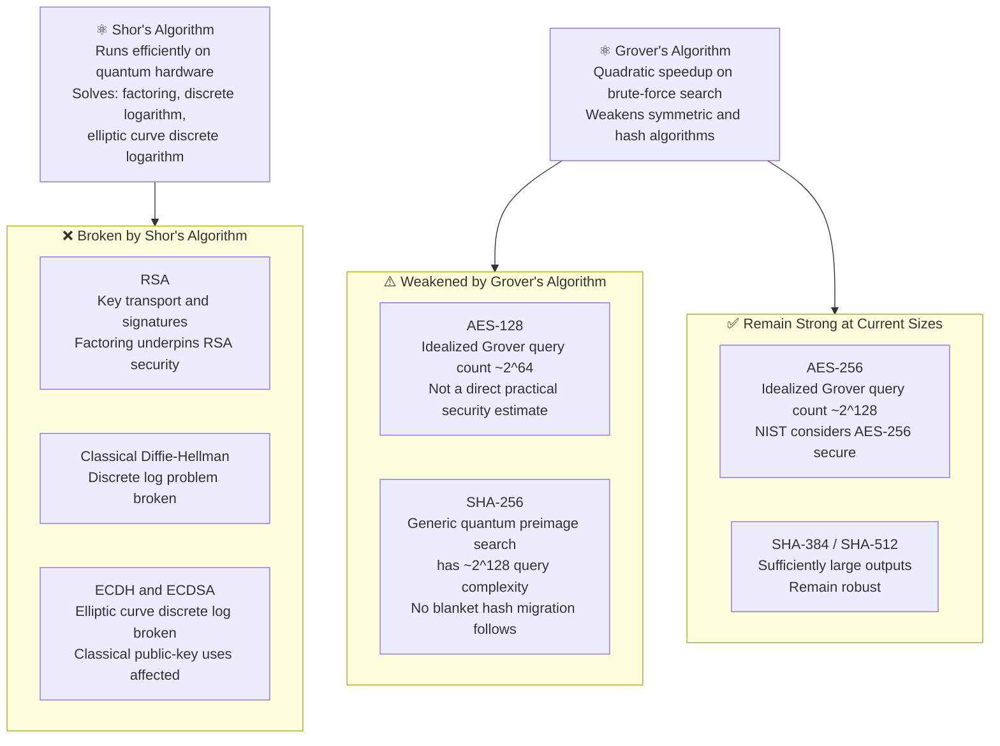
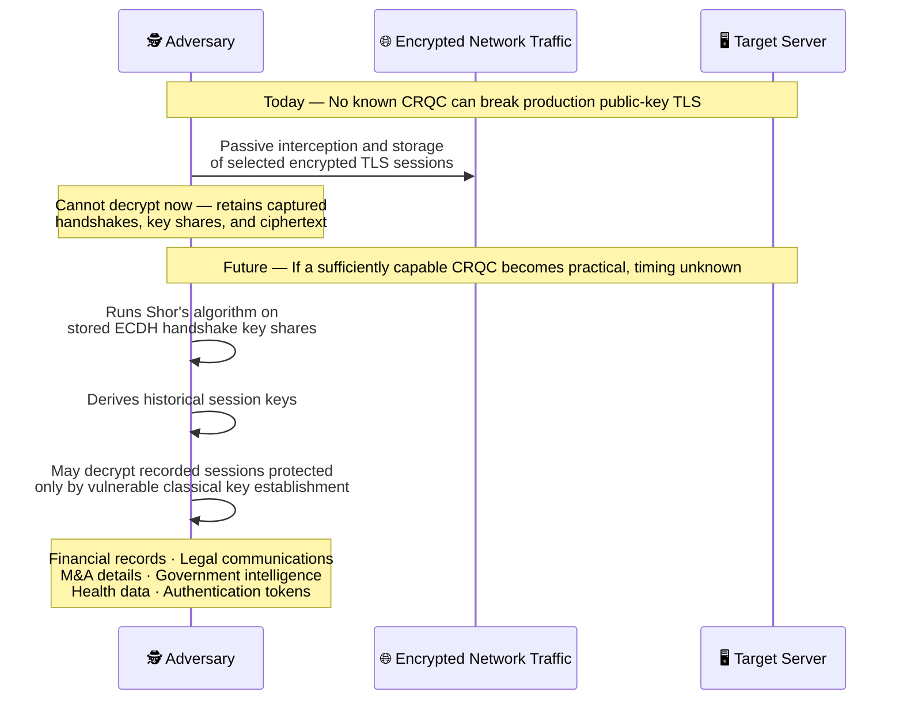
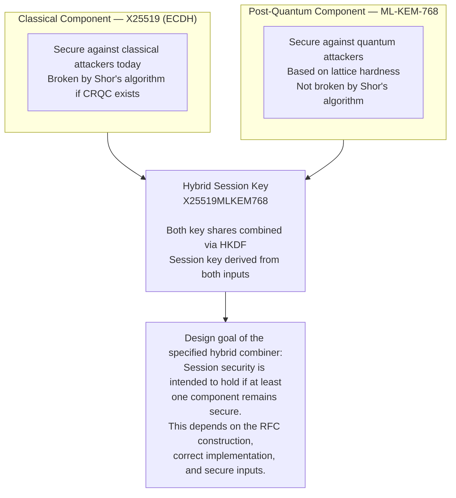
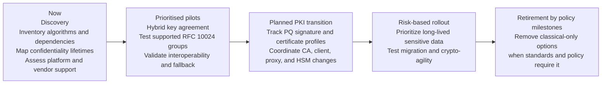

Short on time? >>

  

    📍
    📋
  

  

    
<strong>Short on time?</strong> Summarize this article with

    

      <select class="ai-selector-dropdown" id="ai-platform-select">
        <option value="">-- Select an AI --</option>
        <option value="claude">🤖 Claude</option>
        <option value="chatgpt">✨ ChatGPT</option>
        <option value="gemini">🔮 Gemini</option>
        <option value="perplexity">🌐 Perplexity</option>
        <option value="copilot">⚡ Copilot</option>
      </select>
    

    
Your prompt is copied automatically — just paste it once the AI opens.

  

<blockquote class="prompt-info">

<strong>In short:</strong> A sufficiently capable quantum computer could break classical TLS key exchange and signatures, while symmetric encryption such as AES-256 is not the urgent migration target. Harvest-now-decrypt-later risk depends on how long data must remain confidential and what key exchange protected it. NIST has finalised ML-KEM, ML-DSA, and SLH-DSA, and RFC 10024 standardizes hybrid ML-KEM/ECDHE key-agreement groups for TLS 1.3. Hybrid key exchange does not by itself migrate certificate signatures or solve private-key custody. Start with a cryptographic inventory and treat migration roadmaps as planning guidance, not a quantum-computer forecast.

</blockquote>

<blockquote>

<strong>Written for:</strong> Security architects, CISOs, and engineers responsible for TLS infrastructure and cryptographic migration planning.

</blockquote>

<blockquote>

<strong>Also worth reading:</strong> <a href="/posts/how-https-actually-works/">How HTTPS Actually Works</a> · <a href="/posts/ssl-to-tls-evolution-of-secure-communication/">From SSL 2.0 to TLS 1.3</a> · <a href="/posts/why-tls-private-keys-must-never-live-on-web-server/">Why TLS Private Keys Must Never Live on Your Web Server</a>

</blockquote>

---

## Introduction

TLS 1.3 is a modern version of the web's encryption protocol, but the protocol version alone does not make a connection quantum-resistant. TLS 1.3 supports ephemeral public-key key exchange as well as PSK-based modes; the negotiated mode affects forward secrecy. Its classical public-key algorithms may be vulnerable to a future cryptographically relevant quantum computer.

The relevant threat model is **Harvest Now, Decrypt Later (HNDL)**: an adversary records encrypted traffic and keeps it in case a future quantum computer can recover session secrets from classical public-key key exchange. That possibility matters most for data whose confidentiality must last many years. It does not establish that any particular organization's traffic is being collected, and the date when a cryptographically relevant quantum computer (CRQC) might exist is unknown.

Published resource estimates for breaking RSA or elliptic-curve cryptography vary substantially with assumptions about hardware quality, error correction, circuit design, and runtime. They show why migration planning matters, but they do not establish a reliable CRQC date. A prudent program plans against the required confidentiality lifetime of its data and the lead time for migration rather than relying on a single forecast.

NIST finalised its first post-quantum cryptographic standards in August 2024. In August 2026, the IETF published RFC 10024, which standardizes three hybrid post-quantum/traditional key-agreement groups for TLS 1.3. That standard is a basis for interoperable implementations, not proof that every client, server, proxy, or TLS termination service negotiates a hybrid group; check the actual versions and negotiated parameters in your environment.

This is a current inventory and migration-planning decision. Government and sector roadmaps set milestones for preparation; they are not universal compliance deadlines or predictions of when a CRQC will arrive.

---

## Why Classical Cryptography Has an Expiry Date

To understand the quantum threat, you need to understand what makes classical cryptography work — and specifically what makes it hard to break.

RSA security rests on the difficulty of **factoring large numbers**: given a product of two large primes, find the primes. ECDH security rests on the **elliptic curve discrete logarithm problem**: given a point on a curve, find the scalar that generated it. Both problems are computationally infeasible for classical computers at the key sizes used in production — RSA-2048, P-256, X25519.

In 1994, mathematician Peter Shor introduced an algorithm that, on a sufficiently capable fault-tolerant quantum computer, could solve the factoring and discrete-log problems underlying RSA, finite-field Diffie–Hellman, and elliptic-curve systems. No such machine is publicly known to exist, and estimates of its required resources and runtime remain uncertain. The concern applies to today's classical public-key key exchange and signature algorithms, not to post-quantum algorithms as a class.

```mermaid
flowchart TD
    SHOR["⚛️ Shor's Algorithm\nRuns efficiently on quantum hardware\nSolves: factoring, discrete logarithm,\nelliptic curve discrete logarithm"]
    GROVER["⚛️ Grover's Algorithm\nQuadratic speedup on brute-force search\nWeakens symmetric and hash algorithms"]

    subgraph BROKEN["❌ Broken by Shor's Algorithm"]
        B1["RSA\nKey transport and signatures\nFactoring underpins RSA security"]
        B2["Classical Diffie-Hellman\nDiscrete log problem broken"]
        B3["ECDH and ECDSA\nElliptic curve discrete log broken\nClassical public-key uses affected"]
    end

    subgraph WEAKENED["⚠️ Weakened by Grover's Algorithm"]
        W1["AES-128\nIdealized Grover query count ~2^64\nNot a direct practical security estimate"]
        W2["SHA-256\nGeneric quantum preimage search\nhas ~2^128 query complexity\nNo blanket hash migration follows"]
    end

    subgraph SAFE["✅ Remain Strong at Current Sizes"]
        S1["AES-256\nIdealized Grover query count ~2^128\nNIST considers AES-256 secure"]
        S2["SHA-384 / SHA-512\nSufficiently large outputs\nRemain robust"]
    end

    SHOR --> BROKEN
    GROVER --> WEAKENED
    GROVER --> SAFE
```

For TLS migration, the most urgent quantum-sensitive components are the public-key algorithms used for **key establishment and authentication**. Symmetric encryption and hash functions have different quantum attack costs; current NIST guidance does not call for an urgent blanket replacement of AES or SHA-2. Post-quantum migration must also account for certificate signatures and other public-key uses, not only the key exchange.

### What Exactly Breaks: The Math You Already Know

This repeats the toy Diffie–Hellman (DH) example from [How HTTPS Actually Works](/posts/how-https-actually-works/). Here `a` and `b` are private exponents; `A` and `B` are the public shares sent between endpoints; and `K` is the shared DH secret, not a TLS traffic-encryption key. The superscript shows the exponent.

| Who | Action | Value |
|---|---|---|
| Both agree | Public parameters | `p = 23`, `g = 5` |
| Browser | Chooses private exponent `a` | `a = 6` — stays on the browser |
| Server | Chooses private exponent `b` | `b = 15` — stays on the server |
| Browser → Server | Sends public share `A` | A = ga mod p = 56 mod 23 = 8 |
| Server → Browser | Sends public share `B` | B = gb mod p = 515 mod 23 = 19 |
| Browser (after receiving `B`) | Computes shared secret `K` | K = Ba mod p = 196 mod 23 = **2** |
| Server (after receiving `A`) | Computes shared secret `K` | K = Ab mod p = 815 mod 23 = **2** |
| Passive observer | Sees public parameters and shares | `p`, `g`, `A`, `B` — can recover `K` for these tiny values by trying possible exponents |

The browser knows `p`, `g`, its own exponent `a`, both public shares, and computes `K` from `a` and `B`. The server knows `p`, `g`, its own exponent `b`, both public shares, and computes the same `K` from `b` and `A`. A passive observer sees the public values, not the private exponents.

These values are deliberately tiny and insecure. Since `p = 23`, a classical observer can try the few possible exponents, recover `a` or `b`, and calculate `K = 2` quickly. The example illustrates how both endpoints derive the same secret; it does not demonstrate production security. Standardized production groups use much larger parameters so the best-known classical attacks are computationally infeasible.

**Shor's algorithm breaks this assumption directly.**

A quantum computer running Shor's algorithm does not simply test every possible exponent at once. It uses quantum period-finding, including the quantum Fourier transform, to solve the discrete-log problem in polynomial time on a sufficiently capable fault-tolerant machine. This threatens the hardness assumption behind production-size classical DH and ECDHE; the hardware and runtime required remain uncertain.

| Parameters | Classical attacker | Sufficiently capable quantum computer |
|---|---|---|
| Toy example (`p = 23`) | Tries the few possible exponents and recovers `K = 2` quickly | No quantum computer is needed; the values are already easy to crack |
| Production-size classical DH/ECDHE | Best-known classical attacks are computationally infeasible | Shor's algorithm can solve the underlying discrete-log problem, given a sufficiently capable fault-tolerant machine |

For a recorded TLS handshake whose key establishment uses only classical ephemeral DH/ECDHE, recovering the ephemeral secret lets an attacker derive the shared secret and then the traffic keys from the captured handshake. A PSK or a post-quantum hybrid exchange adds other key-schedule inputs, so the result depends on the negotiated mode and its security assumptions. In TLS, the DH shared secret is input to the key schedule; it is not itself the traffic-encryption key.

**The same break applies when TLS uses ECDHE.**

For an elliptic-curve group such as X25519, the security assumption is: given the public key share `A = a·G` (where `G` is the curve's generator point), finding the scalar `a` is the **Elliptic Curve Discrete Logarithm Problem (ECDLP)**. Shor's algorithm, adapted for elliptic curves, solves this too. TLS 1.3 can also use finite-field DHE groups, which are vulnerable to Shor's algorithm through the discrete-log problem.

The critical detail for HNDL is that classical ephemeral key shares are public. In TLS 1.3, the client and server ECDHE shares appear in the ClientHello and ServerHello; TLS 1.2 ECDHE also exposes public shares in its handshake. An adversary that records the handshake and ciphertext could, given a sufficiently capable quantum computer, derive the classical ephemeral secrets and then the session keys. TLS 1.2 static RSA key exchange is a separate vulnerable mode: a future quantum attack on the public RSA key in the certificate could recover its private key from the recorded handshake, even if no server key file was stolen.

This is the mathematical foundation of Harvest Now, Decrypt Later.

---

## Harvest Now, Decrypt Later — A Long-Term Confidentiality Risk

No known quantum computer can break production TLS public-key cryptography today. HNDL describes a possible future consequence of recording traffic now, not a claim that encrypted TLS traffic can currently be decrypted this way.

**Harvest Now, Decrypt Later (HNDL)** is the threat model in which an adversary collects and archives encrypted traffic now, then attempts to decrypt it if a suitable quantum computer becomes available. The attacker would not need to break the encryption at the time of collection. Whether a particular adversary is doing this, and for which traffic, is not established by the threat model itself.

```mermaid
sequenceDiagram
    participant A as 🕵️ Adversary
    participant N as 🌐 Encrypted Network Traffic
    participant S as 🖥️ Target Server

    Note over A,S: Today — No known CRQC can break production public-key TLS
    A->>N: Passive interception and storage<br/>of selected encrypted TLS sessions
    Note over A: Cannot decrypt now — retains captured<br/>handshakes, key shares, and ciphertext

    Note over A,S: Future — If a sufficiently capable CRQC becomes practical, timing unknown
    A->>A: Runs Shor's algorithm on<br/>stored ECDH handshake key shares
    A->>A: Derives historical session keys
    A->>A: May decrypt recorded sessions protected<br/>only by vulnerable classical key establishment
    Note over A: Financial records · Legal communications<br/>M&A details · Government intelligence<br/>Health data · Authentication tokens
```

HNDL is a threat model, not evidence that a particular interception event was conducted for later quantum decryption. Avoid treating network rerouting incidents or broad intelligence-collection claims as proof that a specific organization or data set has been harvested.

**Who carries real risk today:**

The HNDL threat is not uniform. It is calibrated to data confidentiality lifespans. Ask: *how long does the data I am transmitting today need to remain confidential?*

| Sector | Data type | Confidentiality requirement | HNDL risk |
|---|---|---|---|
| Financial services | M&A negotiations, trading strategies | 5–15 years | High |
| Legal | Privileged communications, litigation strategy | 7–30 years | High |
| Healthcare | Patient records | Often long-lived; retention and confidentiality periods vary by jurisdiction and record type | Depends on data lifetime |
| Government / Defence | Classified or operationally sensitive information | Set by classification and policy; may be long-lived | Depends on data lifetime |
| General enterprise | Session tokens, user passwords | Rotated frequently | Lower |

These periods are illustrative, not statutory retention rules or universal risk ratings. Retention is not the same as required confidentiality: prioritize data by how long it must remain secret, the key exchange it uses, and the plausible time needed to migrate.

---

## The Quantum Timeline: When Does This Become Real?

There is no consensus date for a CRQC. Resource estimates are scenario-dependent, so a precise “credible window” or median year would overstate what the evidence can establish. Planning milestones are still useful: the G7 Cyber Expert Group recommends that financial organizations consider prioritizing critical systems for 2030–2032 and an overall transition around 2035, while emphasizing that these are non-authoritative targets that may change. Those milestones are migration guidance, not a forecast that a CRQC will appear by those dates.

Cryptographic migrations can take years because they involve inventory, procurement, interoperability, validation, and application testing. Begin early in proportion to data sensitivity and confidentiality lifetime. National-security requirements such as CNSA 2.0 have their own scope and transition dates; they should not be generalized to every organization.

---

## NIST PQC Standardisation: The Foundation Is Set

In August 2024, NIST published three final post-quantum cryptographic standards following a public evaluation process begun in 2016:

| Standard | Algorithm | Function | Security basis |
|---|---|---|---|
| **FIPS 203** | ML-KEM (derived from Kyber) | Key encapsulation mechanism for establishing shared secrets; not a drop-in ECDH replacement | Module Learning With Errors (MLWE) |
| **FIPS 204** | ML-DSA (derived from Dilithium) | Digital signatures; protocol and certificate ecosystems need compatible support | Module Learning With Errors (MLWE) |
| **FIPS 205** | SLH-DSA (derived from SPHINCS+) | Hash-based digital signatures; protocol and certificate ecosystems need compatible support | Hash-based construction |

In March 2025, NIST selected **HQC** for standardisation as a second key-encapsulation mechanism, intended to diversify the KEM portfolio. Selection is not the same as a final standard: check the current publication and validation status before deployment.

**Why these algorithms?** They are based on mathematical problems — primarily lattice problems (Learning With Errors) — that are believed to be hard for both classical and quantum computers. Unlike RSA and ECDH, no efficient quantum algorithm is known to solve these problems. The "believed to be" qualifier matters: these algorithms are new, and years of cryptanalysis still lie ahead. That is precisely why hybrid deployment is the recommended approach.

---

## PQC in TLS: Hybrid Key Exchange

Some TLS implementations and services have deployed hybrid post-quantum key agreement. In the **hybrid approach**, classical and post-quantum key-establishment components are used together during a transition period; availability and negotiation depend on the specific client, server, and intermediaries.

```mermaid
flowchart TD
    subgraph Classical["Classical Component — X25519 (ECDH)"]
        C1["Secure against classical attackers today\nBroken by Shor's algorithm if CRQC exists"]
    end

    subgraph PQC["Post-Quantum Component — ML-KEM-768"]
        P1["Secure against quantum attackers\nBased on lattice hardness\nNot broken by Shor's algorithm"]
    end

    COMBINE["Hybrid Session Key\nX25519MLKEM768\n\nBoth key shares combined via HKDF\nSession key derived from both inputs"]

    Classical --> COMBINE
    PQC --> COMBINE

    GUARANTEE["Design goal of the specified hybrid combiner:\nSession security is intended to hold if at least\none component remains secure.\nThis depends on the RFC construction,\ncorrect implementation, and secure inputs."]

    COMBINE --> GUARANTEE
```

The hybrid named group **X25519MLKEM768** combines an X25519 ephemeral share with an ML-KEM-768 encapsulation key from the client; the server returns its X25519 share and an ML-KEM ciphertext. TLS derives the handshake secret from both component secrets using the standardized construction. RFC 10024 defines this group and two additional hybrid groups. Its stated security goal is to retain security if at least one component remains secure; do not reduce that claim to an unconditional “an attacker must break both” without the combiner and implementation assumptions.

> **ML-KEM parameter sets:** ML-KEM-768 is in NIST Security Category 3, whose benchmark is comparable to attacking AES-192; that is not a claim of exactly 192-bit security against every attack. ML-KEM-1024 is Category 5, benchmarked against AES-256. CNSA 2.0 specifies ML-KEM-1024 for its national-security scope. Whether a particular TLS hybrid group and implementation satisfies a CNSA or other policy depends on the applicable profile and validation; do not infer compliance from the group name alone.

Hybrid key agreement has moved beyond laboratory experiments and is available in some mainstream client and TLS stacks, but support is version-, configuration-, and service-dependent. RFC 10024 standardizes the TLS 1.3 groups; standardization does not guarantee that a given connection negotiates one. Measure negotiated groups on your own paths, including through proxies, CDNs, and load balancers, and date any adoption statistics you publish.

---

## What Is Not Ready Yet

Despite the progress above, significant gaps remain — and understanding them is essential for any migration plan.

**PKI and Certificates:** Current X.509 certificates use RSA or ECDSA signatures. Post-quantum certificates using ML-DSA do not yet have broad CA support, browser trust store integration, or OCSP/CRL infrastructure. The hybrid TLS deployments above use PQC for *key exchange only* — the certificate and server authentication chain remains classical. Full PQC migration requires updating the entire certificate lifecycle.

**Hardware Security Modules:** Algorithm support and validation depend on the exact HSM model, firmware, and cryptographic module certificate. TLS hybrid key agreement is usually performed by the TLS implementation using ephemeral exchange material; it is distinct from protecting the server's long-term certificate-signing key in an HSM. Verify the actual integration and vendor support rather than assuming that an HSM either performs or blocks the TLS hybrid exchange.

**Larger ClientHello messages and middleboxes:** ML-KEM public keys and hybrid shares make TLS ClientHello messages larger than classical-only ones. TCP can segment the handshake across multiple packets; IP fragmentation is not an inevitable consequence. Some middleboxes nevertheless assume a small or single-packet ClientHello and may mishandle larger messages. Test the full path through firewalls, proxies, CDNs, and load balancers rather than only testing the client and origin directly.

**TLS 1.3 0-RTT early data:** Early data is encrypted under keys derived from a resumption or external PSK before the new handshake completes; it has weaker forward-secrecy and replay properties. A new hybrid key exchange does not retroactively change the protection of early data encrypted under an older PSK. Review the PSK/ticket lifecycle and application replay profile, and avoid sending sensitive or state-changing operations as 0-RTT. See the current TLS specification for the details.

| Layer | What to verify |
|---|---|
| TLS key agreement | Whether the client and actual TLS terminator support and negotiate an RFC 10024 hybrid group |
| Proxies and middleboxes | Whether the complete path accepts larger ClientHello messages and preserves the negotiated group |
| Certificate authentication | Whether the certificate chain still uses classical signatures and what migration profile applies |
| HSMs and key custody | Exact algorithms, export policy, firmware, and validation status for the deployed module |

Post-quantum readiness is not a single product setting. It requires a platform-by-platform inventory, interoperability tests, and a migration plan.

---

## Crypto Agility: The Governance Response

Post-quantum migration is not a project with a start date and a go-live. It is a multi-year capability shift. The organisations that navigate it successfully will be those that treat **crypto agility** — the ability to swap cryptographic algorithms without re-architecting systems — as a design principle rather than a retrofit.

```mermaid
flowchart LR
    P1["Now\nDiscovery\nInventory algorithms and dependencies\nMap confidentiality lifetimes\nAssess platform and vendor support"]
    P2["Prioritised pilots\nHybrid key agreement\nTest supported RFC 10024 groups\nValidate interoperability and fallback"]
    P3["Planned PKI transition\nTrack PQ signature and certificate profiles\nCoordinate CA, client, proxy, and HSM changes"]
    P4["Risk-based rollout\nPrioritize long-lived sensitive data\nTest migration and crypto-agility"]
    P5["Retirement by policy milestones\nRemove classical-only options\nwhen standards and policy require it"]

    P1 --> P2 --> P3 --> P4 --> P5
```

**Regulatory reference points:**
- **NSA CNSA 2.0:** Transition dates apply to National Security Systems and their suppliers; consult the current NSA FAQ and profile for scope and milestones.
- **G7 Cyber Expert Group (January 2026):** Suggests that financial-sector organizations consider prioritizing critical systems for 2030–2032 and an overall transition by 2035. The roadmap calls these non-authoritative planning targets, not a CRQC forecast.
- **NIST IR 8547:** The transition report remains an Initial Public Draft; treat its proposed dates and transitions as draft guidance, not a final standard.

These timelines are policy planning inputs. They do not predict when quantum computers will be capable of breaking current public-key cryptography.

**The practical starting point is a cryptographic inventory.** Most organisations do not know which systems use RSA key exchange, which certificates use ECDSA, or which internal APIs negotiate TLS 1.2 with RSA key exchange. Without that inventory, there is no basis for prioritising the migration. Tools for automated cryptographic discovery — scanning TLS handshakes, code analysis, dependency mapping — are the first investment worth making.

---

## How PQC Relates to Private-Key Protection

Post-quantum key agreement addresses a future quantum threat to session confidentiality. Long-term certificate private-key custody is a separate security concern that remains relevant regardless of the quantum timeline.

Consider this hypothetical scenario: an attacker has copied a server's TLS certificate private key from disk, a compromised backup, or a misconfigured secrets-management system, and the organization has not detected it.

**In a classical world:** The stolen private key enables impersonation of your server through forged handshakes and MITM attacks. In TLS 1.3 with PFS, it does not expose past sessions directly. Serious, but bounded.

**In a quantum world:** A future quantum attack on recorded classical ECDHE shares could recover session secrets from TLS 1.2 or TLS 1.3 traffic, whether or not the server's long-term certificate key was stolen. For TLS 1.2 static RSA key exchange, a quantum attack on the public RSA key in the recorded certificate can recover the corresponding private key and expose recorded handshakes. A stolen certificate key also creates an impersonation risk while it remains trusted, but that is a separate threat.

**An HSM does not close the HNDL vector.** It can make a long-term private key non-exportable and reduce the risk of key-file theft or later impersonation. It cannot prevent an adversary from recording public key shares and ciphertext, nor can it make classical ECDHE or RSA quantum-resistant. Hybrid post-quantum key agreement addresses the recorded-session confidentiality risk; HSM custody addresses private-key extraction and use. Both controls can matter, but they solve different problems.

> The next post examines that operational key-custody problem: [how to reduce exposure of a TLS certificate private key, and what an HSM or keyless architecture can and cannot guarantee](https://blog.suubodhpatil.com/posts/why-tls-private-keys-must-never-live-on-web-server/).

---

## Key Takeaways

- A sufficiently capable fault-tolerant quantum computer could break classical RSA, DH, and elliptic-curve key exchange and signatures. No reliable date for such a computer is known; current NIST guidance does not identify AES-256 as an urgent migration target.
- HNDL is a threat model for long-lived confidential data protected by classical key exchange. Risk depends on the negotiated algorithms, the data's secrecy lifetime, and the time needed to migrate.
- NIST finalised ML-KEM (FIPS 203), ML-DSA (FIPS 204), and SLH-DSA (FIPS 205) in August 2024. The standards foundation for post-quantum migration is complete.
- RFC 10024 standardizes three hybrid key-agreement groups for TLS 1.3, including X25519MLKEM768. Actual availability and negotiation depend on the client, server, proxy, and configuration; certificate signatures may remain classical.
- NIST, NSA, and G7 transition milestones are planning inputs with different scopes. They should not be presented as predictions of a CRQC date or as universal compliance deadlines.
- Crypto agility — the ability to swap algorithms without re-architecting — helps organisations adapt as standards, policy, and implementation requirements evolve.
- HSMs reduce private-key extraction risk but do not protect recorded classical handshakes from future quantum attacks. Use hybrid key agreement for that confidentiality risk and assess key custody separately.

---

> 💡 **Pro Tip:** Start your PQC readiness programme with a cryptographic inventory, not a product purchase. Map every system using RSA or classical DH/ECDH, the data it protects, how long that data must remain confidential, and the time required to change the system. Use that exposure and migration lead time to prioritize work; do not base the decision on a single CRQC date estimate.



---



---

## References

- [NIST FIPS 203 — Module-Lattice-Based Key-Encapsulation Mechanism Standard (ML-KEM)](https://csrc.nist.gov/pubs/fips/203/final)
- [NIST FIPS 204 — Module-Lattice-Based Digital Signature Standard (ML-DSA)](https://csrc.nist.gov/pubs/fips/204/final)
- [NIST FIPS 205 — Stateless Hash-Based Digital Signature Standard (SLH-DSA)](https://csrc.nist.gov/pubs/fips/205/final)
- [NIST Post-Quantum Cryptography — Frequently Asked Questions](https://csrc.nist.gov/Projects/Post-Quantum-Cryptography/faqs)
- [NIST IR 8547 — Transition to Post-Quantum Cryptography Standards](https://csrc.nist.gov/pubs/ir/8547/ipd)
- [NIST Post-Quantum Cryptography project and transition information](https://csrc.nist.gov/projects/post-quantum-cryptography)
- [NSA CNSA 2.0 — Commercial National Security Algorithm Suite](https://media.defense.gov/2022/Sep/07/2003071834/-1/-1/0/CSA_CNSA_2.0_ALGORITHMS_.PDF)
- [RFC 9846 — The Transport Layer Security (TLS) Protocol Version 1.3](https://www.rfc-editor.org/rfc/rfc9846.html)
- [RFC 10024 — Post-Quantum Traditional (PQ/T) Hybrid Key Agreement Mechanisms for TLS 1.3](https://www.rfc-editor.org/rfc/rfc10024.html)
- [Cloudflare — PQ Progress in 2024](https://blog.cloudflare.com/post-quantum-cryptography-ga/)
- [AWS — ML-KEM Post-Quantum TLS Support](https://aws.amazon.com/blogs/security/ml-kem-post-quantum-tls-now-supported-in-aws-kms-acm-and-secrets-manager/)
- [G7 Cyber Expert Group — Financial Sector PQC Roadmap (January 2026)](https://www.gov.uk/government/publications/advancing-a-coordinated-roadmap-for-the-transition-to-post-quantum-cryptography-in-the-financial-sector/g7-cyber-expert-group-statement-on-advancing-a-coordinated-roadmap-for-the-transition-to-post-quantum-cryptography-in-the-financial-sector-january-20)

---

## Disclaimer

This content reflects independent technical analysis based on publicly documented standards, research, and regulatory guidance reviewed for this revision. Quantum computing timelines, algorithm standardisation status, and platform support evolve rapidly — readers should verify current documentation before making architectural or compliance decisions. This post does not represent the position of any employer, vendor, standards body, or government agency.
