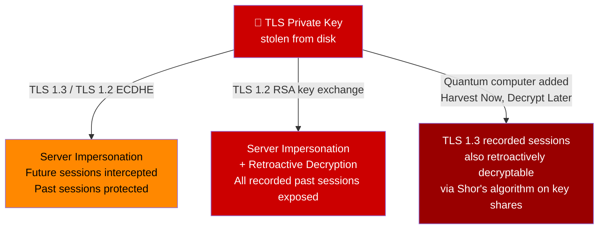
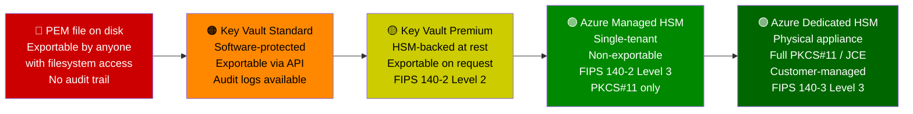
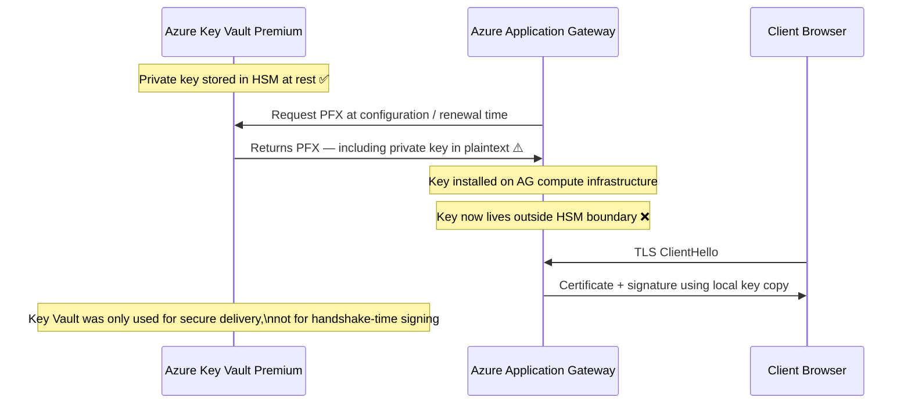
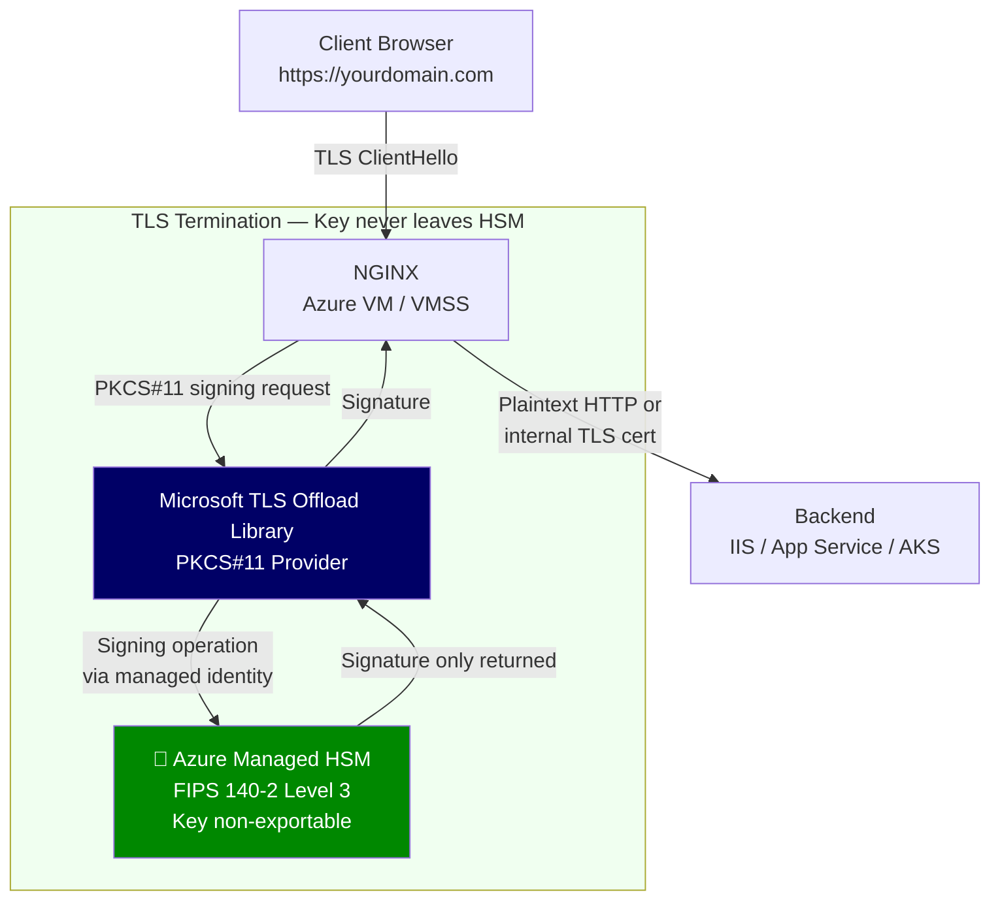
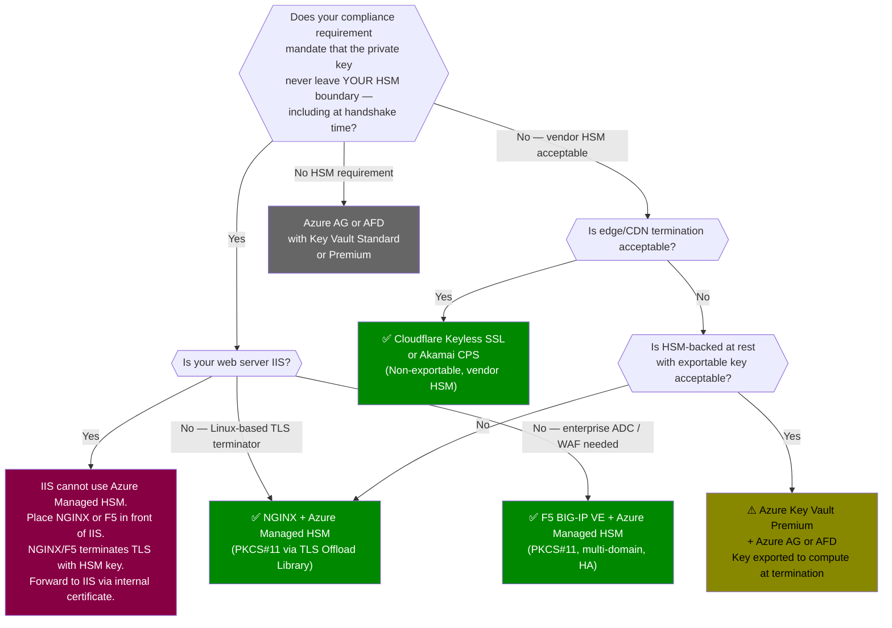

> 🤖 **Short on time?** Copy this into ChatGPT, Copilot, Gemini, or Claude for an instant summary — or to decide if it's worth reading in full:
>
> `Summarize this article in 5 bullet points with key takeaways, and flag any architecture or compliance gaps I should check in my own TLS setup: https://blog.suubodhpatil.com/posts/why-tls-private-keys-must-never-live-on-web-server/`
{: .prompt-tip }

> **Written for:** Security architects, infrastructure engineers, and compliance leads responsible for TLS configuration in production environments — particularly those subject to PCI DSS, ISO 27001, RBI, MAS, or financial services regulations.

> **Also worth reading:** [How HTTPS Actually Works](https://blog.suubodhpatil.com/posts/how-https-actually-works/) · [From SSL 2.0 to TLS 1.3](https://blog.suubodhpatil.com/posts/ssl-to-tls-evolution-of-secure-communication/) · [Post-Quantum Cryptography: Why Even TLS 1.3 Isn't Safe Forever](https://blog.suubodhpatil.com/posts/post-quantum-cryptography-tls-not-safe-forever/)

---

## Executive Summary

- The TLS private key is the crown jewel of your HTTPS infrastructure — it proves server identity and, in TLS 1.2 with RSA key exchange, directly enables decryption of every recorded session. Most organisations store it in a PEM file on disk, alongside the web server configuration.
- A private key on disk is a private key at risk: VM compromise, backup extraction, git leaks, and CI/CD secret sprawl are all documented exfiltration vectors — and you may not know it happened.
- Hardware Security Modules (HSMs) solve this by making keys non-exportable. The cryptographic signing operation happens inside the HSM; the private key never materialises outside it.
- In Azure, not all "secure" options are equal. Azure Application Gateway and Azure Front Door retrieve exportable keys from Key Vault and install them on compute at handshake time. Only NGINX or F5 BIG-IP integrated with Azure Managed HSM via PKCS#11 keeps the private key truly non-exportable during the handshake.
- IIS cannot use Azure Managed HSM. Windows Schannel does not support PKCS#11. If your backend is IIS, the HSM-integrated TLS terminator (NGINX or F5) sits in front of it, forwarding already-decrypted traffic.
- The quantum threat amplifies private key risk: a key exfiltrated today from disk enables retroactive decryption of TLS 1.2 RSA sessions once a quantum computer exists. An HSM-bound non-exportable key closes this vector permanently.

---

## Introduction

Most TLS security discussions focus on certificates: is it from a trusted CA? Has it expired? Does the domain match? The certificate is public — it is sent to every browser that connects. By design, anyone can see it.

The private key is different. It is the secret half of the pair, never sent anywhere, never shared. It proves that the certificate you are presenting was issued to you, and that you possess the corresponding secret. In TLS 1.2 with RSA key exchange, it is also the component that decrypts the client's session material, enabling every session.

In most deployments, this critical secret lives in a PEM file — `private.key` or `server.key` — on the same filesystem as the web server binary, the access logs, and the application code. It is referenced directly in the config:

```nginx
ssl_certificate     /etc/ssl/certs/server.crt;
ssl_certificate_key /etc/ssl/private/server.key;
```

This configuration is chosen because it is simple. It is not the secure choice — it is the convenient one. And it is the most common TLS configuration pattern in production today.

The previous posts in this series covered how TLS works, how protocol weaknesses evolved over thirty years, and why quantum computing threatens even TLS 1.3. This post is about the asset that sits at the centre of all of it — the private key — and what it takes to actually protect it.

---

## What a TLS Private Key Actually Controls

To understand the risk, you need to understand what the private key does. The answer differs depending on your TLS version and cipher suite.

### TLS 1.3 and TLS 1.2 with ECDHE cipher suites

ECDHE — Elliptic Curve Diffie-Hellman Ephemeral — derives the session key from ephemeral values generated fresh for each handshake. The server's long-term private key plays no role in session key derivation. This is what gives forward secrecy its name: even if the private key is stolen later, past sessions remain protected because each session's key material was independent.

The long-term private key's role here is authentication: the server signs the handshake transcript with it, proving to the client that it holds the certificate's corresponding secret. If an attacker steals this key, they gain the ability to impersonate your server in future handshakes — presenting your certificate with a valid signature, invisibly intercepting connections. Past completed sessions remain protected.

### TLS 1.2 with RSA key exchange (still widely deployed)

RSA key exchange works differently. The client generates a random pre-master secret, encrypts it with the server's public key (from the certificate), and sends it. The server decrypts it using the private key. The session key is derived from this shared value.

The private key is the direct decryption key for every session.

If an attacker steals this key, they gain the ability to impersonate your server and retroactively decrypt any recorded TLS 1.2 RSA session — past, present, and future, for as long as the certificate remains valid.



TLS 1.2 with RSA key exchange is still present in many production environments — particularly for internal services, legacy integrations, and traffic flowing from Azure Application Gateway to backend pools. The assumption that "we will migrate to TLS 1.3 before anything happens" does not account for the harvest-now-decrypt-later threat: adversaries recording encrypted traffic today for decryption once a quantum computer exists.

---

## How Private Keys End Up on Disk — and How They Get Stolen

The path from secure key generation to insecure storage is shorter than most organisations realise. Each step below is a documented pattern in real production environments, not a hypothetical.

**Certificate procurement.** A developer runs `openssl genrsa -out server.key 4096` to generate a key pair. The private key is written to disk by design — that is what the command does. It is now on the filesystem.

**Web server configuration.** The certificate and key are copied to `/etc/ssl/private/` or `C:\Certificates\`. Every process running with the web server's OS privileges can read them. On Windows, any member of the Administrators group can export the key from the certificate store.

**Deployment automation.** To automate certificate renewal, the key is added to a CI/CD pipeline as a secret. It appears in build logs, pipeline environment variables, and deployment scripts. It may be copied across multiple runner environments.

**Git commits.** A developer includes the key "temporarily" to test a configuration. The commit goes up. The key is now in git history, in every clone, on every CI runner that ever checked out that branch. Deleting the file does not remove it from history.

**VM snapshots and backups.** The server is snapshotted for backup or scaling. The snapshot contains the full disk, including the key file. Backup storage is often less tightly controlled than the production server. Snapshot access does not always appear in web server logs.

**Insider access.** Any sysadmin, DevOps engineer, or contractor with filesystem access to the web server can copy the key. `cp /etc/ssl/private/server.key /tmp/` leaves no application-level trace.

The characteristic of every vector is the same: the key is a file. Files can be read, copied, transmitted, and stored. There is no technical barrier between the key and anyone who can reach the filesystem. An HSM removes the file entirely — the key is generated inside the hardware boundary and never exits it.

---

## What Compliance Frameworks Actually Require

Several major frameworks explicitly address private key protection. The language has tightened in recent years, and "best practice" is now a regulatory floor for many industries.

| Framework | Requirement | Key Control Language |
|---|---|---|
| **PCI DSS 4.0** | Req 3.7.1–3.7.6 | Key generation in a secure environment; split knowledge and dual control for key custodians; documented key management procedures |
| **PCI DSS 4.0** | Req 4.2.1 | All transmissions of cardholder data encrypted with accepted protocols; cipher suite inventory required |
| **ISO 27001:2022** | A.8.24 | "Cryptographic keys shall be protected against loss, unauthorised access or misuse... throughout their lifecycle" |
| **RBI IT Framework** | Section 5.3 | "All sensitive cryptographic key material shall be stored in an HSM conforming to industry standards (FIPS 140-2 or equivalent)" |
| **MAS TRM 2021** | Section 9.3 | "Financial institutions shall ensure that cryptographic keys are generated, stored and managed using HSMs or other equivalent controls" |
| **NSA CNSA 2.0** | Key management | HSM-grade protection mandated for national security system keys; FIPS 140-2 Level 3 minimum; new NSS acquisitions from January 2027 |
| **FIPS 140-2 Level 3** | Physical tamper evidence + resistance | Keys must not be exportable in plaintext under any operational condition |

The common thread: "HSM conforming to industry standards" or equivalent. A software key vault is not equivalent. A Key Vault Premium key that can be exported on request is not equivalent. The standard these frameworks intend is a hardware or cloud HSM where the key cannot be extracted in plaintext under any operational condition, including by the service provider.

PCI DSS's "split knowledge and dual control" requirement (Req 3.7.2) for key custodians also has practical implications: if a single engineer can `cat /etc/ssl/private/server.key`, there is no split knowledge. An HSM with role-based access control and quorum-based key operations enforces this technically, not just by policy.

---

## The Key Storage Spectrum

Not all "secure key storage" options provide the same guarantees. The distinction matters when evaluating compliance posture.



The critical distinction is between "HSM-backed at rest" and "non-exportable." Key Vault Premium stores keys in HSM hardware at rest — but the key can still be exported via API call. When Azure Application Gateway requests the PFX to install locally, the key leaves the HSM at that moment. Azure Managed HSM does not permit this export. The key never materialises outside the HSM boundary.

| | Key Vault Standard | Key Vault Premium | Azure Managed HSM | Azure Dedicated HSM |
|---|:---:|:---:|:---:|:---:|
| HSM-backed at rest | ❌ | ✅ | ✅ | ✅ |
| Non-exportable key | ❌ | ❌ | ✅ | ✅ |
| Single-tenant isolation | ❌ | ❌ | ✅ | ✅ |
| Usable by Azure AG / AFD | ✅ | ✅ | ❌ | ❌ |
| Usable by NGINX / F5 via PKCS#11 | ❌ | ❌ | ✅ | ✅ |
| FIPS 140 level | — | Level 2 | Level 3 | Level 3 |
| Satisfies RBI / MAS HSM requirement | ❌ | ❌ | ✅ | ✅ |

---

## The Cloud Load Balancer Trap

This is the most common misconception in Azure TLS architecture, and it matters because organisations often interpret "integrated with Key Vault" as meaning "HSM-protected TLS."

Azure Application Gateway and Azure Front Door both support certificate management via Azure Key Vault. Microsoft's documentation describes this as secure certificate management — which it is, for general purposes. It is not HSM-bound TLS termination.



The private key is retrieved from Key Vault at configuration or certificate renewal time and stored on the Application Gateway's compute infrastructure for use during handshakes. Key Vault is used for key custody and delivery — not for protecting the key during TLS operations.

**The compliance test:** Can the private key be accessed by an entity outside the HSM during a TLS handshake? For Azure Application Gateway, the answer is yes — it operates on a local copy. This does not meet "non-exportable key inside HSM" requirements.

Azure Application Gateway and Azure Front Door are excellent services for general TLS offloading. They are the right choice for most workloads. They are not suitable where "private key must remain inside HSM boundary at all times, including during handshake signing" is a hard requirement.

---

## Architectures That Actually Keep Keys Inside the HSM

The following patterns ensure the private key never leaves the HSM during a TLS handshake. The signing operation is performed inside the hardware boundary; only the signature is returned to the TLS terminator.

### Pattern 1: NGINX + Azure Managed HSM (via PKCS#11)

NGINX integrates with Azure Managed HSM through Microsoft's TLS Offload Library, which implements the PKCS#11 interface. NGINX is configured to use the PKCS#11 provider rather than a local key file. When a TLS handshake requires a signing operation, NGINX calls the PKCS#11 library, which forwards the request to the Managed HSM — the key performs the operation internally and returns only the signature.



NGINX holds only the key's URI identifier — not the key material. Multiple domains, multiple certificates, and multiple keys are supported. NGINX instances on Azure VM Scale Sets all use the same Managed HSM, and access is controlled via Azure Managed Identity with Key Vault RBAC.

### What you cannot do here: IIS as the TLS terminator

IIS uses Windows Schannel and the Windows Certificate Store / CNG (Cryptography Next Generation) framework. Azure Managed HSM exposes only PKCS#11, JCE, and a REST interface. Windows does not support PKCS#11, and Managed HSM does not provide a Windows CNG / KSP (Key Storage Provider) for TLS key operations.

IIS cannot terminate TLS using an Azure Managed HSM key. If your backend is IIS, NGINX or F5 terminates the public TLS session using the HSM-bound key, and IIS receives either plaintext traffic or traffic re-encrypted with a separate internal certificate — a self-signed cert, internal CA certificate, or Key Vault software certificate. You cannot reuse the public certificate for this internal hop: doing so would require exporting the HSM key to give IIS a local copy, which defeats the purpose.

### Pattern 2: F5 BIG-IP VE + Azure Managed HSM

F5 BIG-IP VE on Azure fully supports Azure Managed HSM through the same Microsoft PKCS#11 library. This is the enterprise-grade option: full Application Delivery Controller (ADC), WAF, and traffic policy capabilities — all with keys remaining inside Managed HSM. A single F5 instance supports multiple virtual servers, each with its own HSM-resident private key, certificate, and TLS profile.

High-availability active-standby configurations with two BIG-IP instances are supported. Both instances access the same keys in Managed HSM via PKCS#11 through their respective managed identities. This avoids the operational complexity of key synchronisation between HA nodes — both nodes reference the same HSM-resident key and never hold a local copy.

F5 is the preferred option for environments that already operate BIG-IP for load balancing or WAF, or where multi-domain TLS with complex routing policy is required.

### Pattern 3: Cloudflare Keyless SSL / Edge Key Manager

If your requirement is "keys must be HSM-backed and non-exportable" but it is acceptable for those keys to be held in a third party's infrastructure, Cloudflare's Keyless SSL provides HSM-backed key storage at Cloudflare's edge. Keys are non-exportable and protected within Cloudflare's hardware infrastructure. TLS terminates at the Cloudflare edge.

Origin connectivity options:
- HTTPS with Cloudflare IP allowlist on the Azure load balancer public IP
- mTLS between the Cloudflare edge and origin (validates both sides of the origin connection)
- Cloudflare Network Interconnect connected to Azure via ExpressRoute (private origin connectivity, no public Internet exposure for origin traffic)

Cloudflare does not integrate with Azure Managed HSM. The key management boundary is Cloudflare's infrastructure, not yours. For organisations where the key must reside in their own HSM, Cloudflare Keyless SSL does not satisfy this — it satisfies the weaker "non-exportable, HSM-backed at a trusted third party" requirement.

### Pattern 4: Akamai Certificate Provisioning System (CPS)

Akamai CPS generates the private key within Akamai's HSM infrastructure. The key is non-exportable and never leaves Akamai's systems. The customer does not possess the private key at any point in the certificate lifecycle, which simplifies compliance arguments around key custody: there is no "key on your infrastructure" to audit.

TLS terminates at Akamai's edge. Origin connectivity follows similar patterns to Cloudflare: HTTPS with IP allowlisting, mTLS, or Akamai Cloud Interconnect via ExpressRoute.

---

## Choosing the Right Pattern



The decision hinges on one foundational question: does your compliance requirement mandate that the private key never leave a hardware security boundary you control — including at the moment of the TLS handshake? If yes, only NGINX + Azure Managed HSM or F5 + Azure Managed HSM satisfy this in the Azure ecosystem today.

If the key must stay in your HSM but your backend is IIS, NGINX or F5 becomes the public TLS terminator and IIS becomes a backend service reached via an internal certificate. This is the correct architecture — not a workaround. IIS continues to handle application logic; the TLS security boundary is enforced by the NGINX or F5 layer where the HSM integration lives.

---

## The Quantum Amplifier: Why Key Protection Is Urgent Now

[The previous post in this series](https://blog.suubodhpatil.com/posts/post-quantum-cryptography-tls-not-safe-forever/) covered post-quantum cryptography and the Harvest Now, Decrypt Later threat. Private key protection connects directly to both.

Consider a scenario: your TLS private key was exfiltrated in 2024 — copied from disk during a server compromise that you detected, remediated, and recovered from. You rotated the certificate. You believe the incident is closed.

In a classical world: the stolen key enables future impersonation attacks if the certificate was not revoked quickly enough. Past TLS 1.3 sessions remain protected through forward secrecy. Serious, but bounded in scope.

After 2029–2032, with a quantum computer available to the adversary: they recorded your TLS 1.2 RSA key exchange sessions in 2024 alongside the certificate. Now they have both the key and the recorded sessions. They can retroactively decrypt every RSA key exchange session from that period — all the data transmitted, all the credentials, all the API responses. Forward secrecy helped for TLS 1.3, but TLS 1.2 traffic, internal service-to-service calls, and any session that used RSA key exchange is now retroactively exposed.

**A private key that was ever a file on disk cannot be trusted under this model.** The adversary may have copied it years before you knew the server was compromised. You cannot prove they did not.

An HSM-bound non-exportable key eliminates this vector entirely. The key was generated inside the HSM and configured non-exportable. No file ever existed to steal. Retroactive exfiltration is not possible regardless of what happened to the server it was configured on. The quantum threat to past sessions is neutralised not by cryptographic algorithm choice, but by ensuring the key was never available for harvest in the first place.

This is why private key protection is an operational priority today, not a future concern. The key you protect against exfiltration now is the one that determines whether your traffic from 2025–2030 can be retroactively decrypted in 2032.

---

## Key Takeaways

- The TLS private key proves server identity and — in TLS 1.2 with RSA key exchange — directly enables decryption of every session using that key. It is the highest-value secret in your HTTPS infrastructure, and most organisations store it as a readable file on disk.
- VM compromise, backup extraction, git history, CI/CD pipelines, and insider access are all documented paths for private key exfiltration. A key on disk has no technical barrier between it and any entity with filesystem access.
- PCI DSS 4.0, ISO 27001 A.8.24, RBI IT Framework, and MAS TRM 2021 all require HSM-grade key protection. "HSM-backed at rest" (Key Vault Premium) is not the same as "non-exportable key inside HSM during the TLS handshake."
- Azure Application Gateway and Azure Front Door retrieve exportable private keys from Key Vault and install them on compute at configuration time. They are convenient, secure for general use, and not suitable for strict HSM requirements.
- NGINX + Azure Managed HSM and F5 BIG-IP VE + Azure Managed HSM — both using the Microsoft TLS Offload Library via PKCS#11 — are the only Azure-native patterns where the private key never leaves the HSM during TLS handshake signing.
- IIS cannot use Azure Managed HSM. The correct architecture places NGINX or F5 as the HSM-aware TLS terminator in front of IIS, which receives internally-routed traffic via a separate certificate.
- The quantum computing threat amplifies private key risk retroactively. A key that was ever on disk may have been harvested years ago and could enable retroactive decryption of TLS 1.2 sessions once quantum capability exists. An HSM-bound non-exportable key closes this vector permanently.

> The TLS certificate is the identity. The private key is the proof. How you protect the proof determines whether the entire trust chain means anything.

---

> 💡 **Pro Tip:** Run this command on your production web servers: `openssl rsa -in /path/to/server.key -noout -text`. If it returns key material, the private key is accessible to any process with filesystem read access — and to anyone who can read a server backup or snapshot. The fix is not a configuration change; it is an architectural change to an HSM-backed TLS terminator. Start by inventorying where every TLS private key in your environment currently lives. The result will be instructive.

---

## References

- [Azure Managed HSM — Overview](https://learn.microsoft.com/en-us/azure/key-vault/managed-hsm/overview)
- [Microsoft TLS Offload Library for NGINX and Azure Managed HSM](https://learn.microsoft.com/en-us/azure/key-vault/managed-hsm/tls-offload-library)
- [F5 BIG-IP VE and Azure Managed HSM — Integration Guide](https://learn.microsoft.com/en-us/azure/key-vault/managed-hsm/f5-big-ip-integration)
- [Azure Application Gateway — Key Vault Certificates](https://learn.microsoft.com/en-us/azure/application-gateway/key-vault-certs)
- [Cloudflare Keyless SSL](https://developers.cloudflare.com/ssl/edge-certificates/custom-certificates/keyless-ssl/)
- [PCI DSS v4.0 — Requirements 3.7 and 4.2 (Cryptographic Key Management)](https://www.pcisecuritystandards.org/document_library/)
- [ISO/IEC 27001:2022 — A.8.24 Use of Cryptography](https://www.iso.org/standard/27001)
- [NIST SP 800-57 Part 1 Rev 5 — Recommendation for Key Management](https://csrc.nist.gov/publications/detail/sp/800-57-part-1/rev-5/final)
- [RBI IT Framework for NBFC — Cybersecurity Section 5.3](https://www.rbi.org.in/Scripts/PublicationReportDetails.aspx?UrlPage=&ID=836)
- [MAS Technology Risk Management Guidelines 2021 — Section 9.3](https://www.mas.gov.sg/regulation/guidelines/technology-risk-management-guidelines)
- [NSA CNSA 2.0 — Commercial National Security Algorithm Suite 2.0](https://media.defense.gov/2022/Sep/07/2003071834/-1/-1/0/CSA_CNSA_2.0_ALGORITHMS_.PDF)

---

## Disclaimer

This content reflects independent technical analysis based on publicly available documentation, standards, and vendor guidance as of the publication date. Azure service capabilities, HSM integrations, compliance framework requirements, and quantum computing timelines evolve — readers should verify current documentation before making architectural or compliance decisions. This post does not represent the position of any employer, vendor, standards body, or government agency.
