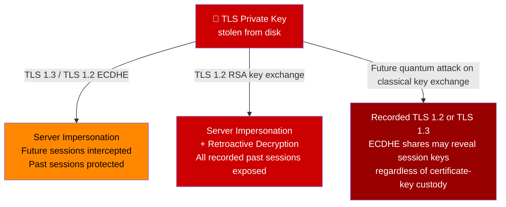
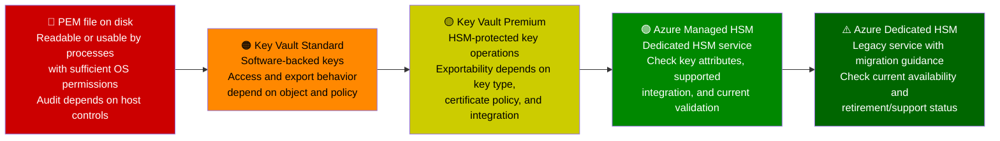
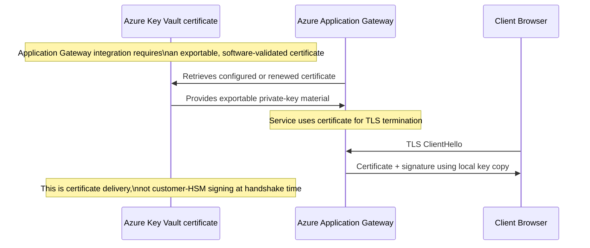
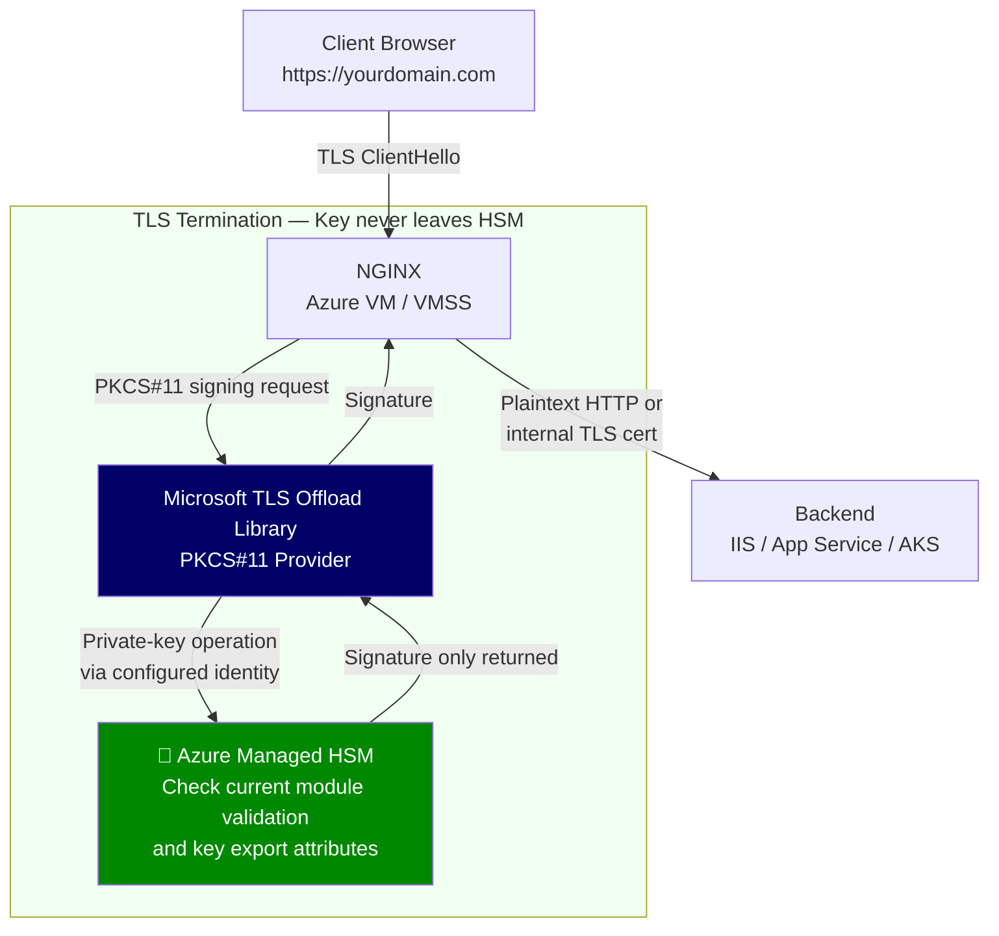
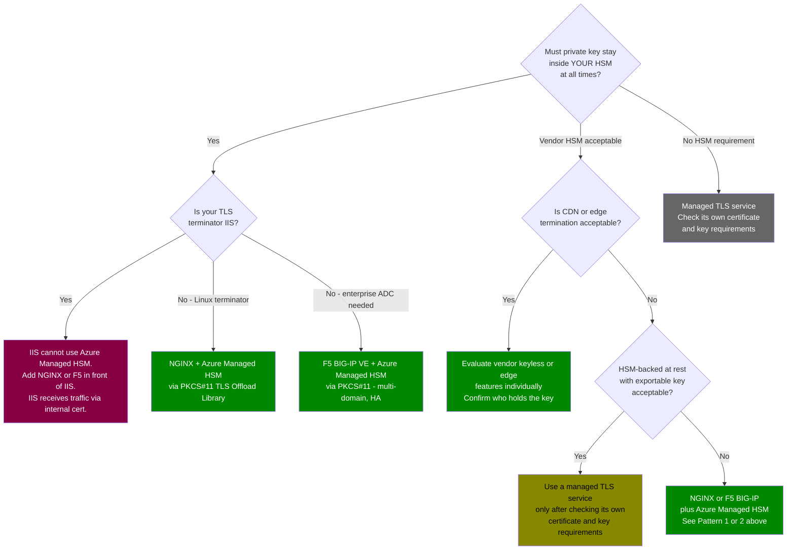

<style>
details.post-intro-details {
  margin-bottom: 1.5rem;
}
details.post-intro-details > summary {
  font-weight: 600;
  color: var(--text-color);
  cursor: pointer;
  user-select: none;
  padding: 0.5rem 0;
  display: flex;
  align-items: center;
  gap: 0.5rem;
  transition: opacity 0.2s;
}
details.post-intro-details > summary:hover {
  opacity: 0.7;
}
details.post-intro-details > summary::marker {
  content: "";
}
details.post-intro-details > summary::before {
  content: "▶";
  display: inline-block;
  font-size: 0.8em;
  transition: transform 0.3s ease;
  margin-right: 0.3rem;
}
details.post-intro-details[open] > summary::before {
  transform: rotate(90deg);
}
</style>

<details class="post-intro-details">
<summary>Short on time? >></summary>

<div class="ai-summary-section" data-ai-prompt="Article URL: https://blog.suubodhpatil.com/posts/why-tls-private-keys-must-never-live-on-web-server/

Summarize the above article in 5 bullet points focusing on:
1) What the certificate private key authenticates, and what its compromise does and does not expose
2) How private keys end up at risk on disk - exfiltration vectors including VM compromise, backups, git leaks, CI/CD
3) Hardware Security Modules (HSM) - non-exportable key custody, authorized private-key operations, and remaining risks
4) Azure-specific guidance - Application Gateway certificate requirements and documented NGINX/F5 Managed HSM integrations
5) How key custody differs from post-quantum key agreement and harvest-now-decrypt-later protection

Be practical for infrastructure engineers and CISOs responsible for TLS security and compliance.">
  <div class="ai-summary-section-icons">
    <span class="ai-summary-section-icon">📍</span>
    <span class="ai-summary-section-icon">📋</span>
  </div>
  <div class="ai-summary-section-content">
    <p><strong>Short on time?</strong> Summarize this article with</p>
    <div class="ai-summary-selector">
      <select class="ai-selector-dropdown" id="ai-platform-select">
        <option value="">-- Select an AI --</option>
        <option value="claude">🤖 Claude</option>
        <option value="chatgpt">✨ ChatGPT</option>
        <option value="gemini">🔮 Gemini</option>
        <option value="perplexity">🌐 Perplexity</option>
        <option value="copilot">⚡ Copilot</option>
      </select>
    </div>
    <p class="ai-summary-section-hint">Your prompt is copied automatically — just paste it once the AI opens.</p>
  </div>
</div>


<blockquote>
<p><strong>Written for:</strong> Security architects, infrastructure engineers, and compliance leads responsible for TLS key management and certificate infrastructure.</p>
</blockquote>

<blockquote>
<p><strong>Also worth reading:</strong> <a href="https://blog.suubodhpatil.com/posts/how-https-actually-works/">How HTTPS Actually Works</a> · <a href="https://blog.suubodhpatil.com/posts/ssl-to-tls-evolution-of-secure-communication/">From SSL 2.0 to TLS 1.3</a> · <a href="https://blog.suubodhpatil.com/posts/post-quantum-cryptography-tls-not-safe-forever/">Post-Quantum Cryptography: Why Even TLS 1.3 Isn't Safe Forever</a></p>
</blockquote>

</details>

---

## Introduction

Most TLS security discussions focus on certificates: is it from a trusted CA? Has it expired? Does the domain match? The certificate is public — it is sent to every browser that connects. By design, anyone can see it.

The private key is different: it is secret key material that must be protected from unauthorized use or extraction. In a certificate-authenticated TLS handshake, the server uses it to prove possession of the key matching its certificate; the certificate authority signs the public key after validating domain or organization control, but does not receive the private key. In the legacy TLS 1.2 static RSA key-exchange mode, the RSA private key also decrypts the client's premaster secret. Modern TLS 1.2 ECDHE and TLS 1.3 use the certificate key for authentication, while ephemeral key agreement establishes session secrets.

In most deployments, this critical secret lives in a PEM file — `private.key` or `server.key` — on the same filesystem as the web server binary, the access logs, and the application code. It is referenced directly in the config:

```nginx
ssl_certificate     /etc/ssl/certs/server.crt;
ssl_certificate_key /etc/ssl/private/server.key;
```

This configuration is chosen because it is simple and remains a common deployment pattern. For many environments it can be acceptable when access, rotation, backup, and monitoring controls match the risk. Low-risk internal services, zero-trust service meshes with short-lived certificates, and development environments may call for a different control set than internet-facing payment or regulated financial services systems. The title and recommendations here focus on environments where private-key compromise has material security, legal, or financial consequences.

The previous posts in this series explain HTTPS, TLS's protocol evolution, and the quantum risk to classical key agreement. This post covers a different but related control: reducing the exposure of the long-term certificate key used for authentication. HSM custody can reduce key-extraction risk; it does not replace post-quantum key agreement or guarantee that a compromised server cannot request signatures.

---

## What a TLS Private Key Actually Controls

To understand the risk, you need to understand what the private key does. The answer differs depending on your TLS version and cipher suite.

### TLS 1.3 and TLS 1.2 with ECDHE cipher suites

In certificate-authenticated TLS 1.2 ECDHE and TLS 1.3 handshakes, ephemeral Diffie–Hellman values establish the session secret; the server's long-term certificate key authenticates the handshake rather than deriving that secret. Later theft of that certificate key therefore does not, by itself, expose completed sessions that used ephemeral key exchange. TLS 1.3 PSK-only resumption and 0-RTT have different forward-secrecy properties, and TLS 1.2 static RSA key exchange is a legacy exception.

The long-term private key's role here is authentication: in a certificate-authenticated handshake, the server signs the handshake transcript with it, proving possession of the certificate's corresponding secret. If an attacker steals the key, they may impersonate the server when they can intercept or redirect a client's connection and the certificate is still trusted. Past completed sessions that used ephemeral key exchange remain protected from this key theft alone.

Certificate Transparency logs can help detect unexpected issuance of publicly trusted certificates for a domain. They do not record when someone uses a stolen existing private key, and presenting that key alone does not let an attacker obtain a replacement certificate from a CA. CT monitoring is useful for issuance visibility, but it is not a key-theft detector or a substitute for revocation, incident response, and key rotation.

### Legacy TLS 1.2 static RSA key exchange

RSA key exchange works differently. The client generates a random pre-master secret, encrypts it with the server's public key (from the certificate), and sends it. The server decrypts it using the private key. The session key is derived from this shared value.

For a recorded session that used static RSA key exchange, the corresponding RSA private key can decrypt the premaster secret and allow the session keys to be derived.

If an attacker steals this key, they can impersonate the server while clients still trust the certificate and can retroactively decrypt recorded sessions that used this static RSA mode. They cannot use it to decrypt sessions that used ephemeral ECDHE. Rotation and revocation limit future impersonation but do not undo exposure of already recorded RSA-key-exchange traffic.


```mermaid
flowchart TD
    PK["🔑 TLS Private Key\nstolen from disk"]

    PK -->|TLS 1.3 / TLS 1.2 ECDHE| A["Server Impersonation\nFuture sessions intercepted\nPast sessions protected"]
    PK -->|TLS 1.2 RSA key exchange| B["Server Impersonation\n+ Retroactive Decryption\nAll recorded past sessions exposed"]
    PK -->|Future quantum attack on classical key exchange| C["Recorded TLS 1.2 or TLS 1.3\nECDHE shares may reveal session keys\nregardless of certificate-key custody"]

    style PK fill:#c00,color:#fff
    style A fill:#f80,color:#000
    style B fill:#c00,color:#fff
    style C fill:#900,color:#fff
```

Static RSA key exchange may remain on legacy endpoints; inventory your own negotiated configurations rather than assuming it is present or absent. HNDL against recorded ECDHE traffic is a separate quantum risk: it targets the public ephemeral key shares and does not depend on theft of the server's certificate private key.

---

## How Private Keys End Up on Disk — and How They Get Stolen

The path from secure key generation to insecure storage is shorter than most organisations realise. Each step below is a documented pattern in real production environments, not a hypothetical.

**Certificate procurement and web server config.** A team may generate a key in software, export it as a PEM or PFX file, and deploy it with the web server configuration. Processes with sufficient filesystem or operating-system privileges may be able to read or use it. On Windows, whether a certificate-store key can be exported depends on its provider and export policy; a local administrator may still be able to use the key or alter the system even when export is disabled.

**Deployment pipelines and git.** Secrets can leak if pipeline steps print them, expose them in command lines, or fail to redact them. Keys committed to git persist in repository history and may remain in existing clones and runners after the file is deleted.

**VM snapshots and backups.** A snapshotted server image contains the full disk, including the key file. Backup storage is typically less tightly controlled than production. Snapshot reads often leave no trace in application logs.

**Insider access.** A person or process with sufficient filesystem access may copy a software key. Such a copy may not appear in application logs, though operating-system auditing, endpoint monitoring, and storage controls can provide visibility.

The common risk is that software key material can be copied by a sufficiently privileged process or operator. A key generated or imported into an HSM and configured as non-exportable can make raw key extraction substantially harder. The HSM still accepts authorized operations, so access policy, audit, and protection against misuse as a signing oracle remain important.

---

## What Compliance Frameworks Actually Require

Several frameworks address cryptographic key protection, but their scope and wording differ. The controls below do not establish one universal storage rule for every TLS private key.

| Framework / standard | Relevant scope | What it does and does not establish |
|---|---|---|
| **PCI DSS 4.0.1** | Requirements 3.7 and 4.2.1 | Key-management controls apply to keys protecting account data; Requirement 4 addresses strong cryptography in transit. These provisions do not create a blanket rule that every TLS certificate key must be in an HSM. |
| **ISO/IEC 27001:2022** | Control A.8.24 | Requires cryptography to be used under an organizational policy and cryptographic keys to be protected. It does not prescribe an HSM for every TLS key. |
| **MAS TRM 2021** | Section 10.2.4 | Says financial institutions should manage, process, and store sensitive cryptographic keys in hardened, tamper-resistant systems, for example using an HSM. This is scoped to the guideline's financial-institution context. |
| **RBI requirements** | Depends on entity and applicable circular | Do not infer a universal HSM mandate from the earlier Section 5.3 citation; identify the current RBI instrument and control that applies to the regulated entity. |
| **NSA CNSA 2.0** | National Security Systems algorithm transition | Specifies cryptographic algorithm and transition requirements for its stated scope; it is not a general HSM mandate for all TLS deployments. |
| **FIPS 140-3** | Cryptographic module validation | A validation applies to a defined module and security policy. It does not by itself prove that every key or integration is non-exportable; check the module certificate and key attributes. |

Requirements depend on the data, system, regulator, contract, and the exact wording of the control. None of the references above supports the draft's earlier blanket claim that every regulated TLS private key must be non-exportable in an HSM. HSM-backed termination can be a strong risk control or a specific system requirement, but verify the applicable control and implementation rather than promising compliance from the product category alone.

PCI DSS split-knowledge and dual-control rules apply to specified key-custodian and manual cleartext key-management activities. They should not be generalized to mean that any readable software key automatically violates split knowledge, or that an HSM automatically satisfies every key-management requirement.

---

## The Key Storage Spectrum

Not all "secure key storage" options provide the same guarantees. The distinction matters when evaluating compliance posture.


```mermaid
flowchart LR
    A["🔴 PEM file on disk\nReadable or usable by processes\nwith sufficient OS permissions\nAudit depends on host controls"] --> B["🟠 Key Vault Standard\nSoftware-backed keys\nAccess and export behavior\ndepend on object and policy"]
    B --> C["🟡 Key Vault Premium\nHSM-protected key operations\nExportability depends on key type,\ncertificate policy, and integration"]
    C --> D["🟢 Azure Managed HSM\nDedicated HSM service\nCheck key attributes, supported\nintegration, and current validation"]
    D --> E["⚠️ Azure Dedicated HSM\nLegacy service with migration guidance\nCheck current availability and\nretirement/support status"]

    style A fill:#c00,color:#fff
    style B fill:#f80,color:#000
    style C fill:#cc0,color:#000
    style D fill:#080,color:#fff
    style E fill:#060,color:#fff
```

Distinguish a Key Vault key from a Key Vault certificate. HSM protection describes where cryptographic operations occur for a key; a certificate's private-key export policy and the consumer's integration determine whether a PFX can be retrieved. A key's exportability is a property of the specific key and service configuration, not a conclusion to draw from the words “Premium” or “HSM-backed.” Azure Dedicated HSM is a legacy offering with published migration guidance; do not present it as a default for new deployments.

| Model | Key operations | Export and TLS-use questions |
|---|---|---|
| Software key on server | Performed by the host's crypto library | Which processes can read or use it? How are files, backups, and permissions controlled? |
| Key Vault software-backed key or certificate | Performed by the service or by a consumer using an exported certificate key | Is the private key exportable under this object's policy? Which service retrieves or uses it? |
| HSM-protected key | Performed inside the specific HSM module when the supported integration is used | Is the key non-exportable? Does the TLS terminator use the HSM for each required operation? Which module validation applies? |
| Managed TLS edge or load balancer | Performed by the provider-managed TLS service | What does the product documentation say about key custody, exportability, TLS versions, and audit evidence? |

---

## Managed TLS Offload and the HSM Boundary

Key Vault integration and HSM-backed TLS signing are different capabilities. A service may retrieve a certificate from a vault and then use its private key in the service's TLS termination environment.

For Azure Application Gateway, Microsoft's current documentation requires a Key Vault certificate with an exportable private key and supports software-validated certificates; HSM-validated certificates are not supported for this integration. That means this documented path does not keep a non-exportable customer HSM key inside the HSM for handshake-time signing. Azure Front Door is a separate managed service: review its current product and SKU documentation independently rather than assuming its certificate flow is identical to Application Gateway.


```mermaid
sequenceDiagram
    participant KV as Azure Key Vault certificate
    participant AG as Azure Application Gateway
    participant Client as Client Browser

    Note over KV: Application Gateway integration requires\nan exportable, software-validated certificate
    AG->>KV: Retrieves configured or renewed certificate
    KV->>AG: Provides exportable private-key material
    Note over AG: Service uses certificate for TLS termination
    Client->>AG: TLS ClientHello
    AG->>Client: Certificate + signature using local key copy
    Note over KV: This is certificate delivery,\nnot customer-HSM signing at handshake time
```

Application Gateway uses the certificate material in its managed TLS termination path. Because the supported Key Vault integration calls for an exportable software certificate, it should not be described as customer-controlled HSM-bound signing.

**The design test:** Does the exact supported integration perform the private-key operation inside the required HSM boundary, with the key configured as non-exportable? The Application Gateway Key Vault certificate path described above does not provide that customer-controlled HSM signing model. Whether it meets a control depends on the control's wording and the provider's documented service boundary.

Managed gateways can be appropriate TLS offload choices when their service boundary and key-management model fit the risk and control requirements. Do not describe them as universally unsuitable or compliant: evaluate each product, SKU, certificate path, and assurance statement against the specific requirement.

The same question applies across cloud providers, but APIs, key types, TLS termination paths, and assurance boundaries differ. Confirm the current product documentation for the exact load balancer or CDN; do not infer exportability or HSM behavior from another service's architecture.

---

## Patterns for HSM-Backed TLS Termination

The following patterns can keep a configured private key non-exportable while a supported TLS terminator requests private-key operations. The exact guarantee depends on the HSM, provider, key attributes, and software versions in the deployed configuration.

### Pattern 1: NGINX + Azure Managed HSM (via PKCS#11)

Microsoft documents a TLS Offload Library for specific NGINX and Azure Managed HSM configurations. In that supported setup, NGINX references the HSM key through the provider rather than loading a PEM private key; the provider sends supported private-key operations to the HSM. Verify the documented operating system, library, TLS stack, key type, and version before treating this as a supported design.


```mermaid
flowchart TD
    Client["Client Browser\nhttps://yourdomain.com"] -->|TLS ClientHello| NGINX["NGINX\nAzure VM / VMSS"]

    subgraph TLS_Layer["TLS Termination — Key never leaves HSM"]
        NGINX -->|PKCS#11 signing request| Lib["Microsoft TLS Offload Library\nPKCS#11 Provider"]
        Lib -->|Private-key operation\nvia configured identity| HSM["🔐 Azure Managed HSM\nCheck current module validation\nand key export attributes"]
        HSM -->|Signature only returned| Lib
        Lib -->|Signature| NGINX
    end

    NGINX -->|Plaintext HTTP or\ninternal TLS cert| IIS["Backend\nIIS / App Service / AKS"]

    style HSM fill:#080,color:#fff
    style Lib fill:#006,color:#fff
    style TLS_Layer fill:#f0fff0
```

In the documented configuration, the terminator references the provider's HSM key identifier rather than loading a PEM key. Check the current integration guide for certificate selection, supported key types, identity and authorization setup, and high-availability behavior before assuming multiple instances can share a key in the same way.

### What you cannot do here: IIS as the TLS terminator

IIS uses Windows Schannel and Windows cryptographic providers such as CNG/KSP for certificate-key operations. Azure Managed HSM does not provide a built-in Windows CNG/KSP provider for this Schannel TLS flow. This is a limitation of the documented integration, not a claim that Windows cannot use PKCS#11 through other software.

If an HSM-bound TLS terminator is required, a supported and validated terminator can sit in front of IIS; the backend hop should use a separate internal certificate or another documented trust arrangement. Do not export the public certificate's HSM key just to reuse it on the backend.

### Pattern 2: F5 BIG-IP VE + Azure Managed HSM

F5 publishes an integration guide for BIG-IP VE and Azure Managed HSM. Treat the guide's supported versions, setup, key types, and limitations as authoritative; do not infer that every BIG-IP deployment or feature uses the HSM for every TLS operation. Validate the exact integration and key attributes before making a non-exportability claim.

For high-availability designs, confirm the vendor's supported access model, identity configuration, failover behavior, and audit trail for both nodes. Shared HSM access can avoid distributing private-key files, but that property must be verified in the actual deployment.

F5 may fit environments that already operate BIG-IP for load balancing or WAF, or need multi-domain TLS and complex routing policy; validate the exact HSM integration and operational requirements before selecting it.

**HSM performance considerations:** A certificate-authenticated full handshake may require a private-key operation at the TLS terminator; a resumed session often avoids repeating certificate authentication, and static RSA key exchange uses decryption rather than a signature. Added latency and throughput depend on the TLS stack, provider, region, network path, and HSM configuration. Benchmark the actual full and resumed handshake mix under expected connection rates before production.

### Pattern 3: Cloudflare Keyless SSL

Cloudflare Keyless SSL is not a Cloudflare-edge HSM key-storage service. The customer operates the key server and retains the private key; Cloudflare's edge requests cryptographic operations from that server during the TLS flow. This changes the trust and availability architecture, but it does not make the customer's key non-exportable inside Cloudflare. Cloudflare's current documentation also lists TLS 1.3 as unsupported for Keyless SSL, so verify protocol requirements before considering it.

Origin connectivity options:
- HTTPS with Cloudflare IP allowlist on the Azure load balancer public IP
- mTLS between the Cloudflare edge and origin (validates both sides of the origin connection)
- Cloudflare Network Interconnect connected to Azure via ExpressRoute (private origin connectivity, no public Internet exposure for origin traffic)

The customer can place the key server behind its own access controls and, if supported, connect it to an HSM. Evaluate network reachability, signing-request authentication, rate limits, failure behavior, supported TLS versions, and the customer's ability to audit operations.

### Pattern 4: Akamai Certificate Provisioning System (CPS)

Akamai's public CPS documentation describes certificate and private-key management, but the cited public material does not establish that every CPS configuration generates an HSM-backed, non-exportable key that never leaves the HSM. Confirm the exact service mode, key origin, exportability, TLS versions, audit evidence, and contractual assurances with Akamai before relying on that claim.

TLS terminates at Akamai's edge. Origin connectivity follows similar patterns to Cloudflare: HTTPS with IP allowlisting, mTLS, or Akamai Cloud Interconnect via ExpressRoute.

---

## Choosing the Right Pattern


```mermaid
flowchart TD
    A{Must private key stay\ninside YOUR HSM\nat all times?}

    A -->|Yes| B{Is your TLS\nterminator IIS?}
    A -->|Vendor HSM acceptable| C{Is CDN or edge\ntermination acceptable?}
    A -->|No HSM requirement| J[Managed TLS service\nCheck its own certificate\nand key requirements]

    B -->|Yes| D[IIS cannot use Azure Managed HSM.\nAdd NGINX or F5 in front of IIS.\nIIS receives traffic via internal cert.]
    B -->|No - Linux terminator| E[NGINX + Azure Managed HSM\nvia PKCS#11 TLS Offload Library]
    B -->|No - enterprise ADC needed| F[F5 BIG-IP VE + Azure Managed HSM\nvia PKCS#11 - multi-domain, HA]

    C -->|Yes| G[Evaluate vendor keyless or edge\nfeatures individually\nConfirm who holds the key]
    C -->|No| H{HSM-backed at rest\nwith exportable key\nacceptable?}

    H -->|Yes| I[Use a managed TLS service\nonly after checking its own\ncertificate and key requirements]
    H -->|No| E2[NGINX or F5 BIG-IP\nplus Azure Managed HSM\nSee Pattern 1 or 2 above]

    style E fill:#080,color:#fff
    style E2 fill:#080,color:#fff
    style F fill:#080,color:#fff
    style G fill:#080,color:#fff
    style D fill:#804,color:#fff
    style I fill:#880,color:#000
    style J fill:#666,color:#fff
```

The decision hinges on the exact control and threat model: must raw key material be non-exportable, must private-key operations happen inside a specific HSM boundary, or is a provider-managed TLS service acceptable? Microsoft documents specific NGINX and F5 integration patterns with Azure Managed HSM, but suitability depends on the supported versions, configuration, key attributes, and the control being assessed.

If a supported HSM-aware terminator sits in front of IIS, IIS can remain the application backend and the two systems can use a separately managed internal TLS connection. Choose plaintext or re-encrypted backend traffic based on the internal threat model and verify that the selected terminator actually uses the HSM for the relevant private-key operation.

An HSM can reduce raw private-key extraction risk; it does not eliminate attack surface. A compromised TLS terminator may still be able to request signatures, and misconfigured access policy, weak authorization, firmware vulnerabilities, or poor incident response can undermine the design. Use least-privilege access, operation auditing, key-rotation procedures, and tested recovery controls. Non-exportability is not the same as non-use.

---

## How Key Custody Relates to the Quantum Risk

[The previous post in this series](https://blog.suubodhpatil.com/posts/post-quantum-cryptography-tls-not-safe-forever/) covers the quantum threat to classical TLS key agreement. That risk is separate from the risk of a certificate private key being copied or misused.

With static RSA key exchange in TLS 1.2, an attacker who has a copy of the server's RSA private key can decrypt recorded sessions that used that mode, even without a quantum computer. With ephemeral ECDHE in TLS 1.2 or TLS 1.3, later theft of the certificate key does not by itself reveal completed sessions; a future quantum attack on the recorded ephemeral public shares is a different risk.

An HSM configured with a non-exportable key can make raw key-file theft harder and can reduce an attacker's ability to impersonate the server using an extracted key. It does not stop a compromised server from requesting authorized signing operations, and it does not protect recorded classical ECDHE handshakes from a future quantum attack. Hybrid post-quantum key agreement addresses that confidentiality risk. This distinction links the posts in the series without treating HSM custody as a substitute for PQC.

---

## Key Takeaways

- A software TLS private key may be copied by a process or operator with sufficient privileges; file controls, secret handling, backups, and endpoint monitoring affect the risk.
- PCI DSS, ISO 27001, MAS TRM, RBI instruments, CNSA 2.0, and FIPS validation have different scopes. None should be paraphrased as a universal rule that every TLS key must be non-exportable in an HSM.
- Application Gateway's documented Key Vault certificate path requires an exportable software-validated certificate. Assess Azure Front Door separately. Microsoft documents specific NGINX and F5 integrations with Managed HSM; verify the exact supported configuration before claiming HSM-bound signing.
- IIS/Schannel does not have a built-in Azure Managed HSM CNG/KSP integration. Any HSM-aware TLS terminator in front of IIS must be validated, and the backend TLS connection should be designed separately.
- An HSM can reduce raw key-extraction risk but cannot protect captured classical ECDHE traffic from a future quantum attack. Hybrid post-quantum key agreement and key custody address different threats.

> The TLS certificate is the identity. The private key is the proof. How you protect the proof determines whether the entire trust chain means anything.



---

> 💡 **Pro Tip:** Do not print private-key material as an audit check. Inventory certificate references and key providers, review file ownership and access controls, trace backup and deployment copies, and confirm the actual key export policy. For HSM-backed termination, test the supported TLS integration and verify through provider metadata and audit records that the intended key remains non-exportable and operations are authorized.

---

## References

- [Azure Managed HSM — Overview](https://learn.microsoft.com/en-us/azure/key-vault/managed-hsm/overview)
- [Microsoft TLS Offload Library for NGINX and Azure Managed HSM](https://learn.microsoft.com/en-us/azure/key-vault/managed-hsm/tls-offload-library)
- [F5 BIG-IP VE and Azure Managed HSM — Integration Guide](https://learn.microsoft.com/en-us/azure/key-vault/managed-hsm/f5-big-ip-integration)
- [Azure Application Gateway — Key Vault Certificates](https://learn.microsoft.com/en-us/azure/application-gateway/key-vault-certs)
- [Azure Key Vault — Certificate exportability](https://learn.microsoft.com/en-us/azure/key-vault/certificates/about-certificates)
- [Azure Dedicated HSM — Migration guide](https://learn.microsoft.com/en-us/azure/dedicated-hsm/migration-guide)
- [Cloudflare Keyless SSL — Overview](https://developers.cloudflare.com/ssl/keyless-ssl/)
- [Cloudflare Keyless SSL — Deployment and customer key server](https://developers.cloudflare.com/ssl/keyless-ssl/configuration/public-dns/)
- [Akamai CPS — Key concepts and terms](https://techdocs.akamai.com/cps/docs/key-concepts-terms)
- [PCI DSS v4.0.1 — Document Library](https://www.pcisecuritystandards.org/document_library/?category=pcidss)
- [RBI Master Directions on Cyber Resilience and Digital Payment Security Controls for non-bank PSOs (2024)](https://www.rbi.org.in/Scripts/BS_ViewMasDirections.aspx?id=12715)
- [ISO/IEC 27001:2022 — A.8.24 Use of Cryptography](https://www.iso.org/standard/27001)
- [NIST SP 800-57 Part 1 Rev 5 — Recommendation for Key Management](https://csrc.nist.gov/publications/detail/sp/800-57-part-1/rev-5/final)
- [MAS Technology Risk Management Guidelines 2021](https://www.mas.gov.sg/-/media/MAS/Regulations-and-Financial-Stability/Regulatory-and-Supervisory-Framework/Risk-Management/TRM-Guidelines-18-January-2021.pdf)
- [NIST FIPS 140-3 — Security Requirements for Cryptographic Modules](https://csrc.nist.gov/pubs/fips/140-3/final)
- [RFC 9846 — TLS 1.3](https://www.rfc-editor.org/rfc/rfc9846.html)
- [RFC 10024 — Hybrid Key Agreement Mechanisms for TLS 1.3](https://datatracker.ietf.org/doc/rfc10024/)
- [RFC 9162 — Certificate Transparency Version 2.0](https://www.rfc-editor.org/rfc/rfc9162.html)

---

## Disclaimer

This content reflects independent technical analysis based on publicly available documentation, standards, and vendor guidance as of the publication date. Azure service capabilities, HSM integrations, compliance framework requirements, and quantum computing timelines evolve — readers should verify current documentation before making architectural or compliance decisions. This post does not represent the position of any employer, vendor, standards body, or government agency.
