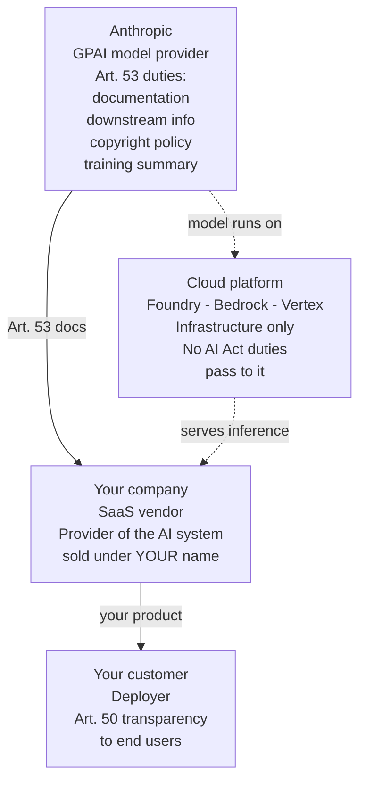
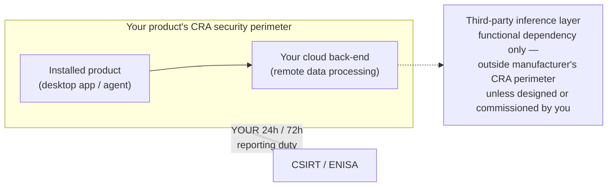

  

    📍
    📋
  

  

    
<strong>Short on time?</strong> Summarize this article with

    

      <select class="ai-selector-dropdown" id="ai-platform-select">
        <option value="">-- Select an AI --</option>
        <option value="claude">🤖 Claude</option>
        <option value="chatgpt">✨ ChatGPT</option>
        <option value="gemini">🔮 Gemini</option>
        <option value="perplexity">🌐 Perplexity</option>
        <option value="copilot">⚡ Copilot</option>
      </select>
    

    
(after ai window opens paste the auto copied prompt manually)

  

> **Written for:** CISOs, cloud architects, compliance teams, and SaaS vendors evaluating EU AI Act and CRA compliance obligations.

> **Part of a series:** This post builds on [Who Processes the Data?](/posts/who-processes-the-data-ai-trust-boundary/) and [Microsoft Foundry Goes GA](/posts/microsoft-foundry-ga-claude-vs-azure-openai/). Those posts asked *who processes the data* — the GDPR lens. This one asks *who answers to the regulator* — and the answers split differently.

---

## Introduction

The first two posts in this series established a discipline: trace where your prompt actually goes, identify who processes it, and check which contract governs that processing. That is the GDPR lens — it follows the *data*.

Today that lens gets a sibling. As of August 2, 2026, the majority of the EU AI Act's provisions apply, and the European Commission gains the power to enforce — and fine — general-purpose AI model providers. On September 11, 2026, the Cyber Resilience Act's reporting obligations begin. Both regulations ask a different question than GDPR: not who processes the data, but **who placed what on the market, under whose name — and who therefore holds the obligations**.

The finding this post builds toward: the two lenses split differently across the same architecture. Under GDPR, moving Claude from Azure Foundry to AWS Bedrock *changes your answer* — dual data processing agreements become a single AWS DPA (Data Processing Addendum).

Under the AI Act, that same move changes **nothing**: Anthropic is the GPAI model provider in both cases, and your role in the value chain is whatever it was before. GDPR follows the data. The AI Act follows the market placement. Claude is this series' running example, but the logic is model-agnostic — substitute GPT, Gemini, or Llama (and their developers), and every mapping below holds.

---

## AI Act Roles 101 (for Architects, Not Lawyers)

The AI Act distributes obligations across a value chain of defined roles. Four of these roles are relevant to cloud AI integrations:

- A **provider** develops an AI system (or has one developed) and places it on the market **under its own name or trademark**. Providers carry the heaviest obligations.
- A **deployer** uses an AI system under its own authority in a professional context. Deployers have lighter duties — oversight, transparency, and (for high-risk systems, from December 2027) usage controls.
- A **GPAI model provider** develops a general-purpose AI model — Claude, GPT, Gemini — and places it on the market. Article 53 sets their obligations: technical documentation, information for downstream providers, a copyright policy, and a training-data summary. Models with systemic risk carry additional Article 55 duties.
- A **downstream provider** integrates a GPAI model into its own AI system and places *that* on the market. This is most SaaS vendors reading this post.

> **The GDPR reflex to unlearn:** GDPR roles follow the data — whoever processes personal data is a processor, wherever they sit. AI Act roles follow the *product* — whoever puts their name on the marketed system is the provider, wherever inference runs. Different inputs, different role maps.

Roles can also **switch**. Article 25 names three triggers by which a deployer, distributor, or other third party *becomes the provider* of a **high-risk** system: (1) putting its own name or trademark on a high-risk system already on the market (unless contract terms allocate the obligations otherwise); (2) making a *substantial modification* to a high-risk system — a change not foreseen in the original conformity assessment that affects compliance or intended purpose; or (3) modifying the intended purpose of a system such that it *becomes* high-risk. Keep the two mechanisms distinct: **Article 25 only governs high-risk systems; Article 3 provider status applies universally to any AI system placed on the market.** White-labeling still makes you the provider under Article 3, with Article 50 transparency duties — it simply does not trigger Article 25 unless the system is high-risk.

For GPAI models, the [Commission's GPAI guidelines](https://artificialintelligenceact.eu/providers-of-general-purpose-ai-models-what-we-know-about-who-will-qualify/) offer an indicative threshold: a downstream modifier becomes a GPAI provider when *"the training compute used for the modification is greater than one-third of the training compute of the original model."* Typical enterprise fine-tuning is orders of magnitude below this — but the guidelines are non-binding, and a court could weigh the criteria differently.

---

## The Core Mapping: Trust-Boundary Patterns Through the AI Act Lens

The first post identified three trust architectures — Pattern A (split trust), Pattern B (unified trust), Pattern C (sub-processor chain) — and the Foundry GA post split Pattern A into A1 (Hosted on Anthropic Infrastructure) and A2 (Hosted on Azure). Here is the same map with AI Act roles overlaid. Read it row by row: the point of the table is which columns *move* between rows and which stay still.

| Platform (pattern) | GDPR: who processes prompts | AI Act: GPAI model provider | AI Act: your typical role |
|---|---|---|---|
| **Azure Foundry — Anthropic-hosted** (A1) | Anthropic (independent processor) | Anthropic | Deployer — or provider of your own AI system |
| **Azure Foundry — Hosted on Azure** (A2) | Anthropic (independent processor) | Anthropic | Deployer — or provider of your own AI system |
| **AWS Bedrock / GCP Vertex AI** (B) | AWS / Google (single DPA) | **Anthropic — still** | Deployer — or provider of your own AI system |
| **M365 Copilot** (C) | Microsoft (Anthropic as sub-processor) | Anthropic (model); Microsoft is provider of the Copilot *system* | Deployer |

### Model Switching Does Not Change AI Act Roles

Read the second and third columns together and the asymmetry jumps out. **Pattern B changed the GDPR answer — it does not change the AI Act answer.** On Bedrock and Vertex, the cloud provider processes your data under a single DPA and Anthropic never sees a prompt. But Anthropic still developed the model and placed it on the market, so Anthropic still holds the Article 53 obligations. Where the weights physically run is a GDPR-relevant fact and an AI Act-irrelevant one. Re-platforming — Foundry to Bedrock, Bedrock to Vertex — re-opens your GDPR analysis and leaves your AI Act role map untouched; swapping the *model* (Claude to GPT to Gemini) changes only whose name sits in the GPAI-provider column.

The M365 Copilot row shows the opposite composition: Microsoft is not merely a processor there — it is the **provider of the Copilot AI system** (its name is on the product), consuming Anthropic's model downstream. Your organisation is a deployer of Copilot, full stop.

The dashed lines are the point: the cloud platform sits in the *data path* but largely outside the *obligation path*. Regulatory duties flow from Anthropic to you to your customer, no matter which dashed route the tokens take.

And the question that determines everything else: **are you a deployer or a provider?** If your company embeds Claude into a product your customers use under your brand — an AI contract analyst, a support copilot, an underwriting assistant — you are not "just using Claude." You are the provider of that AI system. The Article 50 transparency duties (disclosing AI interaction, marking AI-generated content) are live for you **today**, and if your system ever lands in a high-risk Annex III category, the December 2027 obligations land on you — not on Anthropic, not on Microsoft.

**The series' refrain gains a second clause: the model is not the trust boundary, and the platform is not the accountability boundary.**

---

## What Flows Down the Value Chain

Article 53(1)(b) requires GPAI providers to give downstream providers the documentation they need to understand the model's capabilities and limitations and to comply with their own obligations. It is the AI Act's structural answer to a problem the first post described contractually: the opacity of the inference layer.

The documentation arrives through channels with the same platform-dependent friction as the GDPR analysis:

- **Direct API / Foundry (Pattern A):** you have a direct relationship with Anthropic — the marketplace click-through from the first post works in your favour here. In practice you get model cards, system cards, usage policies, and API documentation straight from the source.
- **Bedrock / Vertex (Pattern B):** the cloud provider intermediates the commercial relationship, but Article 53 duties still sit with Anthropic. The platform's model catalog pages carry summaries — verify your procurement path also gives you Anthropic's own Article 53 documentation package, not just AWS or Google service terms.
- **M365 Copilot (Pattern C):** Microsoft, as provider of the Copilot system, absorbs the downstream-provider role. You will generally *not* receive Anthropic's model-level documentation here — check that Microsoft's transparency materials are sufficient for your deployer duties, and record that as the answer.

Same habit as the sub-processor list in post one: **verify which channel your Article 53 materials actually arrive by, and record it.**

---

## Timeline Reality Check: What August 2 Changed, and What the Omnibus Deferred

The [Digital Omnibus on AI](https://datamatters.sidley.com/2026/06/22/eu-lawmakers-reach-provisional-agreement-to-delay-key-eu-ai-act-obligations/), finalised in June 2026, created a confusing headline pair: "the AI Act is delayed" and "the AI Act applies from August 2." Both are true, about different parts:

| Obligation | Status as of August 2, 2026 | Practical engineering task |
|---|---|---|
| Article 50 transparency (chatbot disclosure, AI-content marking, deepfake labeling) | **Live now** | Ship AI-interaction disclosures and content marking in every user-facing AI feature |
| Commission enforcement and fining powers over GPAI providers | **Live now** (GPAI obligations applied since Aug 2025 — enforcement teeth arrive today) | Verify your Article 53 documentation channel per platform; file it in the decision trail |
| National market surveillance authorities fully empowered | **Live now** | Make the trust-boundary decision trail audit-ready |
| CRA vulnerability/incident reporting (covered below) | From **September 11, 2026** | Stand up the reporting workflow; negotiate upstream notification commitments |
| High-risk obligations — standalone Annex III systems | Deferred to **December 2, 2027** | Classify candidate systems now; schedule conformity-assessment prep for mid-2027 |
| High-risk obligations — AI embedded in regulated products (Annex I) | Deferred to **August 2, 2028** | Same, for AI inside regulated products |

The practical read: the deferral is **not** a reason to pause the trust-boundary inventory — it is the window in which to finish it. High-risk classification, Article 25 role analysis, and documentation-channel mapping take quarters, not weeks. And the obligations live today — transparency and GPAI enforcement — touch every AI feature you ship, not just the high-risk ones.

---

## The CRA: A Second Clock, Started by Infrastructure You Don't Operate

The Cyber Resilience Act (Regulation (EU) 2024/2847) governs **products with digital elements** — software and hardware placed on the EU market, plus their *remote data processing solutions*: back-end processing essential to the product's functions. Full obligations apply from December 2027, but the reporting regime starts sooner: from **September 11, 2026**, manufacturers must report actively exploited vulnerabilities and severe incidents — [early warning within 24 hours, notification within 72 hours](https://digital-strategy.ec.europa.eu/en/policies/cra-reporting), final report after remediation. Penalties reach €15 million or 2.5% of worldwide turnover.

### Scope: Not as Simple as "SaaS Is Out"

- **Pure SaaS is generally out of scope** — that's territory for NIS2 (the EU's Network and Information Security Directive 2), not the CRA — unless any client-side component qualifies as a product with digital elements.
- **Shipped software with an AI feature is in scope** — desktop applications, mobile apps, agents installed in customer environments, on-prem components. The remote-data-processing clause then pulls your cloud back-end into the product's security perimeter if the product's functions depend on it.
- **The borderline is wide.** Thick-client SaaS, browser extensions, locally installed agents that front a hosted service — the CRA's definitions (Article 3 and Recital 15) leave real interpretation room for these hybrids. Classify each product individually; do not carry a blanket "we're SaaS, we're exempt" assumption across a portfolio.

### The Reporting Clock — and Who It Actually Binds

Overlay the trust boundary from post one. If your installed product's AI feature calls your back-end, which calls Claude on Foundry, your product *functionally depends* on an inference layer that sits **outside your operational control**. Functional dependency does not by itself create CRA inclusion: under Article 3, "remote data processing" covers only processing designed and developed *by or on behalf of the manufacturer* — so a third-party inference service is generally **not** part of your CRA perimeter unless you designed or commissioned it:

Be precise about who the law binds: **the CRA's reporting obligation falls on you as the manufacturer.** Your 24-hour clock starts when you become *aware* of an actively exploited vulnerability — and for the inference layer, awareness depends on upstream notification for which **the CRA imposes no statutory duty on upstream vendors; only contract terms can create that duty.** This mirrors the GDPR 72-hour breach chain from post one, with a tighter clock and a weaker statutory chain: negotiate the vulnerability-notification commitment explicitly, and subtract it from 24 hours — that's your real margin.

### One Cross-Link Worth Knowing

Under [CRA Article 12](https://www.european-cyber-resilience-act.com/Cyber_Resilience_Act_Article_12.html), a high-risk AI system that complies with the CRA's essential cybersecurity requirements is **presumed to conform** with the AI Act's Article 15 cybersecurity requirement. The two regimes are designed to be satisfied together — CRA compliance work is AI Act compliance work, not a parallel track.

---

## Sidebar: Where ISO/IEC 42001 Fits (and Where It Doesn't)

ISO/IEC 42001 is a voluntary AI management-system standard, not a law — it assigns no value-chain roles and starts no reporting clocks. But it earns a place here twice.

First, as the **home for the process this series keeps prescribing**. Every post has ended with some version of "re-evaluate quarterly; document the decision trail." ISO 42001's management system — particularly its controls on third-party AI suppliers and impact assessment — is exactly the vehicle for institutionalizing that review, with an audit trail a certifier (and eventually a regulator) will recognise.

Second, as a **vendor signal to read correctly**. [Anthropic holds accredited ISO 42001 certification](https://www.anthropic.com/news/anthropic-achieves-iso-42001-certification-for-responsible-ai), and other major model and cloud providers have followed. A certificate tells you the vendor's *management system* was audited — not who processes your prompts, which DPA governs them, or what your AI Act role is. Same caution as the sub-processor list in post one: **certificate ≠ trust boundary.**

One distinction to keep clean: the AI Act's own presumption-of-conformity mechanism runs through **harmonised standards under Article 40**, which European standards bodies are still developing. Those may overlap with ISO 42001 in content, but they are legally distinct — a 42001 certificate does not create AI Act conformity, today or after the harmonised standards land.

---

## The Evaluation Checklist, Extended

The three-pillar checklist from the first post — inference and residency, contracts and acceptance, controls and disclosure — gains a fourth pillar. For each AI integration, record:

**Regulatory roles and deadlines:**
- Who is the GPAI model provider, and through which channel do their Article 53 documentation materials reach you?
- Is your organisation a deployer or a provider for this system? Has anything triggered Article 25 — your trademark on the system, substantial modification, repurposing?
- Are the live Article 50 transparency duties implemented for every user-facing AI feature?
- Could this system fall into an Annex III high-risk category? If plausibly yes, what is the plan for December 2, 2027?
- Is any component a CRA product with digital elements? If yes, does each upstream provider's contractual vulnerability-notification commitment leave workable margin inside the 24-hour reporting window?
- Where does the decision trail live — and is it inside a management system (ISO 42001 or otherwise) with a review cadence and an owner?

As with the original pillars: the answers expire. The Commission's GPAI thresholds are indicative, the Omnibus has already moved deadlines once, and harmonised standards are still landing. Re-run the pillar when anything upstream changes.

---

## Conclusion

The first post argued that the model is not the trust boundary — the platform is. This post adds the regulatory corollary: **the platform is not the accountability boundary either.** GDPR follows your data across whatever infrastructure serves it; the AI Act follows your name on whatever product ships. The same Claude integration can change its GDPR answer by moving from Foundry to Bedrock while its AI Act answer stands perfectly still — and your role in the value chain, deployer or provider, was never the cloud's decision at all. It was yours, made the day you put your name on the product. Know which roles you hold, know whose documentation and notifications you depend on, and give the answers an expiry date. The regulators' clocks are running now.

---

## Key Takeaways

- From August 2, 2026, Article 50 transparency obligations and Commission enforcement over GPAI providers are live; the Digital Omnibus deferred Annex III high-risk obligations to December 2, 2027 (Annex I to August 2028) — a window to finish your inventory, not a pause.
- AI Act roles follow market placement, not data flow: Anthropic is Claude's GPAI model provider on every platform, including Bedrock and Vertex where it never touches your data — and the same pattern applies to GPT, Gemini, and Llama with their respective developers.
- The pivotal self-assessment is deployer vs. provider: shipping an AI feature under your own name makes you a provider of that AI system, with transparency duties live today.
- The CRA's September 11, 2026 reporting regime makes you, the manufacturer, answerable for a product that functionally depends on an inference layer outside your operational control — negotiate upstream vulnerability-notification commitments against a 24-hour clock, because the CRA creates no duty for upstream vendors to notify you; only contract terms can.
- ISO 42001 assigns no roles and starts no clocks, but it is the right vehicle for operationalizing the recurring trust-boundary review; a vendor's certificate is a management-system signal, not a trust-boundary answer.

---

> 💡 **Pro Tip:** For each AI integration, write down three names: the *processor* for prompts and completions (the DPA tells you — the GDPR answer), the *GPAI model provider* (the AI Act answer — the same name on every platform), and the *provider of the AI system* your users actually touch (very possibly you). When the three names differ — and in cloud AI they usually do — each owes different duties to a different authority on a different clock. A vendor-risk review that records only the first name is one-third complete.

---

## References

- [EU AI Act — Regulation (EU) 2024/1689 (official text)](https://eur-lex.europa.eu/eli/reg/2024/1689/oj)
- [EU Lawmakers Reach Agreement to Delay Key EU AI Act Obligations — Sidley](https://datamatters.sidley.com/2026/06/22/eu-lawmakers-reach-provisional-agreement-to-delay-key-eu-ai-act-obligations/)
- [EU AI Act Omnibus Agreement — Postponed High-Risk Deadlines — Gibson Dunn](https://www.gibsondunn.com/eu-ai-act-omnibus-agreement-postponed-high-risk-deadlines-and-other-key-changes/)
- [Providers of General-Purpose AI Models — Who Will Qualify — artificialintelligenceact.eu](https://artificialintelligenceact.eu/providers-of-general-purpose-ai-models-what-we-know-about-who-will-qualify/)
- [When Do You Become a Provider: the Three Routes of Article 25](https://www.aiactblog.nl/en/posts/when-do-you-become-a-provider-ai-act-article-25)
- [Cyber Resilience Act — Regulation (EU) 2024/2847 (official text)](https://eur-lex.europa.eu/eli/reg/2024/2847/oj)
- [Cyber Resilience Act — Reporting Obligations — European Commission](https://digital-strategy.ec.europa.eu/en/policies/cra-reporting)
- [CRA Article 12 — High-Risk AI Systems](https://www.european-cyber-resilience-act.com/Cyber_Resilience_Act_Article_12.html)
- [CRA 24-Hour Reporting Duties Start September 11, 2026 — Crowell & Moring](https://www.crowell.com/en/insights/client-alerts/eu-cyber-resilience-act-countdown-11-september-2026-incidentvulnerability-reporting-deadline-is-less-than-100-days-away)
- [Anthropic Achieves ISO 42001 Certification](https://www.anthropic.com/news/anthropic-achieves-iso-42001-certification-for-responsible-ai)
- [Who Processes the Data? Trust, Responsibility, and AI Inference Beyond the Cloud](/posts/who-processes-the-data-ai-trust-boundary/)
- [Microsoft Foundry Goes GA: Same Processor, Two Hosting Paths](/posts/microsoft-foundry-ga-claude-vs-azure-openai/)

---

## Limitations

This analysis is a technical-governance mapping, not legal advice. It does not cover:

- **High-risk classification analysis** for specific use cases — whether a system falls under Annex III requires case-by-case legal assessment.
- **Prohibited practices (Article 5)**, applicable since February 2025.
- **NIS2 obligations** for pure SaaS operators, mentioned only to delineate CRA scope.
- **Sector-specific regimes** — DORA (Digital Operational Resilience Act) for financial services, MDR (Medical Device Regulation) for medical devices — that interact with the AI Act's Annex I pathway.
- **CRA classification of specific product categories** — desktop apps, mobile apps, agents, browser extensions, and hybrid architectures each raise their own scope questions; the mapping here is directional, not a per-product determination.
- The Digital Omnibus text and the Commission's GPAI guidelines continue to settle; indicative thresholds cited here (such as the one-third training-compute criterion) are non-binding.

---

## Disclaimer

This content reflects independent technical analysis based on publicly available regulatory texts, official guidance, and documentation as of the publication date. Regulatory interpretations, guidelines, and deadlines evolve — readers should verify current texts and consult qualified legal counsel before making compliance decisions. This post does not represent the position of any cloud provider, model vendor, regulator, or employer.
