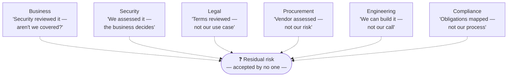

  

    📍
    📋
  

  

    
<strong>Short on time?</strong> Summarize this article with

    

      <select class="ai-selector-dropdown" id="ai-platform-select">
        <option value="">-- Select an AI --</option>
        <option value="claude">🤖 Claude</option>
        <option value="chatgpt">✨ ChatGPT</option>
        <option value="gemini">🔮 Gemini</option>
        <option value="perplexity">🌐 Perplexity</option>
        <option value="copilot">⚡ Copilot</option>
      </select>
    

    
(after ai window opens paste the auto copied prompt manually)

  

> **Written for:** CISOs, security leaders, enterprise architects, engineering leaders, compliance and risk practitioners, and product leaders evaluating AI adoption.

> **Also worth reading:** This post is standalone, but pairs well with the trust-boundary series — [Who Processes the Data?](/posts/who-processes-the-data-ai-trust-boundary/) and [Who Answers to the Regulator?](/posts/who-answers-to-the-regulator-ai-act-cra-trust-boundary/). Those posts map *where* responsibility sits in the AI value chain. This one asks the question that comes before either: *who inside your organization accepts the risk at all?*

---

## Introduction

Sit through enough enterprise AI governance discussions and a pattern emerges. The meeting starts with technology: hallucinations, model security, prompt injection, data privacy, the latest regulation. Slides are presented. Controls are debated. Everyone is engaged, because these are interesting problems with a growing body of good answers.

Then the meeting ends, and nothing gets decided.

Not because the technical questions were hard — most of them have workable answers today. The meeting ends without a decision because a different question was never asked: **if this AI capability is approved and something goes wrong, who owns the outcome?**

Most organizations treat AI governance as a technology problem. In practice, the hardest part of AI governance isn't the AI. It's determining who owns and accepts risk when AI is introduced into a business process. The technology debates are often a comfortable place to hide from that harder, organizational question.

This post is a distillation of lessons from many such discussions across industries. No company names, no specific incidents — the pattern is generic enough that it doesn't need them. If you have been in these rooms, you will recognize it.

---

## The Approval Myth

The most common misunderstanding in AI governance fits in one sentence: *"Security approved it, so we're covered."*

It sounds reasonable. A capable security team reviewed the AI capability, evaluated the vendor, assessed the controls, and signed off. Surely that means the risk is handled?

It doesn't — and the confusion sits in the word "approved." What a security review actually produces is an *assessment*: here are the risks we identified, here are the controls in place, here are the mitigations we recommend, and here is the risk that remains after all of that. That residual risk does not vanish when the review is complete. It transfers to whoever proceeds with the initiative.

Security can evaluate controls. Security can identify risks. But **security does not own business risk** — the business does. When the AI-assisted process produces a bad outcome — a wrong answer sent to a customer, sensitive data summarized into the wrong context, a decision made on fabricated information — the consequence lands on the business process, not on the review that preceded it.

"Security approved it" is shorthand for "security found the residual risk acceptable *to describe*." Someone still has to find it acceptable *to carry*. Those are different acts, performed by different people, and the gap between them is where the approval myth lives.

---

## AI Changes Existing Risk Boundaries — It Rarely Creates New Ones

The second pattern worth internalizing: AI systems rarely introduce entirely new categories of risk. What they do — reliably and at speed — is amplify risk categories your organization already carries:

- **Data access risk.** An AI assistant that can read across systems inherits every over-broad permission ever granted. The permissions were always wrong; now something is actively exercising them.
- **Third-party risk.** Model providers, inference platforms, and plug-in ecosystems extend your vendor chain. The chain existed before; AI adds links that are harder to inspect.
- **Intellectual property risk.** Questions about what leaves the organization in a prompt, and what comes back in a completion, are old data-handling questions wearing new clothes.
- **Compliance risk.** Regulatory obligations attached to a business process do not relax because a model now performs part of it.
- **Operational dependency risk.** A workflow that quietly becomes unable to function without an external inference service has a new single point of failure — the same concentration-risk problem enterprises have managed for decades.

This framing matters for a specific reason: **the introduction of AI often exposes ownership gaps that already existed.** If nobody could tell you who owned the risk of over-broad data access *before* the AI assistant arrived, the AI didn't create that gap — it made the gap impossible to ignore. Organizations frequently experience this as "AI risk" when it is really *deferred ownership debt* coming due.

That is also why buying an "AI risk" tool or writing an "AI policy" so often disappoints. The gap being exposed is not a missing control. It is a missing name.

---

## Everyone Assumes Someone Else Owns the Decision

Here is the scenario, generic by design, that plays out in some form in most large organizations:

A business team wants a new AI capability — say, an assistant that drafts responses using internal knowledge. Everyone does their job:

- **The business** writes the case and requests the capability.
- **Security** performs a thorough review and documents risks and mitigations.
- **Legal** reviews the contractual terms and data processing arrangements.
- **Procurement** runs the vendor through its assessment process.
- **Engineering** evaluates the integration and implementation approach.
- **Compliance** maps the applicable obligations.

Six functions, six diligent reviews, six documents. And then: silence. The initiative sits. Weeks pass. Status meetings are held about why the status hasn't changed.

What happened? Every function completed its *advisory* work — and every function assumed someone else would perform the *deciding* act of formally accepting the residual risk. Security assumes the business will. The business assumes security's sign-off already did. Legal flagged the contract terms but doesn't own the use case. Compliance mapped the obligations but doesn't own the process. Everyone is waiting for a signature nobody was asked to provide.

The dotted lines are the diagram's point: every function is adjacent to the risk, and none of them is connected to it by a solid line of ownership. This is not a failure of diligence — everyone did their job well. It is a failure of *design*. The process defined six advisory roles and zero deciding ones.

---

## Security's Real Role

Part of the fix is for security teams to be disciplined about what their role is — and is not.

A mature security function in an AI governance process does four things:

1. **Identify risks** — concretely, in terms of the business process, not just the technology.
2. **Evaluate controls** — what the vendor, the platform, and the implementation actually provide, versus what the marketing claims.
3. **Recommend mitigations** — proportionate to the use case, with the cost and friction of each stated honestly.
4. **Document residual risk** — in plain language a business owner can understand and act on, because that document is the input to *someone else's* decision.

What a mature security function should *not* do is quietly become the owner of every business decision that has a technology component. That failure mode is seductive because it feels responsible — someone has to decide, and security is in the room. But it fails everyone involved. It fails the business, which loses the discipline of weighing risk against its own objectives. It fails governance, because risk acceptance drifts to the function with the least visibility into business value. And it fails security itself: a team that owns every decision becomes the bottleneck for every initiative and the scapegoat for every incident, and eventually loses the credibility that made its assessments valuable in the first place.

The strongest sentence a security leader can say in an AI governance meeting is not "no." It is: *"Here is the residual risk, documented. Who is accepting it?"*

---

## Governance Is an Accountability Framework, Not a Policy Library

There is a reflex, when "AI governance" lands on the agenda, to start producing documents: an AI policy, an acceptable-use standard, a review checklist. Those artifacts have value — but they are not the substance of governance. An organization can have a beautifully written AI policy and still be unable to launch (or stop) anything, because policies describe *what* should happen and governance is fundamentally about *who*.

Strong governance ensures unambiguous answers to five questions for every AI capability:

| Question | Role | What it means in practice |
|---|---|---|
| **Who decides?** | Decision owner | The named person or body that approves or rejects the capability — and accepts what that implies |
| **Who advises?** | Security, legal, compliance, architecture | Functions that inform the decision with assessments — without being mistaken for the decider |
| **Who implements?** | Engineering / delivery | Accountable for building what was approved — not something adjacent to it |
| **Who monitors?** | Operations / risk | Watches whether assumptions made at approval time stay true in production |
| **Who accepts residual risk?** | Business owner | The name written next to the risk that remains after all controls — the answer that unblocks everything else |

Two observations from applying this in practice.

First, the last row is the one organizations most consistently leave blank — and it is the one that makes the other four meaningful. A decision without risk acceptance is a decision nobody has to stand behind.

Second, note what the framework does *not* mention: hallucination rates, model choice, prompt injection defenses. Those matters get resolved *inside* this structure — by the advisors, for the decider. Without the structure, the same technical topics get debated in circles, because a debate with no decider has no way to end.

---

## The Most Important Governance Question

Before the architecture diagrams, before the control matrices, before the vendor questionnaire — one question, asked early, does more work than any of them:

> **"Who owns the outcome if this AI capability creates a problem?"**

Ask it in the first meeting, and watch what happens. If there is a clear answer, the rest of the governance process becomes remarkably fast: the owner has a natural incentive to understand the risks, the advisors have a clear customer for their assessments, and "how much risk is acceptable" becomes a business judgment made by the person entitled to make it.

If there is no clear answer — and often there isn't — you have just learned the most important fact about the initiative. No amount of technical review will compensate for it. The hours that would have been spent debating hallucination benchmarks are better spent resolving the ownership question, because every downstream discussion depends on it.

This question routinely accelerates governance more than hours of technical debate, for a simple reason: technical debates expand to fill the vacuum left by an unmade decision. Name the owner, and the debates get shorter, sharper, and more useful — because now they have someone to be *for*.

---

## Conclusion

None of this argues that the technical work doesn't matter. Model security, data protection, evaluation, and monitoring are real disciplines, and organizations that skip them will pay for it. But they are the *second* conversation. The first conversation is organizational: who decides, who advises, who implements, who monitors, and — above all — who accepts the risk that remains when the controls have done all they can.

Organizations that get this right don't necessarily have better AI policies or smarter technical reviews. They have something simpler: names next to risks.

**Successful AI governance is not achieved when everyone agrees that the technology is safe. It is achieved when everyone understands who owns the risk.**

---

## Key Takeaways

- AI governance discussions stall on organizational ambiguity, not technology: the technical questions usually have workable answers, while the "who accepts this risk" question often has none.
- "Security approved it" is an assessment, not an acceptance — security evaluates controls and documents residual risk, but residual risk transfers to whoever proceeds, and that must be a named business owner.
- AI rarely creates new risk categories; it amplifies existing ones — data access, third-party, IP, compliance, operational dependency — and in doing so exposes ownership gaps that predate the AI.
- Six diligent advisory reviews with zero deciding roles produce a stalled initiative; the failure is process design, not diligence.
- Governance is an accountability framework before it is a policy library: who decides, who advises, who implements, who monitors, who accepts residual risk — with the last question being the one most often left unanswered.
- Ask "who owns the outcome if this creates a problem?" before any technical debate; the answer (or its absence) is the single most important fact about the initiative.

---

> 💡 **Pro Tip:** Add one field to your AI intake or review template: *"Residual risk accepted by: ______ (name, role, date)."* Not a committee, not a function — a name. If nobody will put their name in that field, the governance process hasn't failed; it has succeeded early, by surfacing in week one the problem that would otherwise surface in month six.



---

## References

- [NIST AI Risk Management Framework (AI RMF 1.0)](https://www.nist.gov/itl/ai-risk-management-framework) — govern function: roles, responsibilities, and risk tolerance as first-class governance outcomes
- [ISO/IEC 42001 — AI Management Systems](https://www.iso.org/standard/42001) — organizational accountability structures for AI, beyond technical controls
- [ISO 31000 — Risk Management Guidelines](https://www.iso.org/iso-31000-risk-management.html) — the general principle that risk acceptance is an ownership decision, not an assessment output
- [Who Processes the Data? Trust, Responsibility, and AI Inference Beyond the Cloud](/posts/who-processes-the-data-ai-trust-boundary/)
- [Who Answers to the Regulator? Mapping the EU AI Act and CRA onto the Cloud AI Trust Boundary](/posts/who-answers-to-the-regulator-ai-act-cra-trust-boundary/)

---

## Disclaimer

This content reflects general lessons from enterprise AI governance discussions across industries, deliberately kept generic and non-attributable. No specific company, customer, vendor, product, program, or incident is referenced or implied. It is not legal, compliance, or risk advice — organizational structures and regulatory obligations vary, and readers should adapt these principles to their own context. This post does not represent the position of any vendor, regulator, or employer.
