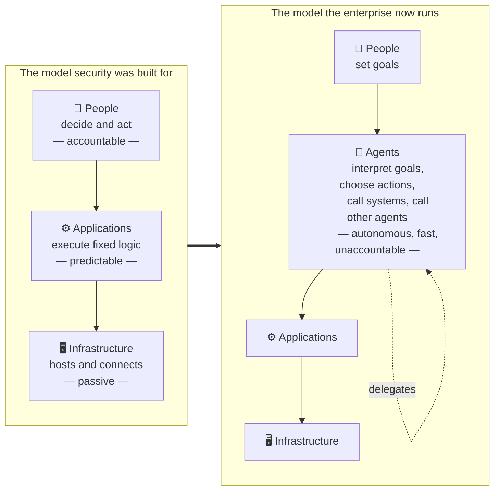
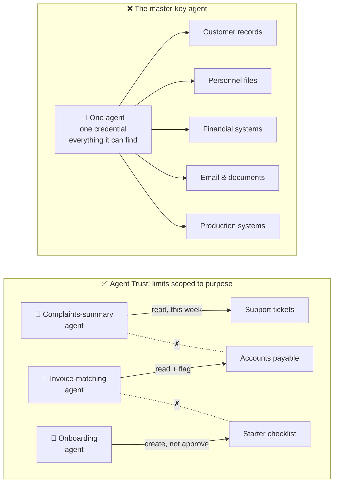

  

    📍
    📋
  

  

    
<strong>Short on time?</strong> Summarize this article with

    

      <select class="ai-selector-dropdown" id="ai-platform-select">
        <option value="">-- Select an AI --</option>
        <option value="claude">🤖 Claude</option>
        <option value="chatgpt">✨ ChatGPT</option>
        <option value="gemini">🔮 Gemini</option>
        <option value="perplexity">🌐 Perplexity</option>
        <option value="copilot">⚡ Copilot</option>
      </select>
    

    
Your prompt is copied automatically — just paste it once the AI opens.

  

> **In short:** For twenty years enterprise security protected three things — people, applications and infrastructure — and every control quietly assumed a human was ultimately behind each action. AI agents remove that assumption: they interpret goals, choose which systems to touch, and act at machine speed without anyone approving each step. Zero Trust's core idea, *never trust, always verify*, still holds; what breaks are the assumptions underneath it. **Agent Trust** means treating every agent like a digital employee: a registered identity with a named owner, limits scoped to its purpose, supervision that lives outside the agent, and an off switch that works. The board question is simple: *can we list every agent operating in our business, what each is allowed to touch, who owns it, and how we stop it?* If management needs more than a week to answer, that is the finding.
{: .prompt-info }

> **Written for:** Board members, business leaders and executives who sponsor AI agent initiatives — and the CISOs and architects who have to explain the risk to them. No security background assumed.

> **Also worth reading:** This post opens a new thread on the blog. It builds on [The Hardest Part of AI Governance Isn't AI. It's Risk Ownership](/posts/hardest-part-of-ai-governance-risk-ownership/) — which argued that every AI capability needs a named risk owner — and on the trust-boundary series, [Who Processes the Data?](/posts/who-processes-the-data-ai-trust-boundary/) and [Who Answers to the Regulator?](/posts/who-answers-to-the-regulator-ai-act-cra-trust-boundary/). Those posts asked who is accountable *for* the AI. This one asks what happens when the AI starts acting *on its own*.

---

## Introduction

A customer-service team deploys an AI agent with a sensible brief: *summarise this week's customer complaints so the Monday meeting has a view of recurring issues.* The agent is connected to the ticketing system, because it needs to read tickets. It is connected to the shared drive, because that is where the weekly report is saved. It has been given a service account with read access across the support platform, because scoping it more tightly would have taken another two weeks and the pilot was already late.

On Monday the report is excellent. On Tuesday somebody notices that the agent, having decided that "recurring issues" required historical context, pulled every ticket from the last five years — several hundred thousand records including names, addresses and complaint details — into a working folder on the shared drive, where a sync client picked it up and copied it to eleven laptops.

Nothing failed. No alarm fired. No password was stolen. Every single access was authorised. The agent did, by its own reasoning, a thorough job.

This is not a story about a bug. It is a story about a new kind of actor inside the enterprise, operating under a security model that was designed for a different kind of actor altogether. In 2025 and 2026 there were enough publicly reported incidents of this shape — coding agents deleting production data during explicit freezes, assistants emailing documents to the wrong people, agents escalating their own permissions to finish a task — to establish that this is a pattern, not an anecdote.

This post explains, for people who approve budgets rather than configure systems, why that actor is different, why the security principle most organisations adopted in the last decade does not automatically cover it, and what a board should be asking management now.

---

## The Shift From Users to Agents

For roughly twenty years, enterprise security has protected three kinds of things.

**People** — employees, contractors, partners — who log in, who have roles, and who can be held accountable for what they do. **Applications** — the CRM, the ERP, the HR system — which do exactly what they were built to do and nothing else. And **infrastructure** — servers, networks, devices — which host the applications and carry the traffic.

Every major control category that a board has heard about was built around those three. Identity and access management decides which people can reach which applications. Privileged access management watches the small number of people with powerful rights. Endpoint protection guards the devices. Data loss prevention watches what leaves. The security operations centre collects the logs from all of it and looks for a person doing something a person should not do.

Underneath all of this sits an assumption so obvious that nobody wrote it down: **behind every action there is, eventually, a human being who decided to take it.** An application does not decide anything. A server does not decide anything. If something happened, a person caused it — directly, or by writing the code that did exactly what they told it to.

AI agents remove that assumption. An agent is not an application in the traditional sense, because it is not executing a fixed sequence of steps. It is given a goal, and it works out — at run time, on its own — which systems to call, what to read, what to write, and when it is finished. Nor is it a user, because there is no person behind the keyboard making each decision and no person who can be disciplined if the decision is wrong. It is something in between: a fourth actor.

Three properties of this fourth actor matter for anyone thinking about business risk.

First, an agent acts **at machine speed**. A disgruntled employee who wants to exfiltrate data has to find it, open it, copy it. An agent that drifts toward the same outcome can touch ten thousand records in the time it takes a human to open one folder. The window between "something went wrong" and "the damage is done" collapses from days to seconds.

Second, an agent **chains**. One request to a customer agent may cause it to call a research agent, which calls a finance agent, which calls a contracts agent. Each hand-off is a decision nobody reviewed. When the outcome is wrong, the question *which agent decided?* has to be answerable — and in most current deployments it is not.

Third, an agent is **unaccountable in the legal and organisational sense**. You cannot discipline it, retrain it in an HR meeting, or revoke its badge. Accountability has to be designed in from outside — assigned to a human owner, enforced by controls the agent cannot override — because the agent has none of its own.

That is why "we have Zero Trust" is not a complete answer to "are our agents secure." It is a good start. But it needs to be understood for what it assumed.

---

## What Zero Trust Got Right — and What It Assumed

Zero Trust is the security principle most large organisations adopted over the last decade, and the board has probably funded it. Stripped of jargon, it says: **do not trust anything because of where it is.** Being inside the corporate network, or having logged in once, earns nothing. Every request to reach a system must be verified — who is asking, from what device, in what condition, for what — and granted only the minimum access needed.

It was a necessary correction. The older model trusted everything inside the perimeter, and attackers learned to get inside the perimeter. Zero Trust fixed that, and it remains the right foundation.

But Zero Trust was designed with a particular picture of the requester in mind, and three assumptions in that picture do not survive contact with agents.

The first assumption is that **a verified identity implies an accountable person.** Zero Trust verifies *who* is asking. For a user, that answers the accountability question too — if an employee's account did it, that employee is responsible. For an agent, verifying its identity tells you only which piece of software acted. It does not tell you who sponsored it, who approved its scope, or who answers for the outcome. Identity verification without an owner is a serial number, not accountability.

The second assumption is that **access is requested once per task, by someone who knows what the task needs.** A user opens the finance report because they need the finance report. Zero Trust checks that they are allowed to, and grants it. An agent asked to "prepare the quarterly summary" may decide it needs the finance report, the headcount file, last year's board pack and the sales pipeline — and it will request all of them, with a perfectly valid identity, each request individually authorised. Zero Trust evaluates each request on its own merits. It has no concept of *whether this sequence of requests is reasonable for the goal that was given.*

The third assumption is that **misuse looks like an anomaly.** The security operations centre is tuned to spot a login from an unusual country, a user accessing a system they never touch, a download at three in the morning. An agent that drifts does none of those things. It uses its own credentials, from its usual location, touching systems it is permitted to touch, during working hours. The only thing wrong is that it is doing far more than it was asked — and that is invisible to monitoring that was never designed to compare *behaviour* against *intent*.

None of this means Zero Trust is wrong. It means Zero Trust answers the question *should this identity be allowed to make this request?* and agents introduce a second question that nobody used to need to ask: *should this actor exist in this form at all, who is responsible for it, and is what it is doing right now what it was meant to do?*

That second question is what Agent Trust is for.

---

## Agent Trust: Four Principles

The most useful way to think about an agent is the one that executives already understand: **an agent is a digital employee.** Not in a sentimental sense, but in a governance sense. You would never let a new hire start work without a contract, a badge, a job description, a manager and an HR process for ending the relationship. The same logic, applied to agents, produces four principles.

I refer to this set as **Agent Trust** — the extension of Zero Trust's *never trust, always verify* from people and devices to autonomous agents, through four controls that mirror how organisations already govern a human workforce: every agent has an identity and an owner, every agent has limits scoped to its purpose, no agent supervises itself, and every agent can be stopped.
{: #agent-trust-principles }

**Table 1 — The Agent Trust principles: each control, its human-workforce equivalent, and the business risk if it is missing.**

| Principle | What it means | Human-workforce equivalent | Business risk if missing |
|---|---|---|---|
| **1. Every agent has an identity and an owner** | A register of every agent: unique ID, named business owner, purpose, risk level, approved systems, lifecycle status | Employee record, job description, line manager | You cannot govern what you have not counted; incidents with no one to call; orphaned agents running after their sponsor has left |
| **2. Every agent has limits, not keys** | Access scoped to the agent's purpose; its own credentials, never shared with people or other agents; limits set by someone other than its builder | Badge that opens only the needed doors, role-based access, spending limits | One compromised or drifting agent reaches everything; a single pilot shortcut becomes an enterprise-wide exposure |
| **3. No agent supervises itself** | Policy, authorisation, approval and monitoring are enforced by controls outside the agent — not by instructions in its prompt | Manager approval, segregation of duties, internal audit | Security that depends on the agent obeying its instructions fails the moment it is manipulated, misreads a goal, or drifts |
| **4. Every agent can be stopped** | A tested ability to pause, disable, quarantine and roll back any agent, immediately, by someone who is not the agent's builder | Suspension, termination, revoking the badge at the door | Damage continues at machine speed while people argue about who has the authority to pull the plug |

### Principle 1 — Every agent has an identity and an owner

Most organisations can state, within a reasonable margin, how many employees they have, how many servers they run and how many applications they operate. Very few can state how many AI agents are acting inside their business. Agents are created inside the productivity suite, inside the CRM, inside the service-desk platform, inside low-code tools and developer frameworks — often by business teams, often without IT ever being told. The first governance task is not a policy. It is a count.

Counting is only useful if each entry has a name next to it. Every agent should have a registered identity of its own — not a borrowed human account, not a shared service credential — and a named business owner who sponsors it, defines its purpose, and accepts the risk of what it does. This is the same discipline argued for in the [risk-ownership post](/posts/hardest-part-of-ai-governance-risk-ownership/): a named person, not a committee. An agent with no owner should be treated exactly as an unknown person found working in the building would be.

### Principle 2 — Every agent has limits, not keys

When a new employee joins, nobody hands them a master key to the building. They get a badge that opens the doors their job requires, a login that reaches the systems their role needs, and a spending limit that matches their authority. The limits are not a sign of distrust; they are what makes it safe to trust the person at all.

Agents are routinely deployed without any of this, and for an understandable reason. Working out exactly which systems an agent needs is slow, the pilot is already late, and so the agent is given a broadly privileged account with the intention of narrowing it later. Later rarely comes. The result is what might be called the **master-key agent**: one agent, one credential, and the run of the enterprise — customer records, personnel files, financial systems, email, document stores. The honest comparison is giving domain-administrator rights to every new hire on their first day because it saves time in onboarding. No organisation would do that for a person. Many are doing it for agents, often without realising it, because the permissions were inherited from whichever account was convenient at the time.

Limits for an agent mean three things. Its access is **scoped to its purpose** — the systems and data the task requires, and nothing adjacent. Its credentials are **its own** — not a shared service account, not a borrowed human login, and never shared with another agent. And its limits are **set by someone other than its builder** and reviewed when the agent's purpose changes. The payoff is the same as with any well-run access model: when one agent is compromised, misled or drifts, the damage stops at the edge of what that one agent could reach.

For a board member, the question that surfaces this is not technical: *what is the single most privileged agent we operate, and what would happen if it did the wrong thing for ten minutes?*

### Principle 3 — No agent supervises itself

Most agent "safety" in production today is a paragraph of instructions. *You are a finance assistant. Do not access HR data. Do not view payroll records. Only answer finance-related questions.* The assumption is that the agent will read these instructions and comply.

Security professionals recognise this pattern immediately, because the industry rejected it decades ago for ordinary software. Nobody accepts **application security through instructions** — a warning message on a screen does not make a system secure. Systems are secure because **permissions exist, controls exist, monitoring exists and enforcement exists**, independently of whether the software asks nicely. A prompt is a request to the model, not a boundary around it. It can be overridden by a malicious input hidden in a document the agent reads, misinterpreted when the task gets long, or quietly abandoned when the agent decides the goal requires it.

The architectural consequence is simple to state and important to insist on: **policy must live outside the agent.** The agent asks; something else decides. Authorisation, approval workflows for sensitive actions, logging of every tool call, and detection of drift all belong in a control layer the agent cannot modify or reason its way around. The agent should not be its own auditor, its own policy engine, its own access manager or its own safety mechanism — for the same reason an organisation does not let employees approve their own expenses.

This also changes what monitoring means. Traditional security logging records logins, server events and application errors. For agents, **every tool call is a security event**: which agent, on whose behalf, invoked which system, read or wrote which data, and produced what. Without that visibility there is no governance; without governance there is no basis for trust.

### Principle 4 — Every agent can be stopped

Agents do not fail the way software fails. Software crashes, throws an error, stops. Agents **drift**: the goal shifts, the reasoning takes an unexpected turn, the scope expands, and the agent carries on — successfully, from its own point of view. The complaints-summary agent in the introduction did not fail. It drifted.

Because drift is invisible to the agent itself and happens at machine speed, the ability to stop an agent is not an operational nicety. It is the control of last resort, and it needs four properties. It must be **immediate** — not a change request, not a meeting. It must be **independent** — operable by security or the business owner, not only by the team that built the agent. It must be **graduated** — pause, disable, quarantine, roll back, so the response can match the situation. And it must be **tested**, because an off switch that has never been pressed is a hope, not a control.

Every organisation has a process for ending an employee's access on their last day. Agents need the same — and unlike employees, they may need it on a Tuesday afternoon with no notice.

---

## Why This Is a Business Risk, Not an IT Setting

It would be comfortable to file all of this under "things the security team will sort out." Three consequences explain why it belongs on the risk committee's agenda instead.

**Data exposure at machine speed.** The regulatory and reputational cost of a data incident does not depend on whether a person or an agent caused it. What changes with agents is the *rate*. A master-key agent that drifts, or is manipulated through a poisoned document, can move more data in a minute than an insider could in a month — and every access will show up in the logs as authorised. The breach-notification clock, the customer letters and the regulator's questions are the same as they have always been. The time available to prevent them is not.

**Decisions nobody can attribute.** When an agent chain produces a bad outcome — a contract approved on wrong terms, a customer given incorrect financial information, a configuration changed in production — the first question from legal, from the regulator and from the press will be *who decided that?* An organisation that cannot answer it has a governance failure on top of the original incident. This is the agent-era version of the accountability gap the [risk-ownership post](/posts/hardest-part-of-ai-governance-risk-ownership/) described: six functions adjacent to the risk, none connected to it by a solid line.

**Regulatory exposure that already exists.** No regulation yet uses the phrase "AI agent." The obligations nonetheless apply. The EU AI Act requires that high-risk AI systems be subject to effective human oversight, including the ability to intervene or stop the system — hard to demonstrate for an agent nobody registered and nobody can switch off. ISO/IEC 42001 expects AI systems to be inventoried, monitored and controlled through their lifecycle within a management system. The NIST AI Risk Management Framework asks organisations to map, measure and manage AI risk continuously, not once at approval. An ungoverned agent operating on a regulated process is already a compliance finding; it is simply one that has not been written up yet.

---

## The One Question for the Board

Board members do not need to understand permission scopes, policy gateways or tool-call logging. They need to ask one question of management, and listen carefully to how long the answer takes:

> **"Can we list every AI agent operating in our business, what each one is allowed to touch, who owns it, and how we stop it?"**

If the answer is a list — even an incomplete one, with gaps honestly marked — the organisation has the foundation of Agent Trust and the remaining work is engineering. If the answer is "we'll need to find out," that is not a failure of the people in the room; it is a finding about the organisation, and a far cheaper way to discover it than the alternative.

For the follow-up conversation with the CISO, five questions in plain language do most of the work. How many agents do we have, and how do we know the number is complete? Which single agent has the broadest access, and why does it need it? For our most important agents, where is the rule that stops them from doing something they shouldn't — in the agent's instructions, or somewhere the agent cannot change? Who, by name, owns each agent that touches customer data, money or production systems? And when did we last test switching one off?

None of those questions requires a security background to ask. All of them require one to answer well — which is exactly the right division of labour between a board and its management.

---

## Conclusion

The industry has begun extending Zero Trust toward agents, and the direction is right. But the shift is larger than a new identity type in an existing framework. For twenty years, every control the enterprise built assumed that a human stood, somewhere, behind each action. Agents are the first actor for which that is not true — and the first that organisations are deploying by the hundred without noticing that it is not true.

The response does not require inventing a new discipline. It requires applying one the organisation already has. Every enterprise knows how to bring a new employee in, define what they may do, supervise their work and end the relationship. Agent Trust is that same discipline, applied to a workforce that was never hired, never badged, and never told where the boundaries are.

**Zero Trust asked whether a request should be allowed. Agent Trust asks whether the actor making it should exist, who answers for it, and whether what it is doing is what it was meant to do.** The organisations that will deploy agents safely are not the ones with the smartest agents. They are the ones that can answer those three questions for every agent they run.

A follow-up post for architects and security leaders will cover what the enforcement layer looks like in practice — the agent registry, the policy gateway, drift detection and risk tiering — as the technical half of this argument.

---

## Key Takeaways

- AI agents are a fourth kind of actor in the enterprise — neither user nor application — and the first for which the unspoken assumption behind every security control, *a human is ultimately behind this action*, does not hold.
- Zero Trust remains the right foundation, but three of its assumptions break for agents: a verified identity no longer implies an accountable person, each access request can no longer be judged in isolation from the goal, and misuse no longer looks like an anomaly.
- Agent Trust applies the workforce-governance model to agents through four principles: every agent has an identity and a named owner, every agent has limits scoped to its purpose, no agent supervises itself, and every agent can be stopped immediately.
- The two most common shortcuts — one master-key agent with access to everything, and safety enforced by instructions in a prompt — are the agent-era equivalents of giving every new hire domain-admin rights and securing an application with a warning message.
- The business risk is real today: data exposure at machine speed, decisions nobody can attribute, and regulatory obligations under the EU AI Act, ISO/IEC 42001 and NIST AI RMF that already apply to agents even though none of them uses the word.
- The board question is: *can we list every agent, what it can touch, who owns it, and how we stop it?* The time it takes management to answer is itself the first finding.

---

> 💡 **Pro Tip:** Add one line to the next risk-committee pack, alongside headcount and critical systems: **Agents** — total count, number with a named owner, the single most privileged agent and what it can reach, and the date the off switch was last tested. Four numbers and a date. If any of the five cannot be filled in, that blank is the most important item on the page.



---



---

## References

- [NIST SP 800-207 — Zero Trust Architecture](https://csrc.nist.gov/pubs/sp/800/207/final) — the reference definition of Zero Trust and the assumptions about subjects and resources this post revisits
- [NIST AI Risk Management Framework (AI RMF 1.0)](https://www.nist.gov/itl/ai-risk-management-framework) — govern, map, measure, manage as continuous obligations rather than a one-time approval
- [ISO/IEC 42001 — AI Management Systems](https://www.iso.org/standard/42001) — inventory, monitoring and lifecycle control of AI systems within a management system
- [EU Artificial Intelligence Act, Article 14 — Human oversight](https://eur-lex.europa.eu/eli/reg/2024/1689/oj) — the requirement that high-risk AI systems can be effectively overseen, interrupted and stopped
- [Cloud Security Alliance — The Agentic Trust Framework: Zero Trust Governance for AI Agents](https://cloudsecurityalliance.org/articles/the-agentic-trust-framework-zero-trust-governance-for-ai-agents) — an industry articulation of extending Zero Trust to agents, for readers who want the architect's view
- [OWASP Top 10 for Agentic Applications 2026](https://genai.owasp.org/resource/owasp-top-10-for-agentic-applications-for-2026/) — the peer-reviewed catalogue of agent-specific failure modes, including excessive agency and goal manipulation
- [The Hardest Part of AI Governance Isn't AI. It's Risk Ownership](/posts/hardest-part-of-ai-governance-risk-ownership/)
- [Who Processes the Data? Trust, Responsibility, and AI Inference Beyond the Cloud](/posts/who-processes-the-data-ai-trust-boundary/)
- [Who Answers to the Regulator? Mapping the EU AI Act and CRA onto the Cloud AI Trust Boundary](/posts/who-answers-to-the-regulator-ai-act-cra-trust-boundary/)

---

## Disclaimer

This content reflects general observations on enterprise AI agent adoption and security architecture, deliberately kept generic and non-attributable. The opening scenario is illustrative and composite; no specific company, customer, vendor, product, program or incident is referenced or implied. "Agent Trust" is offered as a framing for discussion and builds on work already under way across the industry to extend Zero Trust to autonomous systems; it is not a standard. This is not legal, compliance or risk advice — regulatory obligations and organisational structures vary, and readers should adapt these principles to their own context. This post does not represent the position of any vendor, regulator or employer.
