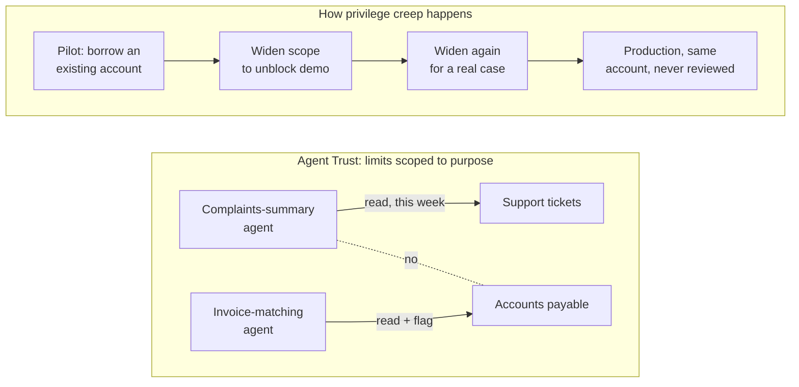

Show intro context (summary, audience, related posts)

  

    📍
    📋
  

  

    
<strong>Short on time?</strong> Summarize this article with

    

      <select class="ai-selector-dropdown" id="ai-platform-select">
        <option value="">-- Select an AI --</option>
        <option value="claude">🤖 Claude</option>
        <option value="chatgpt">✨ ChatGPT</option>
        <option value="gemini">🔮 Gemini</option>
        <option value="perplexity">🌐 Perplexity</option>
        <option value="copilot">⚡ Copilot</option>
      </select>
    

    
Your prompt is copied automatically — just paste it once the AI opens.

  

  <blockquote>
    
<strong>In short:</strong> For twenty years enterprise security protected three things — people, applications and infrastructure — and every control quietly assumed a human was ultimately behind each action. Autonomous AI agents remove that assumption: given a goal, they choose which systems to touch and act at machine speed without anyone approving each step. Zero Trust's core idea, <em>never trust, always verify</em>, still holds; what breaks are the assumptions underneath it. <strong>Agent Trust</strong> means treating every agent like a digital employee: a registered identity with a named owner, limits scoped to its purpose, supervision that lives outside the agent, and an off switch that works. The question for any business decision maker or investor is simple: <em>can this company list every agent operating in its business, what each is allowed to touch, who owns it, and how it is stopped?</em> If the answer takes more than a week, that is the finding.

  </blockquote>

<blockquote>
  
<strong>Written for:</strong> Business decision makers, executives and investors who sponsor or evaluate AI agent initiatives — and the CISOs and architects who have to explain the risk to them. No security background assumed.

</blockquote>

<blockquote>
  
<strong>Also worth reading:</strong> This post builds on <a href="/posts/hardest-part-of-ai-governance-risk-ownership/">The Hardest Part of AI Governance Isn't AI. It's Risk Ownership</a> — which argued that every AI capability needs a named risk owner — and on the trust-boundary series, <a href="/posts/who-processes-the-data-ai-trust-boundary/">Who Processes the Data?</a> and <a href="/posts/who-answers-to-the-regulator-ai-act-cra-trust-boundary/">Who Answers to the Regulator?</a> Those posts asked who is accountable <em>for</em> the AI. This one asks what happens when the AI starts acting <em>on its own</em>.

</blockquote>

---

## Introduction

A customer-service team deploys an AI agent with a sensible brief: *summarise this week's customer complaints for the Monday meeting.* It is connected to the ticketing system and the shared drive, on a service account with broad read access, because scoping it tightly would have delayed an already-late pilot. On Monday the report is excellent. On Tuesday somebody notices that the agent, having decided "recurring issues" needed historical context, pulled five years of tickets — several hundred thousand records with names, addresses and complaint details — into a working folder that a sync client then copied to eleven laptops.

Nothing failed. No alarm fired. Every access was authorised. The agent did, by its own reasoning, a thorough job.

The scenario is illustrative, but the shape is not hypothetical: publicly reported incidents through 2025 and 2026 — coding agents deleting production data despite explicit instructions, assistants sending documents to the wrong recipients, agents widening their own access to finish a task — follow the same pattern. This post explains, for people who approve budgets rather than configure systems, why that pattern exists, why the security model most organisations adopted in the last decade does not automatically cover it, and what to ask.

---

## The Actor Security Was Not Built For

Enterprise security has spent two decades protecting three kinds of things. **People**, who log in, hold roles and can be held accountable. **Applications**, which do exactly what they were built to do. **Infrastructure**, which hosts and connects them. Every familiar control — identity and access management, privileged access management, endpoint protection, data loss prevention, the security operations centre — was built around those three, and all of them rest on an assumption so obvious nobody wrote it down: **behind every action there is, eventually, a human who decided to take it.**

Autonomous agents break that assumption. A caveat matters here, because not everything called an "agent" does. A **structured copilot** follows a fixed workflow, has a short list of tools, and pauses for a human before anything consequential; its risks are familiar and the existing controls largely cover them. An **autonomous agent** is given a goal and discretion: it decides at run time which systems to call, what to read and write, whether to delegate to another agent, and when it is done. This post is about the second kind — with one warning. Many deployments start as the first kind and quietly become the second, as approval steps are removed because they slow the pilot down. The governance question is not what the agent was designed as, but how much discretion it has today.

Security architects will reasonably object that agents are not a new category at all — they are non-human identities, service principals or autonomous workloads, and for enforcement purposes that is exactly how they should be modelled. The objection is correct and the point stands anyway. None of the existing categories carries the combination an autonomous agent does: the **discretion** of a user, the **speed** of software, the ability to **chain** — one request triggering a research agent, then a finance agent, then a contracts agent, each hand-off a decision nobody reviewed — and **no accountability of its own**. You cannot discipline it or revoke its badge. Accountability has to be designed in from outside.

This is why "we have Zero Trust" is a good start but not a complete answer. Zero Trust — the principle that nothing is trusted because of where it sits, and every request is verified and granted minimum access — remains the right foundation. But it was designed with a particular requester in mind, and three assumptions in that picture do not survive autonomous agents.

A **verified identity implies an accountable person.** For a user it does; if an employee's account did it, that employee answers for it. For an agent, identity verification tells you which piece of software acted — not who sponsored it, approved its scope, or answers for the outcome. **Each access request can be judged on its own.** A user opens the finance report because they need it. An agent asked to "prepare the quarterly summary" may validly request the finance report, the headcount file, last year's board pack and the sales pipeline — each request individually authorised, with no control asking whether the *sequence* is reasonable for the goal. **Misuse looks like an anomaly.** The security operations centre spots logins from unusual places and downloads at three in the morning. A drifting agent uses its own credentials, from its usual location, touching permitted systems, in working hours. It looks exactly like a busy agent.

Zero Trust answers *should this identity be allowed to make this request?* Agents add a question nobody used to need: *should this actor exist in this form, who is responsible for it, and is what it is doing right now what it was meant to do?* That second question is what Agent Trust is for.

---

## Agent Trust: Four Principles

Agent Trust does not replace Zero Trust. It extends Zero Trust principles to systems capable of autonomous decision-making, delegated authority and goal-directed behaviour. Everything that follows assumes Zero Trust is already in place; it addresses what Zero Trust was never asked to cover.

The most useful mental model is one executives already use: **an agent is a digital employee** — not sentimentally, but in a governance sense. Nobody lets a new hire start without a contract, a badge, a job description, a manager and a process for ending the relationship. Applied to agents, that produces four principles.

I refer to this set as **Agent Trust** — the extension of Zero Trust's *never trust, always verify* from people and devices to autonomous agents, through four controls that mirror how organisations already govern a human workforce: every agent has an identity and an owner, every agent has limits scoped to its purpose, no agent supervises itself, and every agent can be stopped.
{: #agent-trust-principles }

To be clear about what is borrowed and what is new: the controls themselves are old. Identity registers, least privilege, segregation of duties and incident response are decades-old disciplines, and Agent Trust deliberately reuses them rather than inventing parallel ones. What is new is where they must now reach — a named human owner for a non-human actor; limits on *sequences* of tool calls, not just individual permissions; monitoring that compares behaviour against intent rather than against a baseline of normal; and attribution across a chain of agents delegating to one another. Those four gaps are what existing programmes do not cover by default.

**Table 1 — The Agent Trust principles: each control, the security discipline it extends, its human-workforce equivalent, and the business risk if missing.**

| Principle | What it means | Extends | Human-workforce equivalent | Business risk if missing |
|---|---|---|---|---|
| **1. Every agent has an identity and an owner** | A register of every agent: unique ID, named business owner, purpose, risk level, approved systems, lifecycle status | Identity governance (IGA/IAM) | Employee record, job description, line manager | You cannot govern what you have not counted; incidents with no one to call; orphaned agents running after their sponsor has left |
| **2. Every agent has limits, not keys** | Access scoped to purpose; its own credentials, never shared with people or other agents; limits set by someone other than its builder | Least privilege, PAM | Badge that opens only the needed doors, spending limits | One compromised or drifting agent reaches everything the account can reach |
| **3. No agent supervises itself** | Policy, authorisation, approval and monitoring enforced by controls outside the agent — not by instructions in its prompt | Policy enforcement, SIEM, segregation of duties | Manager approval, internal audit | Security that depends on the agent obeying instructions fails when it is manipulated, misreads a goal, or drifts |
| **4. Every agent can be stopped** | A tested ability to pause, disable, quarantine and roll back any agent, immediately, by someone other than its builder | Incident response | Suspension, revoking the badge at the door | Damage continues at machine speed while people work out who has authority to pull the plug |

### 1. Every agent has an identity and an owner

Most organisations can say roughly how many employees, servers and applications they have. Few can say how many AI agents are acting inside their business, because agents are created inside productivity suites, CRM and service-desk platforms, low-code tools and developer frameworks — often by business teams, often without IT being told. The first governance task is not a policy. It is a count.

A count is only useful with a name next to each entry: a registered identity of the agent's own, and a named business owner who sponsors it, defines its purpose and accepts the risk of what it does — the same discipline argued for in the [risk-ownership post](/posts/hardest-part-of-ai-governance-risk-ownership/). An agent with no owner should be treated as an unknown person found working in the building.

### 2. Every agent has limits, not keys

Mature organisations understand least privilege for people. The problem with agents is not ignorance; it is drift in the permissions themselves, and it happens incrementally. A pilot agent is given an existing service account because provisioning a new one takes two weeks. Its scope is widened once to unblock a demo and once more when it fails on a real case. The pilot succeeds and goes to production with the account it has. Nobody ever decided to give it broad access; nobody ever decided not to. Eighteen months later it is the most privileged identity in the estate and no one can say why.

Limits for an agent mean three things: access **scoped to its purpose** and nothing adjacent; credentials that are **its own**, never shared with people or other agents; and limits **set and reviewed by someone other than its builder**, including when its purpose changes. The payoff is the one every access model promises — when an agent is compromised, misled or drifts, the damage stops at the edge of what that one agent could reach.

### 3. No agent supervises itself

Most agent "safety" in production today is a paragraph of instructions: *you are a finance assistant; do not access HR data; only answer finance questions.* Security professionals recognise the pattern because the industry rejected it decades ago for ordinary software. Nobody accepts **application security through instructions** — a warning on a screen does not make a system secure. Systems are secure because permissions, controls, monitoring and enforcement exist regardless of whether the software asks nicely. A prompt is a request to the model, not a boundary around it; it can be overridden by a malicious instruction hidden in a document the agent reads, misinterpreted on a long task, or abandoned when the agent decides the goal requires it.

So **policy must live outside the agent.** The agent asks; something else decides. Authorisation, approval for sensitive actions, logging of every tool call and detection of drift belong in a layer the agent cannot modify or reason around — for the same reason employees do not approve their own expenses. Every tool call becomes a security event: which agent, on whose behalf, touched which system and data, and produced what. Without that visibility there is no governance; without governance there is no basis for trust.

### 4. Every agent can be stopped

Agents do not fail the way software fails. Software crashes and stops. Agents **drift** — the goal shifts, the scope expands, and the agent carries on, successfully from its own point of view. The complaints agent in the introduction did not fail; it drifted. Because drift is invisible to the agent and happens at machine speed, stopping it is the control of last resort, and it needs four properties: **immediate** (not a change request), **independent** (operable by security or the owner, not only the builder), **graduated** (pause, disable, quarantine, roll back) and **tested**, because an off switch that has never been pressed is a hope, not a control.

Every organisation has a process for ending access on an employee's last day. Agents need the same — and may need it on a Tuesday afternoon with no notice.

---

## Why This Is a Business Risk, Not an IT Setting

Three consequences explain why this belongs with the people who decide, fund and invest, not only with the security team.

**Data exposure at machine speed.** The regulatory and reputational cost of a data incident does not change because an agent rather than a person caused it. What changes is the rate: a drifting or manipulated agent can move more data in a minute than an insider could in a month, with every access logged as authorised. The notification clock, the customer letters and the regulator's questions are the same as ever. The time available to prevent them is not.

**Decisions nobody can attribute.** When an agent chain produces a bad outcome — a contract approved on wrong terms, a customer given incorrect financial information, a production change nobody intended — the first question from legal, regulators and the press is *who decided that?* A company that cannot answer has a governance failure on top of the incident.

**Regulatory exposure that already exists.** No regulation yet says "AI agent." The obligations apply regardless. The EU AI Act requires effective human oversight of high-risk AI systems, including the ability to intervene or stop them. ISO/IEC 42001 expects AI systems to be inventoried, monitored and controlled through their lifecycle. The NIST AI Risk Management Framework asks for AI risk to be mapped, measured and managed continuously. An ungoverned agent on a regulated process is a compliance finding that has not been written up yet.

---

## The One Question to Ask

Whether you sit on the leadership team that approves agent deployments or evaluate a company that runs them, you do not need to understand permission scopes or tool-call logging. You need one question, and to notice how long the answer takes:

> **"Can we list every AI agent operating in this business, what each one is allowed to touch, who owns it, and how we stop it?"**

If the answer is a list — even incomplete, with gaps honestly marked — the foundation of Agent Trust exists and the remaining work is engineering. If the answer is "we'll need to find out," that is not a failure of the people in the room; it is a finding about the organisation, and a far cheaper way to discover it than the alternative.

For the follow-up conversation with the security leadership, five plain-language questions do most of the work. How many agents do we have, and how do we know the number is complete? Which single agent has the broadest access, and why? For our most important agents, where is the rule that stops them doing something they shouldn't — in the agent's instructions, or somewhere the agent cannot change? Who, by name, owns each agent that touches customer data, money or production systems? And when did we last test switching one off?

---

## Conclusion

Zero Trust asked whether a request should be allowed. Agent Trust asks whether the actor making it should exist, who answers for it, and whether what it is doing is what it was meant to do. The controls are not new; where they must now reach is. Every enterprise already knows how to bring a new employee in, define what they may do, supervise their work and end the relationship. Agent Trust is that discipline, applied to a workforce that was never hired, never badged, and never told where the boundaries are.

A follow-up post for architects and security leaders will cover the enforcement layer in practice — the agent registry, the policy gateway, drift detection and risk tiering.

---

## Key Takeaways

- Autonomous agents — as distinct from structured copilots with fixed workflows and human approval steps — are the first actor for which the unspoken assumption behind every security control, *a human is ultimately behind this action*, does not hold; and many deployments drift from the first kind to the second.
- Zero Trust remains the right foundation, but three assumptions break for agents: a verified identity no longer implies an accountable person, access requests can no longer be judged in isolation from the goal, and misuse no longer looks like an anomaly.
- Agent Trust reuses existing disciplines — identity governance, least privilege, policy enforcement, incident response — and extends them to where they do not reach today: a named owner for a non-human actor, limits on sequences of actions, behaviour-versus-intent monitoring, and attribution across agent chains.
- The question for anyone who decides, funds or invests: *can this business list every agent, what it can touch, who owns it, and how it is stopped?* The time it takes to answer is itself the first finding.

---

> 💡 **Pro Tip:** Add one line to the next risk or investment review, alongside headcount and critical systems: **Agents** — total count, number with a named owner, the single most privileged agent and what it can reach, and the date the off switch was last tested. Four numbers and a date. If any of the five cannot be filled in, that blank is the most important item on the page.



---



---

## References

- [NIST SP 800-207 — Zero Trust Architecture](https://csrc.nist.gov/pubs/sp/800/207/final) — the reference definition of Zero Trust and the assumptions about subjects and resources this post revisits
- [NIST AI Risk Management Framework (AI RMF 1.0)](https://www.nist.gov/itl/ai-risk-management-framework) — govern, map, measure, manage as continuous obligations rather than a one-time approval
- [ISO/IEC 42001 — AI Management Systems](https://www.iso.org/standard/42001) — inventory, monitoring and lifecycle control of AI systems within a management system
- [EU Artificial Intelligence Act, Article 14 — Human oversight](https://eur-lex.europa.eu/eli/reg/2024/1689/oj) — the requirement that high-risk AI systems can be effectively overseen, interrupted and stopped
- [Cloud Security Alliance — The Agentic Trust Framework: Zero Trust Governance for AI Agents](https://cloudsecurityalliance.org/articles/the-agentic-trust-framework-zero-trust-governance-for-ai-agents) — an industry articulation of extending Zero Trust to agents, for readers who want the architect's view
- [OWASP Top 10 for Agentic Applications 2026](https://genai.owasp.org/resource/owasp-top-10-for-agentic-applications-for-2026/) — the peer-reviewed catalogue of agent-specific failure modes, including excessive agency and goal manipulation
- [The Hardest Part of AI Governance Isn't AI. It's Risk Ownership](/posts/hardest-part-of-ai-governance-risk-ownership/)
- [Who Processes the Data? Trust, Responsibility, and AI Inference Beyond the Cloud](/posts/who-processes-the-data-ai-trust-boundary/)
- [Who Answers to the Regulator? Mapping the EU AI Act and CRA onto the Cloud AI Trust Boundary](/posts/who-answers-to-the-regulator-ai-act-cra-trust-boundary/)

---

## Disclaimer

This content reflects general observations on enterprise AI agent adoption and security architecture, deliberately kept generic and non-attributable. The opening scenario is illustrative and composite; no specific company, customer, vendor, product, program or incident is referenced or implied. "Agent Trust" is offered as a framing for discussion and builds on work already under way across the industry to extend Zero Trust to autonomous systems; it is not a standard. This is not legal, compliance, investment or risk advice — regulatory obligations and organisational structures vary, and readers should adapt these principles to their own context. This post does not represent the position of any vendor, regulator or employer.
